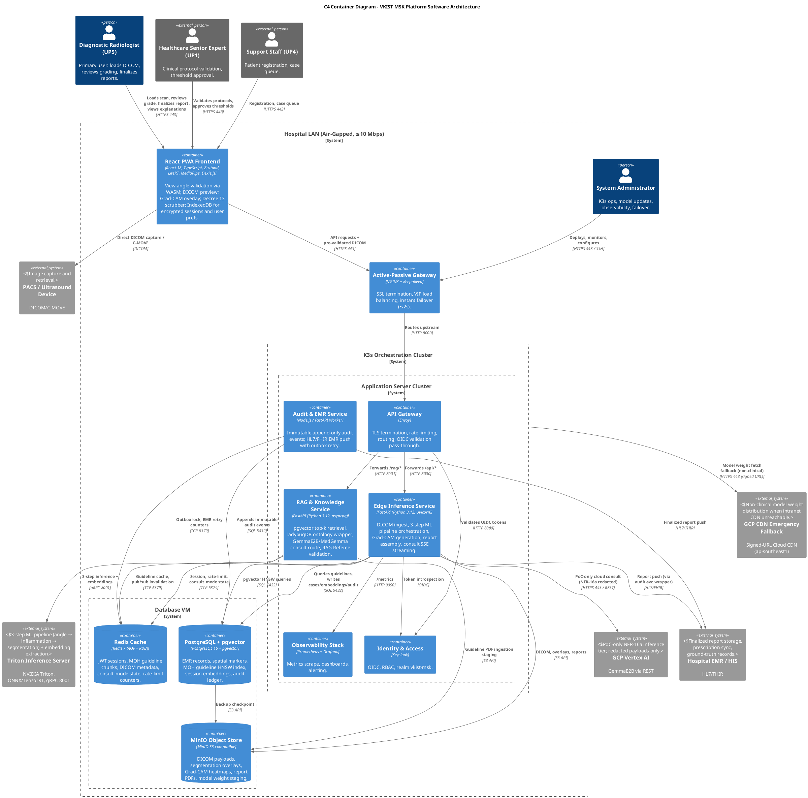
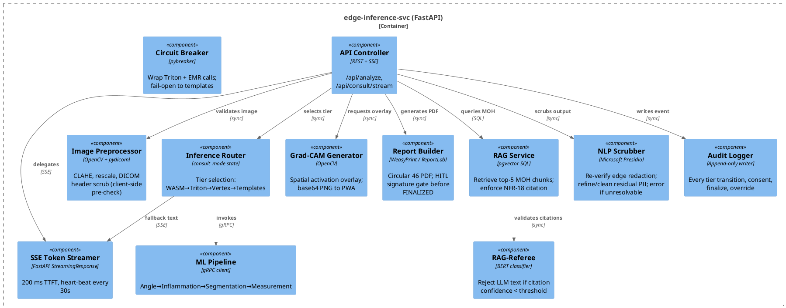
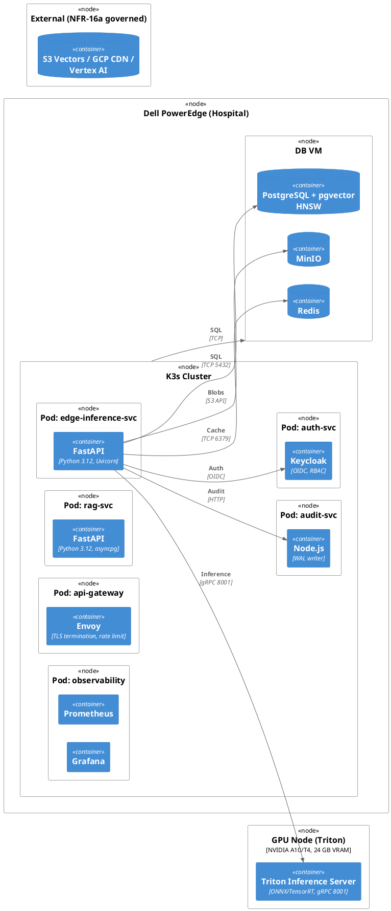

# Software Architecture Specification — VKIST MSK Platform

**Scope:** Sprint 1-2 (FR-25 Synovitis Grading + Multi-Modal NLP Integration)  
**Parent:** [SOLUTION_ARCHITECTURE_SPEC.md](./SOLUTION_ARCHITECTURE_SPEC.md), [SPRINT_1_2_ARCHITECTURE_SPEC.md](../workspace/sprint_1_2/SPRINT_1_2_ARCHITECTURE_SPEC.md)  
**Workflow:** Understand → Model (C4) → Specify → Decompose → Plan

---

## 1. Problem Statement

Build a reproducible, air-gapped-first musculoskeletal ultrasound analysis platform that performs automated synovitis grading (FR-25) with Vietnamese-language NLP explanations, auditable RAG citations, and HITL finalization — deployable on a single-hospital K3s cluster under ≤10 Mbps LAN constraints, with ≤150 MB idle app bundle and ≤1.5 s inference latency.

---

## 2. Requirements

### Functional (Sprint 1-2)
- [ ] FR-25: Load knee DICOM → segment joint structures → measure synovium thickness → grade synovitis 0-3
- [ ] Grad-CAM overlay on primary viewport (zero extra clicks)
- [ ] Circuit-breaker Socratic dialogue (radiologist challenges AI grade before finalizing)
- [ ] BERT drift monitor against baseline MOH corpus
- [ ] RAG-Referee validates every LLM-generated explanation against top-k retrieved MOH guideline chunks
- [ ] Decree 13 PII scrubbing on all outbound text (client-side + FastAPI middleware)
- [ ] ladybugDB ontology traversal for anatomical entity disambiguation
- [ ] GemmaE2B/MedGemma Vietnamese LLM consult (browser WebLLM local OR cloud Vertex AI) with MOH guideline citations
- [ ] Circular 46/2018 PDF report generation
- [ ] Immutable audit log append (NFR-17) and HITL digital signature gate (NFR-19)

### Non-Functional (Critical)
- [ ] NFR-4: 150 MB idle app bundle
- [ ] NFR-5: ≤1.5 s inference (on-prem Triton)
- [ ] NFR-7: ≤200 ms TTFT token streaming
- [ ] NFR-8: Fault-tolerant across Wi-Fi drops (state preserved)
- [ ] NFR-14: No client-side GPU/neural accelerator required
- [ ] NFR-15: Circular 46 EMR compliance
- [ ] NFR-16: Air-gapped primary; NFR-16a PoC fallback with redaction/consent/audit
- [ ] NFR-17: Immutable audit log
- [ ] NFR-18: 100% LLM text cites MOH protocol via RAG
- [ ] NFR-19: HITL digital signature before FINALIZED/ARCHIVED

---

## 3. Constraints & System Context

- **On-prem:** K3s on Dell PowerEdge (single hospital, ≤10 Mbps LAN)
- **Model:** GemmaE2B-Q4 (~1.3 GB) distributed via intranet CDN → GCP CDN fallback → WASM local (WebLLM) or cloud MedGemma on Vertex AI (NFR-16a) → MOH templates
- **Data:** Postgres + pgvector, Redis (5 constrained data types), MinIO, IndexedDB client prefs
- **Auth:** Keycloak + RBAC inside K3s; GitLab/Jira on cloud VM (NFR-16a exception)
- **CI/CD:** Jenkins inside K3s → cloud GitLab via SSH
- **Failover:** NGINX + Keepalived VIP (≤2s switch)

---

## 4. C4 Models

### 4.1 Context Diagram (Tier 1)

See master: `SOLUTION_ARCHITECTURE_SPEC.md §8.1`  
Actors: Radiologist (UP5), Senior Expert (UP1), Support (UP4), Admin  
External: PACS, EMR/HIS, Triton, ladybugDB, pgvector, GemmaE2B/MedGemma, EmbeddingGemma

### 4.2 Container Diagram (Tier 2)



Container communication summary:

| Source | Target | Protocol | Purpose |
|--------|--------|----------|---------|
| PWA | NGINX | HTTPS 443 | All API requests |
| NGINX | Envoy | HTTP 8000 | Route upstream |
| Envoy | Edge Inference | HTTP 8000 | `/api/*` |
| Envoy | RAG Service | HTTP 8001 | `/rag/*` |
| Envoy | Keycloak | HTTP 8080 | OIDC validation |
| Edge Inference | Triton | gRPC 8001 | 3-step ML pipeline + embeddings |
| Edge Inference | Postgres | TCP 5432 | SQL + pgvector HNSW |
| Edge Inference | Redis | TCP 6379 | Session, rate-limit, consult-mode |
| Edge Inference | MinIO | S3 API | DICOM, overlays, reports |
| Edge Inference | Keycloak | OIDC | Token validation |
| RAG Service | Postgres | TCP 5432 | pgvector HNSW |
| RAG Service | Redis | TCP 6379 | Guideline cache, pub/sub |
| Audit Service | Postgres | TCP 5432 | Immutable audit ledger |
| Audit Service | EMR | HL7/FHIR | Finalized report push |
| K3s | GCP CDN | HTTPS 443 | Signed-URL model weight emergency fetch |

### 4.3 Component Diagrams (Tier 3)

**Edge Inference Service (edge-inference-svc)**



### 4.3 Component Diagrams (Tier 3)

**Edge Inference Service (edge-inference-svc)**


### 4.4 Deployment Diagram (Tier 3)



---

## 5. Component Specifications

### 5.1 React PWA

| Concern | Decision |
|---------|----------|
| Framework | React 18 + TypeScript + Zustand |
| Styling | Tailwind CSS (mobile-first) |
| DICOM viewer | Cornerstone.js + custom canvas layer |
| Grad-CAM | `<canvas>` overlay; base64 PNG from FastAPI |
| Local model | LiteRT (MediaPipe Tasks Vision) — angle pre-classifier |
| Client storage | Dexie.js over IndexedDB (encrypted sessions, prefs) |
| Offline | Service Worker: cache-first for shell; network-first for API |
| Bundle | Tree-shake Cornerstone extras; split vendor chunk |
| PHI safety | Decree 13 regex scrubber before any network write |
| Edge guardrail | `guardrail.worker.ts` (WebWorker): Transformers.js BERT for hallucination/mal-intention detection; prompt injection scoring; scope-breach detection. OpenRedaction + pii-filter + js-data-anonymizer run in main thread or dedicated worker for redaction pipeline. Separate from `cv.worker.ts` (LiteRT) and `llm.worker.ts` (WebLLM) with no shared WASM memory. |

### 5.2 FastAPI Application (edge-inference-svc)

```
app/
├── main.py                 # Entry, middleware, lifespan
├── config.py               # Pydantic settings (env-driven)
├── middleware/
│   ├── auth.py             # Keycloak OIDC validation
│   ├── phi_scrub.py        # Microsoft Presidio redaction gate (NFR-16a); refine edge output; error if unresolvable PII
│   └── audit.py            # Append-only event emitter
├── routers/
│   ├── analyze.py          # POST /api/analyze (sync 3-step pipeline)
│   ├── consult.py          # SSE /api/consult/stream (GemmaE2B/MedGemma + RAG + guardrail session management)
│   ├── pacs.py             # C-MOVE proxy + DICOM upload
│   ├── emr.py              # HL7/FHIR push with outbox
│   └── admin.py            # Model update, drift review, cache invalidation
├── services/
│   ├── inference_router.py # consult_mode state machine
│   ├── triton_client.py    # gRPC with retry decorator
│   ├── rag.py              # pgvector top-k + citation formatter
│   ├── referee.py          # BERT drift + RAG confidence gate
│   ├── guardrail.py        # Edge BERT violation scoring, session termination, cloud mitigation trigger
│   ├── redaction.py        # Presidio AnonymizerEngine; re-verify edge redaction; refine residual PII; error if unresolvable
│   ├── report.py           # Circular 46 PDF + HITL signature
│   ├── ontology.py         # ladybugDB C++ bindings wrapper
│   └── audit_writer.py     # WAL append
├── models/
│   ├── dto.py              # Request/response schemas (Pydantic v2)
│   ├── domain.py           # Case, Session, Grade, Embedding entities
│   └── enums.py            # ConsultMode, Grade, Tier
└── infra/
    ├── cache.py            # Redis client (5 data types only)
    ├── db.py               # SQLAlchemy async engine + pgvector
    └── storage.py          # MinIO S3 client
```

### 5.3 Knowledge Service (rag-svc)

Separated from inference to allow independent scaling of RAG queries:
- Endpoints: `POST /rag/query`, `POST /rag/referee-check`, `GET /rag/guideline/{version}`
- Reads pgvector only; no Triton dependency
- Publishes guideline update events to Redis Pub/Sub for cache invalidation

### 5.4 Data Models (Postgres)

Key tables (migration via Alembic):

```
guidelines (id, version, title, source_url, embedding vector(768), active_from, retired_at)
sessions (session_hash, radiologist_id, case_id, consult_mode, created_at, closed_at)
cases (case_id, patient_hash, joint_site, dicom_checksum, final_grade, finalized_at, signer_id)
embeddings (id, session_hash, chunk_text, embedding vector(768), source, created_at)
audit_events (id, event_hash, session_hash, actor, action, tier, consent_token, redaction_manifest, payload_hash, ts)
emr_outbox (id, case_id, payload, status, attempts, next_retry_at)
user_prefs (user_id, jsonb, updated_at)   # synced from IndexedDB
```

Unique constraint: `cases.case_id` final grade requires `signer_id != NULL` (NFR-19).

### 5.5 Redis Keys (Exact Schema)

| Key pattern | Type | TTL | Purpose |
|-------------|------|-----|---------|
| `session:{hash}` | String + Hash | 3600s | JWT session validation |
| `guideline:{ver}:{chunk_id}` | String | 604800s (7d) | MOH guideline chunk |
| `dicom:{session_hash}` | String | 43200s (12h) | Per-session DICOM headers |
| `consult_mode:{session_hash}` | String | 7200s | Tier state (tier_1..tier_3b) |
| `rate:{actor_id}:{window}` | String | 30s sliding | Rate-limit counter |

Key-space invalidation: `guideline:{ver}:*` deleted on version bump via Postgres NOTIFY listener.

### 5.6 Triton gRPC Contract

```protobuf
service InferencePipeline {
  rpc Run3Step (DICOMBytes) returns (PipelineResult);
  rpc ExtractEmbedding (TextChunk) returns (EmbeddingVector);
}

message DICOMBytes {
  bytes raw_dicom = 1;
  string session_hash = 2;
  uint32 max_vram_mb = 3;
}

message PipelineResult {
  AngleClass angle = 1;
  InflammationFlag inflammation = 2;
  SegmentationMask mask = 3;
  SynoviumMeasurement measurement = 4;
  Grade grade = 5;
  bytes gradcam_png = 6;
}
```

Idempotency invariant: identical `raw_dicom + session_hash` → identical output bytes. No partial state between steps.

### 5.7 Frontend Guardrail Runtime

**WebWorker Topology**

| Worker | Runtime | Role | Memory Cap |
|--------|---------|------|------------|
| `cv.worker.ts` | LiteRT (WASM) | CV inference: angle pre-classifier, image preprocessing | Isolated WASM instance |
| `llm.worker.ts` | WebLLM (WASM) | GemmaE2B local generation, Gemma Functions tool-calling | Isolated WASM instance (NFR-4 1.5GB heap) |
| `guardrail.worker.ts` | Transformers.js (WASM/WebGPU) | BERT classification: hallucination, prompt-injection, scope-breach scoring | Shared Web Worker thread (no WASM memory pool) |

Isolation rules:
1. No `SharedArrayBuffer` or `Atomics` between workers — no raw WASM memory sharing.
2. Communication via `postMessage` with structured clone (no transferable object reuse for audit integrity).
3. Unload priority on memory pressure (browser `memorywarning` event): `llm.worker.ts` first, then `guardrail.worker.ts`, then `cv.worker.ts`.
4. IndexedDB is the only persistence layer shared across workers; written by main thread or dedicated serializer, never read inside LLM context window.

**Edge Guardrail Decision Contract**

```
User Input → OpenRedaction + pii-filter → js-data-anonymizer → BERT Guardrail
                                                                    ↓
                                                  PASS: forward to RAG → LLM
                                                  FAIL: terminate LLM session → cloud mitigate
```

Server-side FastAPI contracts:
- `POST /api/guardrail-check` (internal): accepts BERT score + query hash; returns `PASS|MITIGATE`.
- `POST /api/redaction-ground-check`: accepts client manifest hash + sanitized payload; returns `PASS|CLEANED|ERROR`. `CLEANED` = server refined residual PII and continues. `ERROR` = server unable to clean → client receives structured error.
- `POST /api/consult/stream`: now includes `X-Guardrail-Version` and `X-Redaction-Manifest-Hash` headers for audit.

**IndexedDB Schema Additions**

| Table | Key | Columns | Invalidation |
|-------|-----|---------|--------------|
| `guardrail_models` | `[model_name, version]` | artifact_hash, size_bytes, load_timestamp | Version mismatch |
| `policy_config` | `[policy_name]` | version, rules_json, bert_thresholds | Admin push |
| `audit_tokens` | `[session_hash, entity_type]` | token_value, created_at | Session expiry |

---

## 6. Interface Contracts (Selected)

### 6.1 REST Endpoints

| Method | Path | Auth | Request | Response | Notes |
|--------|------|------|---------|----------|-------|
| POST | `/api/analyze` | JWT | multipart DICOM | JSON + Grad-CAM PNG | Sync, ≤1.5 s target |
| GET | `/api/consult/stream` | JWT + consent | SSE text stream | NDJSON chunks | Token streaming ≤200 ms TTFT |
| POST | `/api/emr/push` | JWT | case_id | 202 Accepted | Outbox if offline |
| POST | `/api/admin/models` | Admin | modelZip | 200 OK | K3s rolling restart |
| GET | `/api/rag/citations?q=` | JWT | query string | JSON top-5 chunks | NFR-18 |

### 6.2 SSE Consult Stream Contract

```
event: token
data: {"text":"The","confidence":0.92}

event: citation
data: {"source":"MOH guideline 2024 §3.2","page":12}

event: done
data: {"tier":"tier_2","latency_ms":340}
```

---

## 7. Build vs Buy Matrix (Sprint 1-2 Specific)

| Component | Build | Buy | Decision | Rationale |
|-----------|-------|-----|----------|-----------|
| Frontend PWA | Build | — | **Build** | Custom DICOM viewer + Grad-CAM layer; thin client requirement |
| FastAPI backend | Build | — | **Build** | Tight Decree 13 + NFR-16a middleware; in-house domain logic |
| Triton inference | — | Deploy self-hosted | **Deploy** | Open-source stack; no SaaS |
| Ontology (ladybugDB) | Build | — | **Build** | Embedded C++; SNOMED-CT mapping custom to MSK |
| pgvector | — | Postgres extension | **Use** | Zero infra overhead |
| Redis | — | OSS | **Use** | Scoped to 5 types; self-hosted |
| MinIO | — | OSS | **Use** | S3-compatible; self-hosted |
| Auth | Build (Keycloak) | Auth0/Okta SaaS | **Build** | NFR-16: Keycloak on-prem, no SaaS identity |
| EMR integration | Build | Mirth Connect | **Build** | Thin HL7 wrapper FastAPI → EMR; keeps surface area small |
| CI/CD | Jenkins in K3s | SaaS GitHub Actions | **Build** | Jenkins inside LAN; cloud GitLab via SSH |
| Issue tracking | Self-hosted Jira | Atlassian Cloud | **Build (NFR-16a)** | Cloud VM, compensating controls |

---

## 8. Task Decomposition

### Phase 1: Foundation (Parallel)
- [ ] **T1-A Infra: K3s bootstrap + network policy** (S)  
  Deploy K3s on Dell PowerEdge; Calico network policies; NGINX + Keepalived VIP; TLS secret automation.

- [ ] **T1-B Database VM: Postgres + pgvector + MinIO + Redis** (S)  
  Install Postgres 16 + pgvector extension; MinIO (4 disk RAID); Redis AOF+RDB; backup cron to MinIO.

- [ ] **T1-C CI/CD: Jenkins in K3s + GitLab on cloud VM** (M)  
  Jenkins agents as K3s jobs; pre-push PII hook; GitLab RDB backup job to MinIO; IP-whitelist IAM.

- [ ] **T1-D Auth: Keycloak realm + RBAC** (S)  
  Realm `vkist-msk`; roles: radiologist, senior_expert, admin; client `pwa`, `edge-svc`, `rag-svc`.

- [ ] **T1-E PWA shell: React + Zustand + PWA manifest** (S)  
  Offline-capable shell; Dexie.js setup; Service Worker with cache-first for shell only.

### Phase 2: Core ML Pipeline
- [ ] **T2-A Triton server + 3-step model ensemble** (L)  
  Angle → Inflammation → Segmentation pipeline; gRPC server on port 8001; TensorRT engines.

- [ ] **T2-B FastAPI edge-inference-svc** (L)  
  `/api/analyze` endpoint; DICOM ingest; pipeline orchestration; Grad-CAM overlay generation.

- [ ] **T2-C Circuit Breaker + consult_mode state machine** (M)  
  pybreaker around Triton + EMR; consult_mode Redis keys; SSE status push to PWA.

- [ ] **T2-D Retry decorators (Triton + EMR)** (S)  
  Exponential backoff; idempotency enforcement; outbox queue for EMR failures.

### Phase 3: NLP & Knowledge
- [ ] **T3-A pgvector guideline ingestion pipeline** (M)  
  Ingest MOH PDFs → chunk → embed (BERT/Writing-Alignment) → HNSW index; Postgres NOTIFY pub/sub.

- [ ] **T3-B ladybugDB ontology setup** (M)  
  SNOMED-CT knee/hip subset; MSK entity relationships; C++ embedded bindings in FastAPI.

- [ ] **T3-C RAG service + RAG-Referee** (M)  
  `/rag/query`; top-5 retrieval; BERT classifier to validate LLM citations; reject if threshold fail.

- [ ] **T3-D Browser WebLLM + Cloud MedGemma LLM endpoints** (L)  
  Browser: WebLLM (GemmaE2B-Q4) loaded via Service Worker from intranet/GCP CDN; runs in separate WebWorker from CV pipeline.  
  Cloud: MedGemma on GCP Vertex AI (NFR-16a governed); FastAPI wrapper with streaming + Decree 13 redaction middleware.  
  Triton: EmbeddingGemma only (768-dim RAG embeddings), no LLM hosting.

- [ ] **T3-E Decree 13 scrubber (client + server)** (M)  
  Client: Dexie.js pre-egress regex. Server: FastAPI middleware for NFR-16a redaction; role-hash tokens.

### Phase 4: Compliance & HITL
- [ ] **T4-A Immutable audit log** (M)  
  Append-only WAL writer (audit-svc); schema per NFR-17; every tier transition + consent + finalize event.

- [ ] **T4-B HITL signature gate** (S)  
  `cases.finalized_at` + `signer_id` non-null constraint; digital signature capture (VKI token + timestamp).

- [ ] **T4-C Circular 46 PDF report generator** (M)  
  WeasyPrint template; includes grade, Grad-CAM image, MOH citations, signer block, audit hash.

### Phase 5: Observability & Hardening
- [ ] **T5-A Prometheus + Grafana dashboards** (M)  
  Triton VRAM/utilization; inference latency p50/p99; Redis hit rate; circuit-breaker state; K3s node health.

- [ ] **T5-A BERT drift monitor** (M)  
  Weekly batch job comparing current session embeddings vs. baseline; alert admin via Grafana if KL divergence > threshold.

- [ ] **T5-C Fallback chain integration test** (S)  
  Simulate Triton down → verify Tier 3a consent flow + redaction; simulate CDN down → verify GCP CDN signed URL fallback.

---

## 9. Execution Plan

### Week 1-2: Phase 1
Deliverables: K3s cluster up, DB VM ready, CI/CD pipeline green, PWA shell live.

### Week 3-4: Phase 2
Deliverables: `/api/analyze` end-to-end; Grad-CAM overlay visible in PWA; circuit-breaker handles Triton failure.

### Week 5-6: Phase 3
Deliverables: RAG queries return MOH citations; GemmaE2B/MedGemma streams Vietnamese explanations; RAG-Referee blocks unmapped LLM text.

### Week 7: Phase 4
Deliverables: Audit log immutable; HITL signature enforces finalization; Circular 46 PDF exports.

### Week 8: Phase 5 + Sprint Review
Deliverables: Dashboards, drift monitor, integration tests, demo-ready PWA.

---

## 10. References

- [Solution Architecture Spec](./SOLUTION_ARCHITECTURE_SPEC.md) — full pattern citations, trade-offs, NFR-16a design
- [Sprint 1-2 Architecture Spec](../workspace/sprint_1_2/SPRINT_1_2_ARCHITECTURE_SPEC.md) — sprint-scoped container/component/deployment diagrams
- [Agent Skills](../../AGENT_SKILL/) — coding convention, secrets/PHI safety, contract hygiene
- [Codebase Structure](../workspace/sprint_1_2/CODEBASE/) — backend/frontend/infra/knowledge/ml layout
