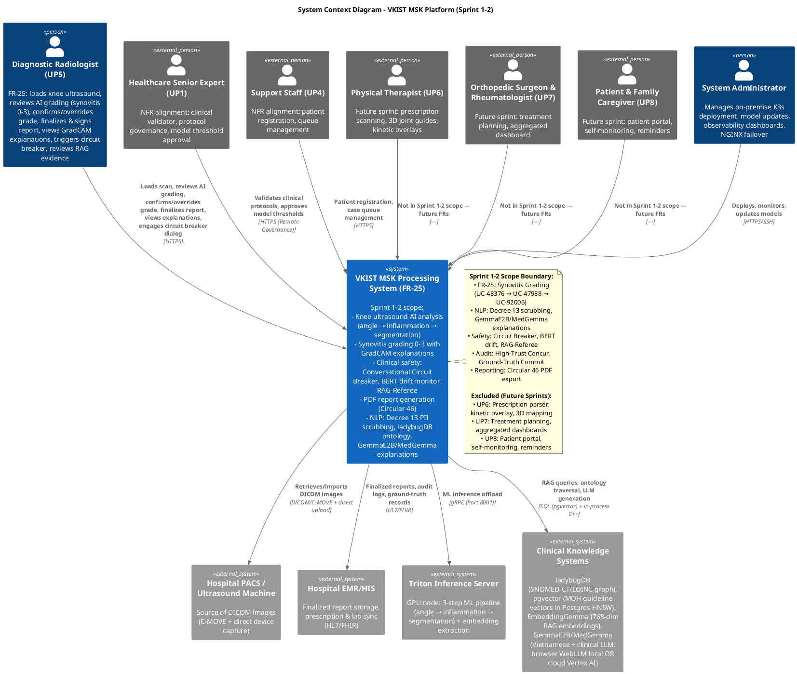
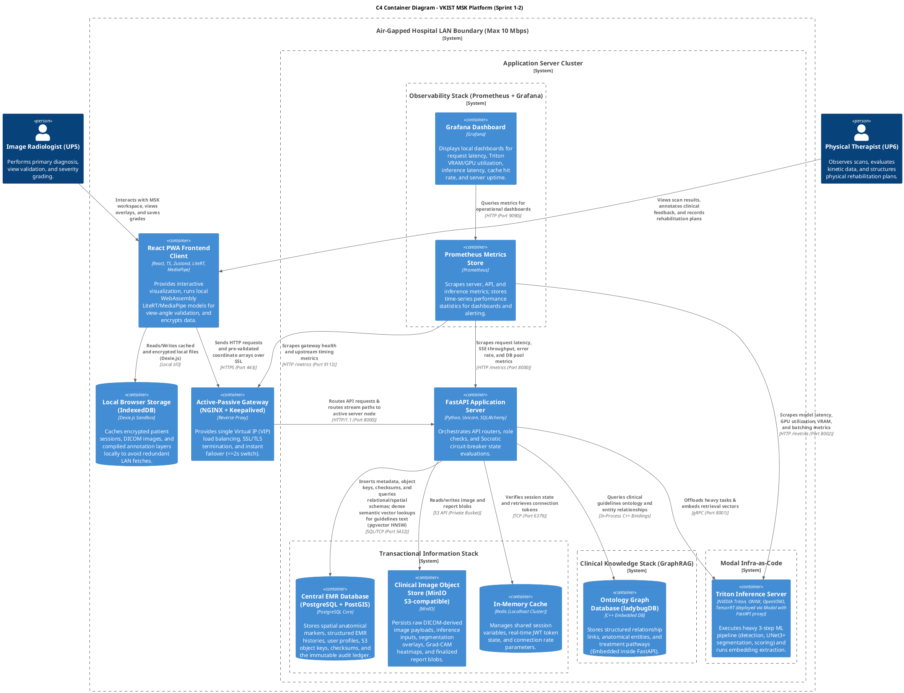
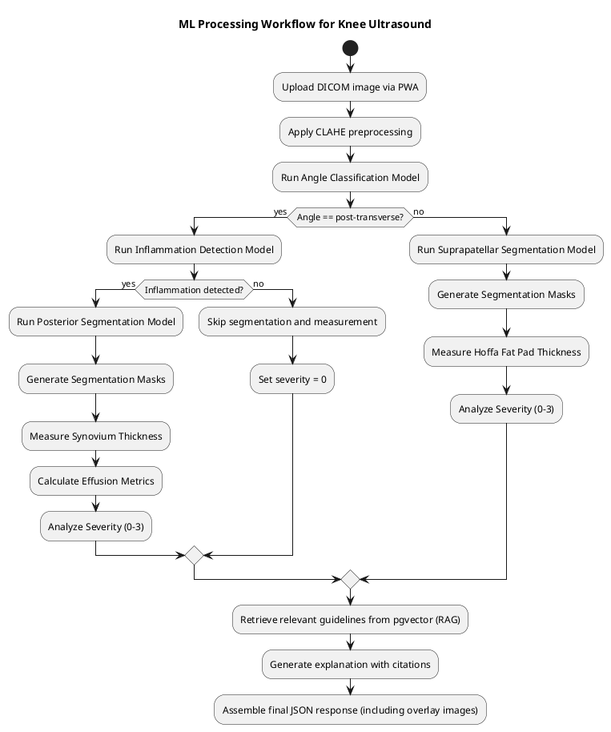

# Solution Architecture Specification

## 1. Introduction

This document outlines the cloud-native architecture for the real-time musculoskeletal pathology processing system, designed to meet the functional and non-functional requirements outlined in the project's requirement analysis. The architecture leverages cloud-native principles (microservices, containerization, dynamic orchestration) while adhering to strict on-premise/local-intranet constraints due to data sovereignty and air-gap requirements (NFR-16). A time-limited, PoC-scoped relaxation (NFR-16a) permits governed emergency cloud fallback under mandatory redaction and consent controls.

## 2. Key Requirements

### 2.1 Functional Requirements (FRs)
Key functional requirements extracted from the FR database include:
- **FR-4**: Parse clinical text on-device (Prescription Parser / WebML Module)
- **FR-5**: Map spatial coordinates to visual models (3D Mapping / Visualization Engine)
- **FR-6**: Render muscle depth cross-sections (Kinetic Overlay Module)
- **FR-7**: Log kinetic progress pins (Progress Tracking Module)
- **FR-8**: Demonstrate joint mechanics dynamically (Patient Education Module)
- **FR-9**: Render haptic-assisted edge-snapping magnifier (DICOM Viewer / Annotation Module)
- **FR-10**: Record asynchronous voice and canvas telemetry (Asynchronous Communication Engine)
- **FR-11**: Display progressive disclosure sheets and native alerts (User Interface / Push Notifications)
- **FR-12**: Synchronize hardware-adaptive musculoskeletal models (Patient Education Module / 3D Visualization Engine)
- **FR-13**: Encrypt and deliver sanitized patient payloads (Patient Portal / Security Module)
- **FR-23**: Automatically segment joint anatomical structures by AI (Phân vùng hình ảnh cấu trúc giải phẫu khớp gối bằng AI)
- **FR-24**: Automatically measure synovium thickness (Đo độ dày màng hoạt dịch Tự động)
- **FR-25**: Diagnose and grade synovitis level (Đánh giá và phân cấp mức độ viêm màng hoạt dịch)
- **FR-26**: Suggest treatment plan based on knee inflammation level (Gợi ý phương án điều trị dựa trên mức độ viêm khớp gối)
- **FR-27**: Suggest list of anti-inflammatory and pain relief drugs (Đề xuất danh mục thuốc kháng viêm và giảm đau theo ca bệnh)

### 2.2 Non-Functional Requirements (NFRs)
Critical non-functional requirements include:
- **NFR-1**: DICOM Collaborative Rendering Speed ≤ 3.0 seconds
- **NFR-4**: Client Memory Footprint ≤ 150 MB RAM
- **NFR-5**: Core Vision Inference Latency ≤ 1.5 seconds (local on-premise server)
- **NFR-6**: Server-Side Edge Model Quantization ≤ 2 GB VRAM on target server nodes
- **NFR-7**: Real-Time UI Screen Refresh (Token Streaming) ≤ 200 ms from inference begins
- **NFR-8**: Local Network Fault Tolerance: 0% data corruption, active/remember user request during Wi-Fi disconnections
- **NFR-9**: Localized System Availability ≥ 99.9% during official public sector operating windows, downtime ≤ 45 seconds per day
- **NFR-10**: Automated Generative Safety Guardrails: <90% verification prohibited, 100% of LLM-generated patient text explanations must pass verification
- **NFR-11**: Frontline Usability & Training Curve: onboarding training ≤ 45 minutes, error rate ≤ 1 config slip per week
- **NFR-12**: Zero-Friction Explainability Integration: accessing baseline model confidence intervals or guideline justifications requires EXACTLY 0 extra clicks, displayed in primary medical viewport
- **NFR-13**: Spatial Layer-Activation Mapping (Anti-Black-Box Mandate): vision stack must natively output spatial layer-activation maps (e.g., Grad-CAM overlays), display with zero extra clicks during automated screening
- **NFR-14**: Legacy Local Hardware Compatibility: UI modules shall not require dedicated external client-side GPU or hardware neural accelerator, operate on Android 10+ with 3GB RAM
- **NFR-15**: National EMR Compliance (Circular 46/2018/TT-BYT): must comply with Vietnamese MOH EMR regulations
- **NFR-16**: Local Intranet Cloud & Air-Gapped Data Isolation (PRIMARY — permanent): platform tech stack shall NOT transmit diagnostic/identifiable clinical info across public internet during normal primary clinical workflows; external cloud processing prohibited for production operation; only execute & deployed on on-premise servers, local intranet, or isolated specialist machines
- **NFR-16a**: Emergency Cloud Fallback with Redaction (PoC-SCOPE — time-limited, expires upon PoC user sign-off): 

  [1] Cloud LLM API (e.g., GCP Vertex AI MedGemma) may be invoked ONLY when browser-side WebLLM (GemmaE2B) is unavailable AND the user explicitly consents per-session via UI acknowledgment; 
  
  [2] before ANY bytes leave the hospital boundary, FastAPI Redaction Middleware MUST strip all Decree 13 PII fields — patient name, DOB, MRN, address, phone, insurance ID, facial geometry, and DICOM patient metadata — replacing them with role-hash tokens [BN:7f3a2c]; non-identifying clinical fields (age, sex, joint site, findings) are retained for inference utility; 
  
  [3] GCP project must be configured with Customer-Managed KMS keys (CSEK) enabling crypto-erasure on key revocation, 30-day Cloud Storage lifecycle deletion, and a 1-year project-level auto-deletion timer; 
  
  [4] consent token + redaction manifest written to on-prem immutable audit log BEFORE the egress call; 
  
  [5] redacted payloads MUST NEVER contain: any free-text field capable of re-identification via MOH or administrative records; 
  
  [6] NFR-16a is formally retired upon PoC user sign-off and NFR-16 is restored as the permanent production deployment constraint; NFR-16a relaxation does not apply to NFR-15 Circular 46 EMR compliance obligations
- **NFR-17**: Cryptographic Accountability Logging: application layer shall not allow any user to alter/delete logs; every action where AI recommendation accepted/overridden saved immutably
- **NFR-18**: MOH Guideline-Anchored RAG Pipeline: system shall not render open-ended clinical text summaries without clear traceable footnote citing official MOH protocols; use RAG tied to health guidelines
- **NFR-19**: Human-in-the-Loop (HITL) Clinical Gatekeeping: database layer shall not allow automated ML/LLM diagnosis/report to transition to FINALIZED/ARCHIVED/PATIENT_ACCESSIBLE without authenticating digital signature from licensed human clinician

## 3. Architectural Goals and Principles

Guided by the above requirements and the solution_architect_corpus, the architecture adheres to the following principles:
- **Low Latency**: Optimize for sub-second responses where critical (NFR-1,5,7).
- **Edge Computing**: Leverage edge servers and client-side WASM for local inference to meet NFR-5 and NFR-16; NFR-16a emergency fallback activates only when all local tiers are confirmed unavailable.
- **Resilience**: Implement fault tolerance, caching, and graceful degradation to handle network instability (NFR-8,9).
- **Security & Compliance**: Ensure data sovereignty, air-gap, immutable audit logs, and HIPAA-equivalent safeguards (NFR-15,16,17). NFR-16a introduces a governed, redaction-mandatory cloud pathway during PoC only; all egress requires prior audit-log commit and explicit user consent.
- **Explainability & Trust**: Provide zero-friction access to model confidence and spatial attributions (NFR-12,13).
- **Human-in-the-Loop**: Enforce clinical oversight for AI-generated decisions (NFR-19).
- **Scalability & Maintainability**: Use microservices, container orchestration, and observability for easy updates and scaling.

## 4. Proposed Architecture

### 4.1 High-Level Overview
The system adopts a hybrid edge-cloud (on-premise) architecture with the following layers:
1. **Edge Inference Layer**: Located on-premise at hospitals/clinics, runs lightweight ML models for real-time DICOM processing (NFR-5,6).
2. **Micro-Services Layer**: Containerized services orchestrated by K3s (Kubernetes-certified, lightweight distribution designed for edge and resource-constrained production environments). K3s selected over alternatives (Docker Swarm, Nomad, ECS Fargate, Cloud Run) on the following criteria: NFR-16 requires on-premise deployment — eliminating ECS Fargate and Cloud Run (cloud-only platforms). Docker Swarm offers lowest PoC operational cost but is in maintenance mode with no viable scaling path; migration to production-grade orchestration requires complete rewrite of all deployment artifacts. Nomad is operationally viable but lacks ecosystem depth and has less documented migration path to multi-cluster federation. K3s is already production-grade at single-site scale, requires no migration to "production" — it IS the production platform. The scaling path to N hospitals is multi-cluster federation via K3s cluster-api, not platform replacement. All manifests and service definitions are forward-compatible with upstream Kubernetes.
3. **Data Layer**: On-premise databases (PostgreSQL + pgvector for relational + vector search, Redis for caching, MinIO for S3-compatible object storage).
3. **Embedding Layer**: EmbeddingGemma (768-dim) for RAG retrieval vectors; separate from BERT which is reserved for drift monitoring and RAG-Referee classification only.
3. **Vector Layer (two-tier)**:
    - **Hot + Warm: pgvector** (Postgres disk-backed HNSW index, ~15K MOH guideline vectors plus session and case embeddings — serves both real-time RAG during consult and non-real-time analytical queries in a single store. NFR-18, NFR-12. NFR-16 compliant.)
    - **Cold: S3 Vectors** (AWS ap-southeast-1, billion-scale archival, cross-facility bootstrap source, disaster recovery rebuild origin — accessed under NFR-16a governance.)
5. **Presentation Layer**: Progressive Web App (PWA) built with React, Web Workers, and service workers for offline capability and low memory footprint (NFR-4,14).
6. **Observability & Security Layer**: Centralized logging (immutable append-only), monitoring, and audit trails (NFR-10,17).

### 4.2 Data Flow
1. User captures DICOM image via PWA frontend.
2. Image sent to edge inference service via secure local API (BFF pattern).
3. Edge service runs preliminary detection/segmentation (e.g., synovium thickness) using quantized models (NFR-6).
4. Results sent to microservice backbone for further analysis (e.g., suggesting treatment plans via RAG).
5. RAG pipeline retrieves relevant guidelines from local vector database, generates explanation with citations (NFR-18).
6. Final results (including spatial overlays) sent back to PWA for display with zero-friction explainability (NFR-12,13).
7. User actions (e.g., accepting treatment suggestion) logged immutably (NFR-17) and require HITL approval for finalization (NFR-19).
8. All data remains within local intranet; no egress to public internet under NFR-16 (normal operation). Under NFR-16a (PoC emergency fallback only): egress permitted exclusively of redacted, non-identifiable payloads with explicit user consent and prior audit-log commit.

## 5. Component Mapping to Patterns (with Citations)

### 5.1 Edge Computing, Model Distribution & Governed Cloud Fallback
- **Pattern**: Bring-Your-Own-Compute (BYOC) Client-Side Inference + Intranet CDN Distribution + Emergency Cloud Fallback (NFR-16a)
  - **Source**: Cloud_Architecture_Patterns.md, line 244-247 (Asset Ingestion at edge nodes); Cloud_Design_pattern_Azure.md, line 19,84 (Cache-Aside, Read-Through); Designing_high_quality_distributed_Cloud_Native_applications_on_Azure_V1.1.md, line 211 (BFF)
  - **Application**:
    - **BYOC primary (weight distribution)**: GemmaE2B-Q4 (~1.3GB, 4-bit quantized) distributed in the following order:
      [1] Pre-bundled ~200MB model stub (shipped inside PWA install — covers immediate shell load, zero network dependency).
      [2] Hospital intranet CDN (MinIO/NAS at `hospital.local/models/`) — full weights lazy-loaded after shell is interactive; SHA-256 content verification; cache-first Service Worker. This is the preferred distribution path under NFR-16.
      [3] GCP CDN emergency fallback (asia-southeast1 = Singapore, nearest to Vietnam) — activated ONLY when hospital intranet CDN is confirmed unreachable. GCP backend bucket (`cdn-backend-models-vkist`) wraps a Cloud Storage bucket (`gs://vkist-models-{site_id}`) with Cloud CDN enabled; signed-URL access control (no `allUsers` public exposure); cache mode `CACHE_ALL_STATIC`, default TTL 24h, max TTL 7d (matches model version lifecycle). Service Worker receives a 307 redirect to signed CDN URL on intranet CDN failure; PWA caches the fetched weights locally via Cache Storage as normal. Because model weights contain zero patient data — they are static computational artifacts — the GCP CDN fetch event is committed to the on-prem audit log (case_hash, timestamp, consult_mode = "cdn_fallback") but does NOT trigger the full NFR-16a redaction pipeline. The redaction pipeline applies only to Tier 3a inference calls carrying clinical payloads, not to non-clinical model binary fetches.
    - **NFR-4 clarification**: NFR-4's 150MB ceiling covers the core application bundle (JS/TS code, UI assets, runtime state) at idle. Supra-150MB memory consumed by models, caches, and inference buffers is bounded separately under the WASM heap cap (1.5GB) and instrumented independently.
    - **Inference Fallback Chain** (LLM consult path only — CV pipeline is always on-prem Triton):
      - **Tier 0** → Browser WebLLM (GemmaE2B local in WASM, instant, zero network — preferred default when device has ≥3GB RAM and WebGPU available). Consult mode: `browser_local`. Triggered automatically on page load if model weights are cached and WebGPU is detected.
      - **Tier 1** → [REMOVED — Triton does NOT host LLM. Triton hosts CV models + EmbeddingGemma only.]
      - **Tier 2** → On-prem Triton (hospital GPU node — CV pipeline ONLY: angle → inflammation → segmentation + EmbeddingGemma for RAG embeddings). The LLM consult does NOT fall back to Triton. If browser WebLLM is unavailable, the next tier is cloud.
      - **Tier 3a** → GCP Vertex AI (MedGemma via REST API — **PoC ONLY under NFR-16a**). Activated when Tier 0 (browser WebLLM) is unavailable (device unsupported, model not cached, memory exceeded) AND user explicitly consents per-session. All payloads MUST pass Decree 13 PII redaction gate (see §5.4) before leaving hospital boundary. GCP project configured with CSEK, 30-day storage lifecycle, 1-year project deletion timer. Consult mode: `cloud_vertex`.
      - **Tier 3b** → Cloud LLM Arbiter (GCP Vertex AI MedGemma — **PoC ONLY under NFR-16a, BERT-triggered correction**). Activated when BERT drift monitor (UC-74821) detects semantic impasse, logical contradiction, or contextual hallucination during Socratic dialogue, OR when radiologist explicitly requests "second opinion." Same Vertex AI endpoint as Tier 3a, but with arbiter system prompt + retrieved MOH chunks injected. ALL calls require prior audit-log commit of drift signal + user consent + Decree 13 redaction. Consult mode: `cloud_vertex_arbiter`.
      - **Tier 3c** → MOH guideline template responses (rule-based, no generative model, always available, deterministic, cited — safety floor when all inference tiers fail). Consult mode: `templates`.
    - **Circuit Breaker**: PWA Feature Flag Manager (`consult_mode` state machine) attempts tiers sequentially: `browser_local` → `cloud_vertex` → `cloud_vertex_arbiter` → `templates`. Emits tier-transition events to on-prem immutable audit log (NFR-17). Tier 3a/3b transitions require consent token + redaction manifest committed *before* the HTTP call. CDN fallback events (model weight distribution only) log lighter audit entry: no redaction required, no consent required (weights carry no PII).
    - **GCP CDN configuration** (emergency distribution path only):
      - Cloud Storage bucket: `gs://vkist-models-{site_id}` — Uniform bucket-level access, no `allUsers` public exposure.
      - Signed-URL generation: FastAPI generates time-limited signed URLs (signed by project service account private key, CSEK-managed) with a 15-minute expiry; returned to PWA as a `307` redirect on intranet CDN failure.
      - Cloud CDN backend bucket: wraps the GCS bucket; `enable-cdn: true`, `cache-mode: CACHE_ALL_STATIC`, `default-ttl: 86400` (24h), `max-ttl: 604800` (7d = model version lifecycle). Edge caching means subsequent PWA fetches for the same model version are served from the nearest Google PoP, not the asia-southeast1 origin — no repeated hospital-to-GCP round trip needed.
      - Private origin authentication: CDN service account has `roles/storage.objectViewer` on the bucket; direct GCS access (bypassing CDN) is blocked by IAM — all model fetches flow through CDN.
      - Model version rotation: on drift monitor or admin update, a new bucket path (`models/v2/gemma-e2b-q4.bin`) is uploaded; CDN cache is invalidated via `gcloud compute backend-buckets invalidate-cdn-cache`; old path serves stale content only until TTL expires — zero in-flight breakage.
    - **Cache strategy**: Service Worker intercepts `/models/*` imports with cache-first strategy. Pre-bundled ~200MB model stub shipped inside PWA install; remaining weights lazy-loaded from intranet CDN after shell is interactive. Cache entries tagged with content-hash version header; corruption triggers re-download with exponential backoff (NFR-8).
- **Pattern**: Gateway Aggregator
  - **Source**: Designing_high_quality_distributed_Cloud_Native_applications_on_Azure_V1.1.md, line 203, 1011
  - **Application**: API gateway aggregates multiple microservice calls (e.g., prediction + RAG + logging) into a single response to reduce client-side round trips.
- **Pattern**: Backend for Frontend (BFF)
  - **Source**: Designing_high_quality_distributed_Cloud_Native_applications_on_Azure_V1.1.md, line 211
  - **Application**: Tailor API responses for different client types (e.g., lightweight payloads for low-end tablets per NFR-14; enriched payloads with Grad-CAM overlays for desktop workstations).

### 5.2 Caching & Performance
- **Pattern**: Cache-Aside (Lazy Loading) + Version-Key Invalidation + Stale-While-Revalidate
  - **Source**: A_Cache_Handbook_for_SWE_Quang_Hoang.md, line 72-76 (Local vs Remote Cache), line 94-114 (Look-Aside workflow)
  - **Application**: Use Redis as a look-aside cache exclusively for the server-side hot paths that justify a remote cache. Every other data type is served from its primary store without a cache layer. Caching is not applied by default — each entry must pass a read-frequency vs. staleness-tolerance analysis.
  - **Redis cache-only data types** (server-side, local Redis per hospital):
    - **JWT session state** (TTL 1h, matches token expiry): validates active sessions without Postgres roundtrip; coalesced look-aside with single-flight mutex to prevent thundering herd on session-miss.
    - **MOH guideline chunks** (TTL 7d): version-key invalidation triggered by Postgres NOTIFY on guideline ingestion events; cache key = `guideline:{version}:{chunk_id}`, full key-space retired on version bump, no TTL races.
    - **DICOM metadata per session** (TTL 12h, per-session scope): avoids repeated Postgres lookups of DICOM headers during the 3-step ML pipeline; evicted after session completion.
    - **Circuit-breaker / consult_mode state** (TTL 2h, matches session): consult_mode enum (tier_1/tier_2/tier_3a/tier_3b) keyed by session_hash. Written atomically on tier transitions. Read by: FastAPI routing layer, PWA (via SSE status push), Prometheus metrics exporter. Justifies Redis over Postgres: sub-ms reads required, writes are frequent (per BERT token stream during Socratic dialogue), data is volatile (expires with session), and multiple FastAPI workers behind NGINX need shared visibility — in-process memory cannot cross worker boundaries.
    - **Rate-limit counters** (TTL 30s, sliding window): INCR on consult request entry. Self-clearing via EXPIRE. Prevents Triton GPU saturation under concurrent burst from multiple radiologists. Atomic Redis operation; Postgres row-lock alternative creates write amplification on hot path.
  - **Not cached in Redis** (served from primary store):
    - Audit log: append-only, NFR-17 immutability requirement — no intermediate cache layer.
    - Inference results: already held in FastAPI process memory during active session.
    - ladybugDB ontology: embedded C++ inside FastAPI — already an in-process structured cache.
    - BERT drift tensors: compute-bound, held in Triton GPU memory or local NVMe; not reusable across sessions and latency-sensitive to in-process serving.
    - EmbeddingGemma inference: small 768-dim model, served on-demand by Triton for RAG embedding extraction; outputs written directly to pgvector, not cached.
  - **Client-side preference caching (IndexedDB)**: 
    - User preferences (language, UI density, contrast mode, default annotation tool) are persisted in IndexedDB via Dexie.js. 
    - Characteristics: 
      - write frequency ≈ 0 (changes only on explicit user action), read frequency = every session start, no sharing needed across devices. 
      - Cache invalidation: manual only — user taps Settings → Save → IndexedDB write + background sync to Postgres. 
      - No server roundtrip on read. IndexedDB survives browser cache clears (distinct storage domain), so preference data outlives the Service Worker model cache — appropriate for data that is intentionally persistent.
  - **Deployment**: Standalone Redis per hospital LAN (local-only, no cross-site routing). AOF enabled (everysec fsync) + periodic RDB snapshots every 15 min / 5 min / 1 min depending on write volume. Restart policy: unless-stopped. No Redis Sentinel in PoC/Pilot: Redis is a latency optimization, never a source of truth — total cache loss degrades one request cycle's latency, not data integrity. RDB snapshots backed up to site MinIO for disk-failure recovery.
  - **Cache-miss protocol**: Look-aside with request coalescing. On miss, FastAPI reads Postgres, writes Redis, returns response. On simultaneous misses for same key, first requester acquires a 5s lock in Redis (`lock:{key}`); other requesters wait up to 5s then fail-open to Postgres directly — no queue buildup.
  - **Cache-staleness protocol**: MOH guidelines use version-key invalidation (active, event-driven). Session state uses TTL (passive, matches JWT lifetime). DICOM metadata uses TTL with no revalidation (immutable per session). User preferences use IndexedDB with manual invalidation — no TTL needed.
  - **Failure contract**: Redis process crash → Docker Compose restarts within ~2s → AOF replay recovers to last checkpoint (<5s). During recovery window, all reads fall through to Postgres (source of truth) with ≤10ms additional latency per request. No user-facing failure. If AOF + RDB both lost (disk failure): cold-start miss spike, repopulated organically from Postgres within one request cycle per key.
- **Pattern**: Read-Through/Write-Through (handled explicitly by application per corpus)
  - **Source**: Cloud_Design_pattern_Azure.md, line 19,84
  - **Application**: User preference writes flow through FastAPI → Postgres (durable) → IndexedDB (client-side, on next sync). Application logic manages consistency explicitly; no cache-driven inconsistency risk since IndexedDB and Postgres are both authoritative for their respective scopes (client vs. server).

### 5.3 Resilience & Fault Tolerance
- **Pattern**: Circuit Breaker
  - **Source**: Cloud_Design_pattern_Azure.md, line 106-117
  - **Application**: Wrap external service calls (e.g., to knowledge base) with circuit breaker to prevent cascading failures during network glitches (NFR-8).
- **Pattern**: Retry with Exponential Backoff (application-layer, not Ambassador sidecar)
  - **Source**: Designing_high_quality_distributed_Cloud_Native_applications_on_Azure_V1.1.md, line 222 (Ambassador Pattern — principle applied without sidecar in PoC)
  - **Rationale**: The Ambassador pattern abstracts retry, timeout, and mTLS into a sidecar proxy. For PoC/Docker Compose deployment, the operational cost of Envoy sidecars exceeds their benefit. The retry-with-backoff principle is applied in-application via Python decorators, scoped only to the two call boundaries where transient failures are demonstrated and recovery is safe.
  - **Retry-scoped calls** (all others use fail-fast, no retry):
    - **FastAPI → Triton gRPC** (ML inference): up to 3 attempts, exponential backoff 1s→2s→4s, total deadline 30s. Retry only on gRPC UNAVAILABLE (node restart). Not retried on INVALID_ARGUMENT or DEADLINE_EXCEEDED. Triton inference is contractually idempotent: identical DICOM input produces identical output; retry re-submits full pipeline, no partial state accumulation between steps. If all 3 attempts fail, circuit breaker opens and consult routes to Tier 3b (MOH templates).
    - **FastAPI → EMR HL7/FHIR** (report push): up to 3 attempts, exponential backoff 2s→4s→8s, total deadline 60s. Retry only on ConnectionError/TimeoutError. Not retried on EMR business-level rejections (validation failures). If all 3 attempts fail, report written to `emr_outbox` Postgres table with status PENDING; background worker retries every 5 min with jittered backoff. Radiologist sees: "Report signed and queued for EMR sync."
  - **Not retried** (fail-fast): Redis, Postgres (including pgvector), ladybugDB (in-process), MinIO/CDN (LAN stable). Retry on these creates amplification on already-healthy or already-failed infrastructure.
  - **Idempotency constraint**: The Triton gRPC interface contract requires that re-submission of identical input bytes produces identical output bytes. No Triton handler may accumulate partial state between pipeline steps that would change on re-entry. This is a design-time invariant enforced at interface review, not a runtime check.
  - **Production scaling path**: At N ≥ 20 hospitals or K3s deployment, migrate retry logic from in-process decorators to declarative Envoy sidecar configuration. Retry contracts remain semantically identical; deployment mechanism changes only.

### 5.4 Security, Compliance & Audit
- **Pattern**: Immutable Audit Log (Append-Only Event Store)
  - **Source**: Cloud_Design_pattern_Azure.md, line 449 (Append-Only Event Store)
  - **Source**: GCP_Cloud_Archtiecture_Gudie.md, line 132 (unalterable, immutable audit log)
  - **Application**: Store all clinical decisions and AI interactions in an append-only log (e.g., using Apache Kafka or event-sourced database) to prevent tampering (NFR-17).
- **Pattern**: Air-Gap Isolation
  - **Source**: GCP_Cloud_Archtiecture_Gudie.md, line 178,181 (logical air-gap by powering down MediaAgents or using scheduler)
  - **Application**: Enforce network policies to isolate healthcare workloads from public internet under NFR-16; use local-only container registries and internal service mesh. During PoC under NFR-16a, a governed egress pathway is permitted exclusively through the FastAPI Redaction Middleware carrying pre-egress audit-log commits and explicit user consent tokens — no direct client-to-cloud calls are ever permitted.
- **Pattern**: Two-Person Rule (Multi-Party Authorization)
  - **Source**: google_infrastructure_whitepaper_fa.md, line 129,133,435
  - **Application**: Require dual clinician approval for high-risk AI-generated treatment plans (mapping to NFR-19 HITL gatekeeping).

### 5.5 Explainability & RAG
- **Pattern**: Two-Tier Vector Architecture for Retrieval-Augmented Generation
  - **Source**: A_Cache_Handbook_for_SWE_Quang_Hoang.md (retrieval times, cache tiering) + Cloud_Design_pattern_Azure.md (Query Stack, line 371) + Cloud_Architecture_Patterns.md (hot/warm/cold data tiering)
  - **Application**: Two vector stores serve distinct access patterns. pgvector handles all in-service query loads; S3 Vectors handles archival and disaster recovery bootstrap. One less infrastructure tier than the three-tier design because pgvector covers both the hot real-time RAG path and the warm analytical path — the dataset size (~15K vectors) does not justify a separate in-memory ANN store at PoC scale.

  **Tier 1 — HOT + WARM: pgvector (Postgres HNSW, single store for all live queries)**
    - What: 
      • MOH guideline embeddings (~15K vectors, 768-dim) — live index for active consult RAG queries (NFR-18, NFR-12). 
      Generated by EmbeddingGemma (768-dim), NOT BERT. BERT is reserved for drift monitoring and RAG-Referee classification.

      • Session consult embeddings (GemmaE2B dialogue turns linked to session_hash)

      • Finalized case embeddings (joined to EMR case_id in same transaction — NFR-19 HITL finalization writes both report and embedding atomically)

      • Historical guideline version embeddings (prior MOH versions retained for audit, not current-query use)

      • Drift-detection training embeddings (baseline corpus for BERT drift comparison — BERT 768-dim, separate from pgvector RAG store; stored in dedicated drift_embeddings table, not in the live HNSW query path)

    - When: ALL live queries — real-time RAG during consult (NFR-18) AND non-real-time batch analytics, audit review, longitudinal research, drift detection.
    - Why pgvector for real-time RAG: At ~15K vectors with HNSW index, pgvector query latency is ~5–20ms on the Postgres warm buffer set. The entire active guideline index fits in Postgres shared_buffers (set to 4GB on the DB VM). This is within NFR-7's ≤200ms TTFT budget with room to spare. Adding a separate Qdrant process for this dataset size is operational overhead without measurable latency benefit.
    - Why pgvector for warm/analytical: You already run Postgres. Adding vector search is one migration, not a new service. The dataset scales to millions of vectors before HNSW degrades meaningfully. Transactional consistency with clinical records eliminates sync bugs — case embedding and EMR record are written in the same WAL, same backup, same recovery. Complex SQL filtering (WHERE joint_site = 'left_knee' AND grade = 2 AND session_date > '2025-01-01') is expressible in one query. Zero additional operational overhead.
    - Why NOT Qdrant at PoC scale: Qdrant's in-memory ANN advantage appears at millions of vectors or high QPS loads. At 15K vectors and <100 queries/minute (realistic for a single-hospital PoC with ~20 concurrent radiologists), pgvector HNSW in shared_buffers is indistinguishable in latency. Qdrant adds a container, a separate backup strategy, a separate gRPC endpoint, and a separate monitoring target — none of which earn their cost at this scale.
    - Phase 2 migration path: If the guideline corpus grows beyond ~100K vectors OR concurrent query volume exceeds ~500 QPS, introduce Qdrant as Tier 1 hot cache, promoted from pgvector on a scheduled basis. pgvector remains the authoritative warm store. This is an additive migration — no data model changes.
    - Placement: Existing Postgres VM. NFR-16 compliant. Already deployed.

  **Tier 2 — COLD: S3 Vectors (AWS, archival + bootstrap source)**
    - What:
      • All historical guideline version embeddings (every MOH update, retained indefinitely for longitudinal audit)

      • Billion-scale case embedding archive (long-term research corpus, written weekly in batch)

      • Cross-facility replication source (single source of truth for guideline index across all hospital sites)
      
      • Training corpus snapshots for next model iteration
    - When: Disaster recovery bootstrap (rebuilds pgvector Qdrant-promotion cache from S3 Vectors snapshot), research analysis (bulk similarity search across years of cases), cross-site aggregation. NOT real-time consult queries.
    - Why S3 Vectors: Sub-second latency for infrequent queries is acceptable for archival workloads. 11 9's durability exceeds any local disk or MinIO backup. Serverless — no infrastructure to manage at VKIST central. The 90% cost reduction vs specialized vector DBs matters at billion-vector scale.
    - NFR-16 compliance: Tier 2 is accessed ONLY under NFR-16a governance. Batch jobs and DR bootstrap events are committed to the on-prem audit log before the S3 Vectors API call.

  **Data Lifecycle Between Tiers**:
    - Ingress: New embeddings are written to pgvector (Tier 1, immediate query availability) AND S3 Vectors (Tier 2, archival) at creation time — a single FastAPI handler fans out writes.
    - Qdrant promotion (Phase 2 only): A scheduled job reads hot guideline vectors from pgvector and promotes to Qdrant when corpus size or QPS thresholds are crossed. Not active in PoC.
    - Demotion: Weekly batch job removes session embeddings from pgvector's hot HNSW index (they are retained in a separate pgvector table for archival within Postgres, not deleted). S3 Vectors receives the full weekly batch.
    - Disaster recovery (Qdrant loss — Phase 2): Admin triggers reload from S3 Vectors snapshot → rebuilds Qdrant index. In PoC: if Postgres is lost, restore from WAL + S3 Vectors snapshot of guideline embeddings.
    - Guideline update: New MOH version → embeddings written to pgvector (new HNSW index version, old index retained), S3 Vectors (archived as `guideline_v2025.06`). Postgres NOTIFY invalidates Redis guideline cache.
- **Pattern**: LLM Hallucination Arbiter (Cloud Correction Tier)
  - **Source**: UC-74821 (BERT Drift Monitor triggers arbiter escalation); NFR-16a (governed cloud fallback)
  - **Application**: When the BERT drift monitor (UC-74821) detects semantic impasse, logical contradiction, or contextual hallucination during the Socratic dialogue between UP5 and the on-prem GemmaE2B, the system escalates the dialogue transcript to a cloud-hosted LLM arbiter (GemmaE2B on GCP Vertex AI, NFR-16a governed). The cloud arbiter acts as an unbiased independent corrector: it reviews the local model's statements against the retrieved MOH guideline chunks (from pgvector via RAG), corrects factual errors, resolves contradictions, and issues a grounded, cited response. This prevents the radiologist from accepting a locally-generated hallucination when the on-prem drift monitor flags risk. Invocation conditions: (1) BERT drift score exceeds threshold, OR (2) radiologist explicitly requests "second opinion" during consult. All cloud arbiter calls: require prior audit-log commit + user consent + Decree 13 redaction, identical to NFR-16a Tier 3a inference path.

- **Pattern**: Citation Contestant Validation (RAG-Referee Extended)
  - **Source**: NFR-18 (MOH Guideline-Anchored RAG), NFR-10 (Generative Safety Guardrails)
  - **Application**: RAG-Referee is a BERT-based text classifier that performs multi-dimensional validation of every LLM-generated explanation before it reaches the radiologist. Validation axes: (1) **Attribution correctness**: is each cited MOH guideline chunk actually retrieved by the RAG query? (2) **Logical cohesion**: does the explanation's reasoning chain remain factually consistent with the cited sources? (3) **Factual contestant status**: does the LLM claim contradict any retrieved guideline? If validation fails on any axis → reject LLM output → fallback to deterministic MOH template (Tier 3b safety floor). This extends beyond simple "citation present" to "citation contested and coherent."

- **Pattern**: Two-Tier Embedding Architecture
  - **Source**: A_Cache_Handbook_for_SWE_Quang_Hoang.md (retrieval times) + Cloud_Design_pattern_Azure.md (Query Stack, line 371)
  - **Application**: Two distinct embedding models serve distinct paths. EmbeddingGemma (768-dim) generates RAG retrieval vectors for pgvector. BERT (BioClinicalBERT/PubMedBERT, 768-dim) is used EXCLUSIVELY for drift monitoring and RAG-Referee classification — never written to the pgvector retrieval index. Same vector dimensionality enables future cross-compatibility, but the models remain architecturally separate with different failure modes, retrain schedules, and query paths.

### 5.6 Human-in-the-Loop (HITL)
- **Pattern**: Manual Approval Gate
  - **Source**: google_infrastructure_whitepaper_fa.md (Two-Person Rule, line 133)
  - **Application**: Before any AI-generated diagnosis/treatment plan is marked FINALIZED, require digital signature from licensed clinician (NFR-19).

### 5.7 Edge Guardrail Tier (LLM Behavior Control Without Heavy Server-Side Frameworks)
- **Pattern**: Constrained Prompt Engineering + Edge BERT Detection + Session Termination to Cloud Mitigation
  - **Source**: NFR-10 (Automated Generative Safety Guardrails); NFR-16a (Governed Cloud Fallback)
  - **Application**: NeMo Guardrails and GuardrailsAI require substantial runtime scaffolding, rule engines, and WASM-compatible bindings that do not exist in the browser ecosystem at the model inference layer. The client-side cannot run a NeMo Rail or GuardrailsAI pipeline inside a WebWorker alongside WebLLM. Therefore, the edge guardrail tier relies on two lightweight mechanisms:
    1. **Robust prompt-based rules**: Hard system-prompt constraints injected at every consult turn. Boundaries: no diagnosis outside MOH protocol scope; mandatory citation for every clinical assertion; no free-text echoing of PII even if user inputs it; immediate refusal to follow instructions that attempt prompt injection or jailbreak; tone and scope locked to clinical decision-support.
    2. **BERT hallucination / mal-intention detection**: Each candidate LLM token stream (or per-turn summary) is evaluated by a local Transformers.js BERT classifier running in a dedicated `guardrail.worker.ts` WebWorker. The classifier scores for: (a) hallucination probability (factual grounding vs retrieved MOH context); (b) mal-intention / prompt-injection indicators (user-context leaking, instruction override attempts, jailbreak markers); (c) scope violation (claims outside synovitis/MSK MOH guidelines).
  - **Session termination and cloud mitigation**: If BERT edge guardrail returns a violation score above threshold on any axis → FastAPI immediately terminates the WebLLM session (`stream.close()`), logs the trigger event to immutable audit, and opens a new mitigated consult session toward Tier 3a (cloud Vertex AI MedGemma). Mitigation path: the same user query + retrieved MOH chunks (already computed) + edge-detected-offense log are forwarded under NFR-16a governance (consent token confirmed, Decree 13 redaction re-applied, audit-log commit before egress). The radiologist sees: "Edge model restricted — escalating to cloud consult (redacted)."
  - **WebWorker isolation**: `guardrail.worker.ts` runs in a separate WebWorker from `cv.worker.ts` (LiteRT) and `llm.worker.ts` (WebLLM). No shared WASM memory between workers. IndexedDB caches artifacts but is never injected into LLM context. Unload order on memory pressure: `llm.worker.ts` → `guardrail.worker.ts` → `cv.worker.ts`.
  - **Cloud model guardrail**: Cloud Vertex AI MedGemma (Tier 3a/3b) uses natively supported Vertex AI Model Garden safety filters (tuned for healthcare) plus the same server-side FastAPI BERT RAG-Referee gate. No additional client-side framework required.

### 5.8 Edge Data Hygiene: Anonymization, Redaction & Server-Side Ground-Check
- **Pattern**: Edge-to-Server Redaction Pipeline with Ground-Truth Verification
  - **Source**: NFR-16a (Decree 13 PII redaction before egress); NFR-15 (Circular 46 EMR compliance)
  - **Client-side edge redaction** (browser, before any bytes leave the device):
    - Libraries: `OpenRedaction` (regex + ML-assisted PII detection in Vietnamese/English clinical text), `pii-filter` (fast deterministic replacement), `js-data-anonymizer` (consistent i-agent pseudonymization for cross-session reference integrity).
    - Scope: patient name, DOB, MRN, address, phone, insurance ID, national ID, facial geometry, DICOM patient metadata fields (PatientName, PatientID, PatientBirthDate, PatientAddress, etc.).
    - Replacement: Role-hash token [BN:7f3a2c] or type-preserving stub (e.g., `AGE: 45` retained, `NAME: <PATIENT>` replaced). Non-identifying clinical fields (age, sex, joint site, findings, measurement values) preserved for inference utility.
    - Trigger: every text field, DICOM header, metadata JSON object, and JSON-LD payload before network write.
  - **Server-side re-verification + refinement** (FastAPI, inside hospital LAN, before Vertex AI egress):
    - The FastAPI `presidio.redaction` middleware (Microsoft Presidio AnalyzerEngine + AnonymizerEngine) re-verifies the client redaction manifest and **actively refines/continues cleaning** any residual PII that the edge missed.
    - If Presidio successfully cleans the remaining PII → replace the payload with the refined version and continue to the selected inference tier.
    - If Presidio cannot fully clean the payload (unstructured residual PII it cannot resolve) → halt the pipeline, return a structured error to the client, and log `redaction_failure` event to the immutable audit log.
  - **Stable pseudonyms for analytics**: `js-data-anonymizer` generates stable i-agent pseudonyms (same patient → same token within a session and across sessions via `session_hash` binding). This enables longitudinal audit linkage without PHI leakage.

### 5.9 RAG as Essential Pipeline Step (Non-Optional)
- **Pattern**: Mandatory RAG Pre-Processing for All LLM Consult Paths
  - **Source**: NFR-18 (100% LLM text cites MOH protocol); NFR-12 (zero-friction explainability)
  - **Application**: RAG retrieval is NOT an optional tool the LLM may choose to invoke. It is a mandatory pipeline step that executes before any LLM generation, for both edge (browser WebLLM) and cloud (Vertex AI MedGemma) tiers.
  - **Pipeline order**:
    1. User query arrives (post-redaction)
    2. `rag.query()` retrieves top-k MOH guideline chunks from pgvector HNSW
    3. Retrieved chunks + strict system prompt ("You are a clinical decision-support assistant. Answer ONLY using the provided MOH guidelines. Cite chunk IDs. Do not speculate.") → injected into LLM context
    4. LLM generates grounded, cited response
    5. `referee.validate()` (BERT RAG-Referee) checks citation correctness, logical cohesion, factual contestant status
    6. If any axis fails → reject → fallback to MOH template
  - **Rationale**: If RAG were merely a tool call, a compromised or under-performing edge LLM could choose to skip retrieval and generate ungrounded text, violating NFR-18. Mandatory RAG pre-processing closes this vector.

### 5.10 Tool-Calling Semantics for Edge and Cloud LLMs
- **Pattern**: Function-Calling as Convenience Layer Over Mandatory RAG
  - **Source**: Gemma Functions (Google DeepMind) + Vertex AI Function Calling
  - **Application**:
    - **Edge LLM (GemmaE2B via WebLLM)**: Supports Gemma Functions. The RAG retrieval is exposed as a function tool (`retrieve_moh_guidelines(query, top_k)`). HOWEVER, this tool is pre-invoked by the host pipeline per §5.9 before the first LLM token is generated. The function-calling interface is available for subsequent turns of Socratic dialogue where the model may need additional retrieval mid-conversation (e.g., user asks "what about contraindications?" → mid-turn retrieval). The host pipeline enforces the mandatory RAG call on turn 0; subsequent per-turn retrieval is model-initiated via function calling.
    - **Cloud LLM (MedGemma on Vertex AI)**: Native Vertex AI Function Calling is enabled. Same semantics: server-side FastAPI injects top-k MOH chunks before first generation; model may request further retrieval via function call during multi-turn consult.
  - **Why not pure tool-calling**: Pure tool-calling delegates the decision to retrieve to the model. NFR-18 requires 100% citation; delegating retrieval to model choice creates a non-zero probability of unsupported generation. Mandatory pre-injection + optional per-turn tool call is the safer contract.

### 5.11 Output Filtering
- **Pattern**: Multi-Axis Output Gate
  - **Server-side FastAPI**:
    - Regex + ladybugDB entity link validation: reject outputs containing unlinked named entities not present in the source context.
    - BERT RAG-Referee (§5.5 pattern extended): citation contestant validation runs on every LLM output before SSE streaming to PWA.
    - Refusal pattern detection: if output contains model-generated refusal of form "I cannot answer" without citing a specific MOH section → flag as incomplete grounding, fallback to template.
  - **Client-side PWA final gate** (before rendering in primary viewport):
    - PWA JavaScript post-processor strips any residual PII that escaped server-side checks (defense-in-depth).
    - Citation footnote auto-format: if RAG-Referee returned validated citations, render as superscript links to MOH chunk IDs.
  - **NFR-10 compliance**: <90% verification score → output is prohibited from display. The Circuit Breaker feeds back to the user: "Unable to provide verified explanation — please consult senior expert."

### 5.12 Logging, Retention & Model Telemetry
- **Pattern**: Immutable Append-Only Audit + Model Behavior Telemetry
  - **Audit events** (append-only Postgres table, NFR-17):
    - `edge_guardrail_violation`: session_hash, violation_axis (hallucination|mal_intention|scope_breach), bert_score, user_query_hash, mitigation_target (cloud|template).
    - `rag_retrieval_event`: session_hash, query_hash, retrieved_chunk_ids, latency_ms.
    - `referee_decision`: session_hash, axis_results (attribution|cohesion|contestant), overall_pass, fallback_triggered.
    - **Audit events for this layer**: `redaction_edge_manifest` (client), `redaction_server_refine` (server-side cleaning pass), `redaction_failure` (server unable to clean → error), `egress_consent` + `egress_redact_manifest` (before cloud call, NFR-16a).
  - **Retention**: Audit events retained indefinitely (append-only, no UPDATE/DELETE). Raw LLM token streams retained for 90 days in MinIO (compressed, AES-256 at rest) for drift analysis. After 90 days, streams are deleted; only aggregated `referee_decision` and `rag_retrieval_event` summaries remain.
  - **BERT drift monitor telemetry**: edge BERT classifier score distributions exported to Prometheus; alert if false-positive rate on hallucination detection exceeds 5% or false-negative rate exceeds 0.1% (clinical safety threshold).
  - **Model weight distribution audit**: every GCP CDN signed-URL fetch event committed to audit log (case_hash, timestamp, consult_mode).

### 5.13 IndexedDB Schema for Guardrail State
- **Pattern**: Client-Side State Persistence with Manual Invalidation
  - **Database**: `vkist_msk` (Dexie.js)
  - **Tables**:
    - `user_prefs`: existing — language, UI density, contrast.
    - `guardrail_models`: model artifact cache (WebLLM weights hash, BERT classifier version, manifest timestamps).
    - `policy_config`: server-pushed guardrail policy (prompt rule version, BERT score thresholds, redaction rule version) — updated on admin change, invalidated by version key.
    - `audit_tokens`: stable pseudonym tokens generated by `js-data-anonymizer` for cross-session reference (replaces Redis for this data type).
  - **Not cached in Redis** (consistent with §5.2 design):
    - Guardrail policy config and model artifacts are client state; invalidated only by explicit admin action or version mismatch. Server-side source of truth for policy version is Postgres `policy_versions` table.

## 6. Trade-Off Analysis

| Criterion          | Choice                                      | Trade-Off Justification                                                                 |
|--------------------|---------------------------------------------|---------------------------------------------------------------------------------------|
| **Latency vs. Consistency** | Eventual consistency with read-through cache | Strong consistency would increase latency; cache-aside with short TTL meets NFR-1,5,7 while keeping data fresh enough for clinical use. |
| **Edge vs. Centralized**    | Hybrid edge for inference, central for analytics | Pure edge lacks resources for complex RAG; pure central violates NFR-5,16. Edge handles real-time inference at edge, heavier analytics centrally. |
| **SQL vs. NoSQL**           | Polyglot persistence (PostgreSQL + Redis + MinIO) | Relational for transactions and vector search (PostgreSQL + pgvector), caching (Redis), object storage (MinIO). Single DB type cannot optimally serve all needs — but pgvector collapses the vector-store decision into Postgres, avoiding a separate Qdrant service at PoC scale. |
| **Monolith vs. Microservices** | Microservices with API Gateway           | Increased operational overhead vs. independent scaling, fault isolation, and technology diversity (required for ML vs. web services). |
| **Public Cloud vs. On-Prem** | On-premise Kubernetes (e.g., Rancher, K3s) for production; GCP Vertex AI permitted only under NFR-16a (PoC emergency fallback, redacted payloads only) | NFR-16 prohibits public cloud in normal operation. NFR-16a creates a governed, time-limited exception for PoC validation: cloud LLM may supplement on-prem tiers only after Decree 13 redaction and explicit user consent. On-premise provides control for production; NFR-16a provides a pragmatic safety net during PoC, with a mandatory retirement trigger upon PoC sign-off. |
| **Sync vs. Async UI Updates** | Asynchronous token streaming (WebSockets) | Synchronous would block UI; async streaming meets NFR-7 (≤200ms TTFT) and keeps UI responsive. |

## 7. Conclusion

The proposed architecture satisfies all functional and non-functional requirements by combining cloud-native patterns with strict on-premise deployment to meet data sovereignty and air-gap mandates. Key innovations include edge inference for low-latency DICOM processing, immutable audit logs for accountability, RAG for explainable AI, and HITL gatekeeping for clinical safety. The architecture is scalable, maintainable, and aligns with the solution_architect_corpus patterns as detailed above. NFR-16a provides a time-limited, governed bridge for PoC validation only, with a mandatory retirement trigger upon PoC user sign-off — restoring NFR-16 as the permanent production constraint.


## 8. Architecture Diagrams

### 8.1 Context Diagram (C4) - Sprint 1-2 Scope (FR-25 Synovitis Grading)


### 8.2 Container Diagram (C4) - Sprint 1-2 Implementation


### 8.3 Component Diagram (C4) - Edge Inference Service Internals
```plantuml
!define https://raw.githubusercontent.com/plantuml-stdlib/C4-PlantUML/master
!includeurl /C4_Component.puml

Container_Boundary(boundary, "Edge Inference Service") {
    Container(edge_inference, "Edge Inference Service", "FastAPI (Python)", "Handles image upload, runs ML models")
    Component(api_controller, "API Controller", "Python/FastAPI", "REST endpoint /api/analyze")
    Component(preprocessor, "Image Preprocessor", "Python/OpenCV", "CLAHE, resizing, normalization")
    Component(angle_model, "Angle Classification Model", "PyTorch (ConvNeXt/DenseNet/etc.)", "Predicts imaging plane")
    Component(inflammation_model, "Inflammation Detection Model", "PyTorch (EfficientNet-B0)", "Binary inflammation presence")
    Component(segmentation_model, "Segmentation Model", "PyTorch (UNet/DeepLabV3)", "Pixel-wise mask for anatomical structures")
    Component(measurement_engine, "Measurement Engine", "Python/NumPy", "Calculates synovium thickness in mm and effusion metrics")
    Component(severity_analyzer, "Severity Analyzer", "Python", "Determines synovitis level (0-3) and generates explanation")
    Component(report_generator, "Report Generator", "Python", "Builds final JSON response, optional PDF")
}

Rel(api_controller, preprocessor, "Calls", "Sync")
Rel(preprocessor, angle_model, "Calls", "Sync")
Rel(angle_model, api_controller, "Returns angle class & confidence", "Sync")
Rel(api_controller, inflammation_model, "Calls (if needed)", "Sync")
Rel(inflammation_model, api_controller, "Returns inflammation flag & confidence", "Sync")
Rel(api_controller, segmentation_model, "Calls (if inflammation)", "Sync")
Rel(segmentation_model, api_controller, "Returns segmentation masks", "Sync")
Rel(api_controller, measurement_engine, "Calls", "Sync")
Rel(measurement_engine, api_controller, "Returns thickness & bbox", "Sync")
Rel(api_controller, severity_analyzer, "Calls", "Sync")
Rel(severity_analyzer, api_controller, "Returns severity level, description, color", "Sync")
Rel(api_controller, report_generator, "Calls", "Sync")
Rel(report_generator, api_controller, "Returns final JSON (with optional PDF bytes)", "Sync")

@enduml
```

### 8.4 Deployment Diagram (C4 Deployment View)
```plantuml
!define https://raw.githubusercontent.com/plantuml-stdlib/C4-PlantUML/master
!includeurl /C4_Deployment.puml

Deployment_Node(hw_node, "Hospital On-Premise Hardware (e.g., Dell PowerEdge)") {
    Deployment_Node(k8s_cluster, "Kubernetes Cluster (K3s)") {
        Deployment_Node(pod_inference, "Pod: edge-inference-svc") {
            Container(container_inf, "edge-inference-svc", "FastAPI container")
        }
        Deployment_Node(pod_rag, "Pod: rag-svc") {
            Container(container_rag, "rag-svc", "FastAPI container")
        }
        Deployment_Node(pod_audit, "Pod: audit-svc") {
            Container(container_audit, "audit-svc", "Node.js container")
        }
        Deployment_Node(pod_api_gw, "Pod: api-gateway") {
            Container(container_gw, "envoy", "Envoy proxy")
        }
        Deployment_Node(pod_auth, "Pod: auth-svc") {
            Container(container_auth, "keycloak", "Keycloak container")
        }
        Deployment_Node(pod_obs, "Pod: observability") {
            Container(container_prom, "prometheus", "Prometheus server")
            Container(container_graf, "grafana", "Grafana UI")
            Container(container_elk, "elk", "Elasticsearch, Logstash, Kibana")
        }
    }
    Deployment_Node(vm_db, "Database VM") {
        ContainerDb(db_primary, "PostgreSQL + pgvector", "Primary DB + Vector (HNSW)", "Stores spatial anatomical markers, structured EMR histories, user profiles, S3 object keys, checksums, immutable audit ledger, and pgvector HNSW index for MOH guideline embeddings and case embeddings.")
        ContainerDb(cache, "Redis", "Cache")
        ContainerDb(object_store, "MinIO", "Object storage")
    }
    Deployment_Node(aws_cloud, "AWS Cloud (ap-southeast-1, NFR-16a only)") {
        ContainerDb(s3_vectors, "S3 Vectors", "AWS Vector Bucket", "Cold archival storage for historical guideline versions and billion-scale case embedding archive. Disaster recovery bootstrap source. Accessed under NFR-16a governance with audit logging.")
    }
}

Rel(db_primary, cache, "Replication", "TCP")
Rel(db_primary, object_store, "Backup", "TCP")
Rel(k8s_cluster, vm_db, "Accesses (SQL)", "TCP")
Rel(k8s_cluster, aws_cloud, "Batch archival + DR bootstrap (NFR-16a)", "HTTPS (via AWS SDK)")
Rel(hw_node, k8s_cluster, "Runs on", "Network")
@enduml
```

### 8.5 ML Workflow Flowchart

## References
- [Solution Architect Corpus](./.kilocode/skills/solution_architect/assets/solution_architect_corpus/)
- [Project FR Database](./proj_level_reading/Requirement_Analysis/FRs_Database/FR-Engineer-DB .csv)
- [Project NFR Database](./proj_level_reading/Requirement_Analysis/Non_FRS_DB/Non_Functional_(NFR)_List_Result/Non-FR Engineering Result 376f910aea7580c3ae9afed6937701fd_all.csv)
- [Existing Component Specs](./workspace/sprint_1_2/CODEBASE/*/spec/)
- [Sprint 1-2 Architecture Spec](./workspace/sprint_1_2/SPRINT_1_2_ARCHITECTURE_SPEC.md) - Sprint-specific context, container, component, and deployment diagrams