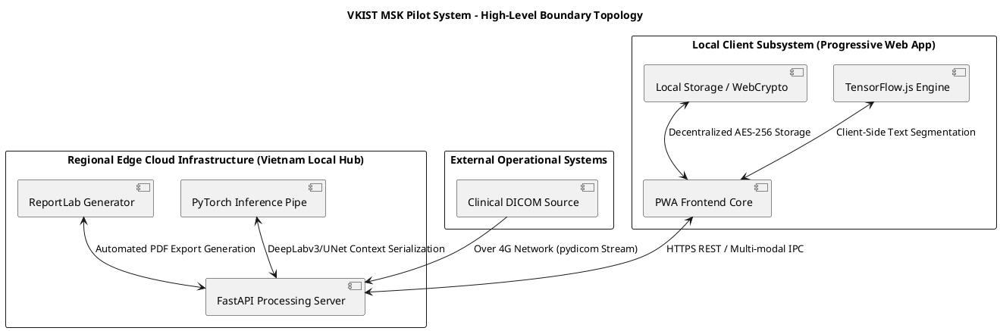
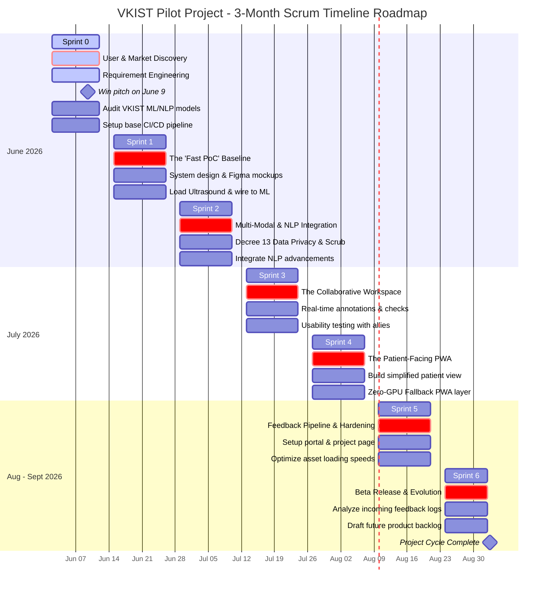

# VISION_SCOPE.md

*VKIST Musculoskeletal Pilot Project Specification & Strategic Context The Project Vision*

---

## 1. Project Identity, Motivation & Problem Statement

### 1.1 Project Identity

* **Project Name:** VKIST MSK Pilot Workspace.


* **Pitch Matrix Date:** June 9, 2026.


* **Active Cycle:** June 2, 2026 to September 2, 2026 (Strict 3-Month Window).


* **Engineering Paradigm:** **Hybrid Architecture Execution**—Macro-Planning driven via Structured Waterfall Phases coupled with Micro-Managed tactical execution loops via Agile Scrum Sprints.


### 1.2 Core Motivations

* **The Academic Migration:** Intentionally transitioning isolated, static machine learning model checkpoints from academic research codebases into an active, functional, and referenceable medical software ecosystem. This is critical to establishing the engineering team's operational value within the local healthcare community.


* **Technological Convergence:** Infusing VKIST’s foundational Computer Vision models with modern advancements in Natural Language Processing (NLP) and robust web systems engineering architectures.


* **Mitigating Clinical Exhaustion:** Systematically solving the crippling clinical time constraints endemic to Vietnamese public referral facilities (e.g., Bach Mai, Viet Duc) where outpatient counts regularly exceed 100 individual evaluations per single daily shift.
* **Countering Dangerous Folk Interventions:** Offering a high-trust, data-backed clinical education mechanism to explicitly displace hazardous alternative practices (e.g., direct herbal leaf-wrapping or violent manual adjustment of unstable structures) that cause tissue infections or permanent anatomical failure.

---

## 2. Global System Boundary Layout



---

## 3. Comprehensive End-User Persona Matrices

### 3.1 The Diagnostic Radiologist

* **Identity Context:** Highly specialized medical doctors responsible for translating high-fidelity image structures into explicit text matrices to dictate treatment tracks.
* **Demographics:** Ranges from tech-fluent, digitally native attendings to senior department directors (Ages 28–55).
* **Operational Environment:** Low-ambient-light reading environments within high-pressure public hospitals; processing massive daily DICOM streams with tight turnaround times.
* **Domain Mastery:** Exceptional structural pattern recognition across diverse modalities (X-Ray, CT, MRI).
* **Critical Technical Knowledge Deficit:** Unfamiliar with machine learning edge-case behavioral profiles, model optimization constraints, or internal weight tuning.
* **Attitude Towards AI Integration:** Receptive to deterministic systems that eliminate administrative overhead, calculate structural lines accurately, and prevent alert fatigue. Highly resistant to unproven, black-box demos that disrupt fast-paced screen setups.
* **Product Team Architectural Mandate:** Implement **invisible workflow preservation**. The system must serve as an background validation layer that shields them from diagnostic liability without introducing extraneous clicks or system lag.

### 3.2 The Rheumatologist & Orthopedic Surgeon

* **Identity Context:** The definitive treatment architects who consume diagnostic data to orchestrate downstream pharmaceutical, mechanical, or invasive surgical paths.
* **Demographics:** Clustered between ages 30 and 60. Senior members wield substantial institutional control over hospital procurement choices.
* **Operational Environment:** Divided among sterile surgical suites, chaotic inpatient rounds, and heavily overcrowded outpatient clinics.
* **Domain Mastery:** Advanced biomechanics, complex clinical diagnosis, and high-stakes legal/ethical responsibility for long-term recovery curves.
* **Critical Technical Knowledge Deficit:** Lacks granular pixel-level physics understanding regarding raw ultrasound or MRI artifacts, and possesses no visibility into the patient's behaviors outside the clinical environment.
* **Attitude Towards AI Integration:** Disinterested in shallow AI models identifying obvious fractures. Highly motivated by deep predictive algorithms (e.g., forecasting specific cartilage degeneration trajectories or hardware mechanical failure risks).
* **Product Team Architectural Mandate:** Deliver an **intelligent clinical force multiplier**. The interface must feature rapid-consumption dashboards that synthesize fragmented data silos and automate visual patient translation layers to protect precious consultation minutes.

### 3.3 The Physical Therapist / Physiotherapist

* **Identity Context:** Downstream clinical executors tasked with translating high-level medical scripts into long-term physical, mechanical, and kinetic rehabilitation programs.
* **Demographics:** Younger, highly active professionals (Ages 20–39).
* **Operational Environment:** Highly demanding outpatient therapy units with extreme caseload rates (11 to 20+ patients per daily shift), causing severe time constraints and a high prevalence of work-related musculoskeletal disorders (WMSDs).
* **Domain Mastery:** Functional kinetic rehabilitation, manual tissue therapies, and precision configuration of electro-physical modalities (TENS, NMES, Diathermy).
* **Critical Technical Knowledge Deficit:** Limited radiological image processing literacy and minimal training in advanced clinical statistics.
* **Attitude Towards AI Integration:** Cautious regarding professional devaluation, but highly responsive to objective tracking interfaces that validate client progression metrics across multiple touchpoints.
* **Product Team Architectural Mandate:** Treat them as **kinetic movement athletes**. The PWA must serve as a lightweight digital exoskeleton, leveraging zero-GPU mobile rendering profiles to completely automate manual charting, expose tissue-depth calculations, and bridge cross-domain language gaps.

### 3.4 The MSK Patient & Caregiver Proxy

* **Identity Context:** The ultimate consumers of care, balancing chronic physical discomfort with severe medical information deficits.
* **Demographics:** Elderly populations (Ages 45–80+) exhibiting low digital literacy, heavily supported by younger family caregivers (Ages 20–45) who act as their technology proxy.
* **Operational Environment:** Home-based rehabilitation contexts and busy public waiting areas; highly susceptible to engaging video-based community medical misinformation.
* **Domain Mastery:** Expert experiential awareness of their unique chronic pain boundaries; zero formal anatomical proficiency.
* **Critical Technical Knowledge Deficit:** Incapable of parsing raw medical terminology or grayscale imaging slices, and unaware of the permanent physiological risks associated with non-standard folk medicine tracks.
* **Attitude Towards AI Integration:** Highly receptive if the system transforms abstract scans into simple, intuitive 3D architectural representations that reduce clinical anxiety.
* **Product Team Architectural Mandate:** Focus on **profound empathy and strict interface accessibility**. The application must run on legacy consumer smartphones, utilizing high-contrast views, large fonts, and dual-profile family data synchronization models.

---

## 4. Key Constraints & Regulatory Boundaries

| Dimension | Constraint Parameter | Engineering Strategy |
| --- | --- | --- |
| **Statutory Data Governance** | Strict compliance with **Vietnam's Decree 13/2023/ND-CP** regarding sensitive personal health data protection. | Deploy client-side cryptographic scrubbing using the WebCrypto API. Ensure all production cloud infrastructure, file caches, and backend databases reside locally within sovereign Vietnamese data centers (e.g., Viettel IDC, VNPT). |
| **Hardware Heterogeneity** | The patient/caregiver fleet consists largely of legacy, low-cost consumer smartphones with weak WebGL/GPU rendering capabilities. | Implement a **Hybrid Dual-Engine Subsystem** inside the PWA. If browser checks flag outdated GPUs, hot-swap Three.js out for a zero-GPU CPU-bound 36-frame flat image sequence turntable switcher to generate the interactive rotation effect. |
| **Physical Context Barriers** | Physical therapists operate with hands continually covered in conductive gels, therapeutic oils, or sweat. | Design macro-scale UI target regions supporting knuckle-taps, simple touch vectors, and minimal textual input requirements during active sessions. |
| **Operational Gating** | Vietnamese clinicians fear an unmanageable, uncompensated influx of open communication requests from patients. | **Strictly exclude open-ended chat loops** (e.g., Zalo/Messenger approximations). All data interfaces must use highly structured, asynchronous, one-way or tightly gated programmatic summaries. |

---

## 5. System Execution Milestones (3-Month Cycle)

```plantuml
@startgantt
title VKIST MSK Pilot Project - Gantt Lifecycle View
theme classic

[Sprint 0: Pitch & Architecture Spike] lasts 11 days and starts 2026-06-02
[Sprint 1: The Fast PoC Baseline] lasts 12 days and starts 2026-06-15
[Sprint 2: Multi-Modal & NLP Integration] lasts 12 days and starts 2026-06-29
[Sprint 3: The Collaborative Workspace] lasts 12 days and starts 2026-07-13
[Sprint 4: The Patient-Facing PWA] lasts 12 days and starts 2026-07-27
[Sprint 5: Feedback Pipeline & Hardening] lasts 12 days and starts 2026-08-10
[Sprint 6: Beta Release & Evolution] lasts 10 days and starts 2026-08-24

[Sprint 0: Pitch & Architecture Spike] is colored after Red
[Sprint 1: The Fast PoC Baseline] is colored after Orange
[Sprint 3: The Collaborative Workspace] is colored after Green
[Sprint 6: Beta Release & Evolution] is colored after Blue
@endgantt

```

### 5.1 Sprint-by-Sprint Implementation Scope

* Sprint 0 | June 2 – June 12 | "Pitch & Architecture Spike" 

    * *Deliverables:* Technical architecture clearance; validation audit of the VKIST machine learning stack (DeepLabv3/UNet models). Establish deployment paths for on-device and local edge server infrastructure.
    - **Sprint Goal:** Secure administrative clearance and map research code constraints before system initialization.
    - **Key Epic / Backlog Items:**
        - 🎯 **Milestone:** Lock pitching presentation deck and win official project pitch on **June 9**.
        - 🔍 **User & Market Discovery:** Complete identification parameters for the 4 primary user groups (Radiologists, Orthopedic Surgeons, Physiotherapists, Patients).
        - 📋 **Requirements Engineering:** Finalize Functional Requirements (FR) and capture initial Non-Functional Requirements (NFR) regarding localized data governance.
        - 🛠️ **Technical Spike:** Audit existing VKIST ML/NLP models (ConvNeXt, MedViT, and UNet architectures) to map web-deployment pathway boundaries.
        - 🏗️ **Infrastructure Baseline:** Set up the base CI/CD pipelines to support rapid incremental code compilation.


* Sprint 1 | June 15 – June 26 | "The Fast PoC Baseline" 


    * *Deliverables:* Rapid UI prototype generation via high-fidelity mockups. Configure initial server pipelines (FastAPI `app.py`) to process raw array matrices, saving output metrics securely to internal storage.

    - **Sprint Goal:** Establish an interactive end-to-end processing pipeline to lock early stakeholder buy-in.
    - **Key Epic / Backlog Items:**
        - 🎨 **Product Design:** Conduct UI/UX wireframing loops and publish interactive Figma prototype mockups.
        - ⚡ **API Foundation:** Instantiate the FastAPI backend server topology to handle secure local asset transfers.
        - 🩺 **ML Ingestion:** Connect file ingest pathways to load raw ultrasound images and wire them directly into the underlying classification pipeline.
        - 🖼️ **Early Visual Layer:** Output early inference mask previews onto a basic browser-based preview window canvas.


* Sprint 2 | June 29 – July 10 | "Multi-Modal & NLP Integration" 


    * *Deliverables:* Embed localized NLP translation modules. Implement client-side privacy scrubbing masks to satisfy Decree 13 anonymization requirements before transferring assets over network boundaries.

    - **Sprint Goal:** Build the multi-modal interaction engine while anchoring core statutory data security guardrails.
    - **Key Epic / Backlog Items:**
        - 🛡️ **Sovereign Privacy Architecture:** Implement automated client-side metadata scrubbing to ensure full compliance with **Vietnam's Decree 13/2023/ND-CP**.
        - 💬 **Zero-Friction NLP Conduit:** Deploy the multi-modal diagnostic chat system using language interfaces to clean up fragmented clinical abbreviations.
        - ⚙️ **Local Anonymization:** Configure on-device string parsers to sanitize personal identification tokens before indexing transactions to the server log.


* Sprint 3 | July 13 – July 24 | "The Collaborative Workspace" 


    * *Deliverables:* Deploy the asynchronous collaborative canvas allowing clinical annotation mapping. Isolate role-based permissions (e.g., read-only diagnostic configurations for downstream therapists).

    - **Sprint Goal:** Release the shared cross-department canvas to safely link distinct clinical domains without record mutation.
    - **Key Epic / Backlog Items:**
        - 🤝 **Multidisciplinary Sync:** Standardize multi-user workspace access protocols, granting Physical Therapists read-only clinical analytics layers.
        - ✏️ **Asynchronous Collaboration:** Build layers for asynchronous clinical annotations, drawing tools, and structured safety-check verification matrices.
        - 🔬 **Frontline Verification:** Run target usability test rounds with professional clinical partners to isolate interface anomalies under high shift volumes.


* Sprint 4 | July 27 – Aug 7 | "The Patient-Facing PWA" 

    * *Deliverables:* Package the platform as an installable Progressive Web Application. Activate the hybrid graphic rendering pipelines to handle legacy consumer smartphones smoothly.

    - **Sprint Goal:** Deliver an installable, empathetic patient portal optimized for lower-spec consumer hardware architectures.
    - **Key Epic / Backlog Items:**
        - 👵 **Empathetic UI Refactoring:** Build a jargon-free, high-contrast dashboard panel utilizing massive text scaling properties for elderly populations.
        - 📱 **PWA Compilation:** Package the frontend application instance as a Progressive Web Application supporting cross-platform mobile browser configurations.
        - 📉 **Zero-GPU Fallback System:** Deploy the dual-rendering branch infrastructure, automatically swapping intensive WebGL layers for flat image-sequence turntables on legacy smartphones.


* Sprint 5 | Aug 10 – Aug 21 | "Feedback Pipeline & Hardening" 

    * *Deliverables:* Establish public feedback channels and system optimization metrics. Optimize image transfer compression layers and configure automated cleanup scripts to prune data directories.

    - **Sprint Goal:** Optimize backend asset processing throughput and activate structured community signal logging.
    - **Key Epic / Backlog Items:**
        - 📊 **Feedback Instrumentation:** Embed standard data-collection portals, project presentation hubs, and simplified error reporting dialogs.
        - 🚀 **Performance Optimization:** Optimize image file loading routines, introduce multi-level asset caching, and compress backend array transfers.
        - 🧹 **System Pruning:** Deploy background cleanup tasks to automatically purge unmanaged temporary file storage pools.


* Sprint 6 | Aug 24 – Sept 2 | "Beta Release & Evolution" 

    * *Deliverables:* Push the hardened workspace deployment to the target Vietnamese MSK cohort. Evaluate incoming system feedback metrics to construct the downstream long-term product backlog.

    - **Sprint Goal:** Launch the verified pilot ecosystem to the target Vietnamese user fleet and chart long-term architecture steps.
    - **Key Epic / Backlog Items:**
        - 🚀 **Pilot Launch:** Deploy the application bundle onto local cloud data centers and open system channels to the target Vietnamese MSK medical cohort.
        - 📈 **Telemetry Aggregation:** Analyze performance signatures, user friction patterns, and real-world system adoption logs.
        - 🗺️ **Product Backlog Maturation:** Evaluate initial feedback metrics to build out a robust, prioritized downstream product feature backlog.



Below is the minimal timeline of the project

| Sprint | Date Range | Focus Block & Core Objectives |
| --- | --- | --- |
| **Sprint 0** | June 02 – June 12 | Pitch & Arch Spike (User/Market Discovery & Requirement Engineering) |
| **Sprint 1** | June 15 – June 26 | The Fast PoC Baseline (Fast & Proof-of-Concept System Validation) |
| **Sprint 2** | June 29 – July 10 | Multi-Modal & NLP Integration (Natural, Zero-Friction Workflows) |
| **Sprint 3** | July 13 – July 24 | The Collaborative Workspace (Multidisciplinary Coordination Layer) |
| **Sprint 4** | July 27 – Aug 07 | The Patient-Facing PWA (Ready & Mobile-Optimized Platform) |
| **Sprint 5** | Aug 10 – Aug 21 | Feedback Pipeline & Hardening (Optimizations & Community Review Loops) |
| **Sprint 6** | Aug 24 – Sept 02 | Beta Launch & Evolution (Deployment to MSK Cohort & Backlog Drafting) |


---

## 6. Project Success Criteria ("Done a Good Job")

1. **Zero Workflow Friction Impact:** Frontline medical specialists can access automated model insights and verify clinical states without adding extra configuration steps or time penalties to their existing routines.
2. **Deterministic Cross-Device Stability:** The user interface achieves smooth performance across the user fleet, successfully scaling down to CPU-bound rendering modes on legacy mobile chipsets without crashing.
3. **Flawless Statutory Compliance Verification:** Zero unencrypted patient data leaks or data non-compliance events recorded during data exchanges, fully satisfying Decree 13 protection protocols.
4. **Sustained User Cohort Retention:** Targeted physical therapists and clinicians actively utilize the structured workspace instead of bypassing the ecosystem in favor of unsecured external messaging networks.
5. **Successful Academic-to-Production Migration:** Smoothly packaging VKIST's core image segmentation and classification files into an optimized, installable, high-efficiency web production application.