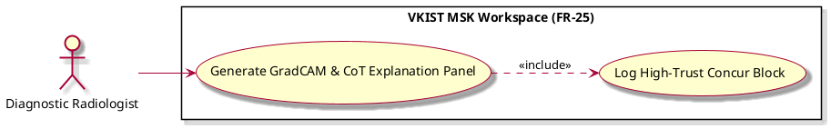
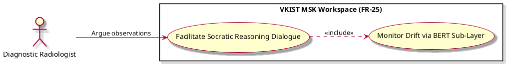
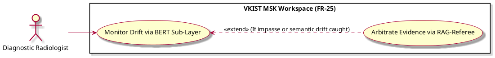
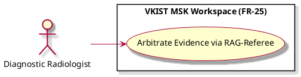
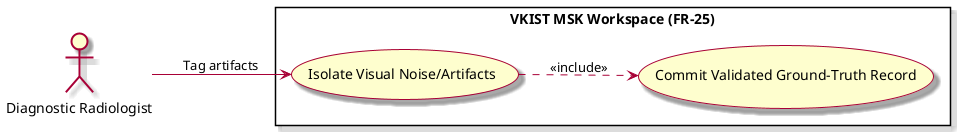
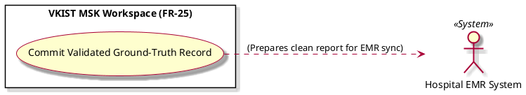
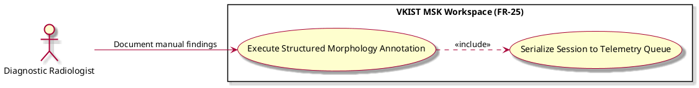
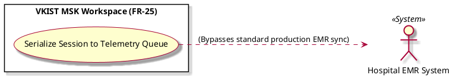

---

# PART 1: Core Viewing & Data Intake Pipelines

## 1. UC-48376: Load Patient Scan Session

### Notion Properties Input Panel

```text
* Name [Verb + Noun]: Load Patient Scan Session
* Actor: Diagnostic Radiologist (Rad), VKIST Vision Grader Engine (Grader)
* Goal: Ingest raw ultrasound frame arrays and initialize the diagnostic session state.
* Interaction: System-to-System / User-to-System
* Stimulus: User opens an unreviewed patient file, or the workspace catches an active DICOM stream hook.
* SysResponse: Confirmation that raw frame arrays are mapped, spatial calibrations are set, and the local session state is active.
* VerboseForm (Formula Reference View): "The use case 'Load Patient Scan Session' defines a User-to-System / System-to-System interaction where the Diagnostic Radiologist (Rad) and VKIST Vision Grader Engine (Grader) aim to Ingest raw ultrasound frame arrays and initialize the diagnostic session state. This workflow is triggered when User opens an unreviewed patient file, or the workspace catches an active DICOM stream hook, causing the system to respond by providing Confirmation that raw frame arrays are mapped, spatial calibrations are set, and the local session state is active."

```

### Page Body Content (`SpecificationWithDiagram`)

```markdown
# Use Case Deep-Dive: Load Patient Scan Session

## 1. Structural Preconditions & Postconditions
* **Preconditions:**
  * Local workspace application is authenticated and has secure socket access to the local image buffer.
  * DICOM/raw frame data payload is uncorrupted and readable.
* **Postconditions (Success State):**
  * Core frame parameters are loaded into memory with spatial scale calibrations preserved.
  * Background parsing pipeline registers the unique session hash and prepares the context matrix for downstream agents.

---

## 2. Interaction Scenarios (Step-by-Step Flow)

### Main Success Scenario (Happy Path)
1. **Diagnostic Radiologist** selects a patient case file from the workspace worklist interface.
2. **VKIST Vision Grader Engine** feeds raw ultrasound image tensors, spatial calibrations, and foundational frame telemetry metadata into the workspace memory layer.
3. **System** extracts pixel dimensions and constructs localized rendering viewports.
4. **System** includes `UC-25776` in the background to spin up explanation prompt matrices.
5. **System** displays the fully loaded image frame in the workspace canvas, preparing the viewport for immediate review.

### Alternative & Exception Flows
* **Exception Flow A: Corrupted Image Frame Payload**
  * At step [2], if the payload data fails format validation or structural check headers, the system halts execution, logs a data corruption fault code, and alerts the user with an "Unable to Parse Scan Session" dialog box.
* **Exception Flow B: Resolution / Calibration Mismatch**
  * At step [3], if spatial aspect ratios or metadata pixel matrices lack the standardized calibration tags required by the vision engine, the workspace falls back to a safe default scale flag and displays a non-blocking diagnostic accuracy warning icon.

---

## 3. PlantUML Visual Model
```plantuml
@startuml
left to right direction
skin rose

actor "Diagnostic Radiologist" as Rad
actor "VKIST Vision Grader Engine" as Grader << System >>

rectangle "VKIST MSK Workspace (FR-25)" {
    usecase "Load Patient Scan Session" as UC-48376
    usecase "Generate GradCAM & CoT Explanation Panel" as UC-25776
}

Rad --> UC-48376
Grader --> UC-48376
UC-48376 ..> UC-25776 : <<include>>
@enduml
```


---

## 2. UC-47988: Review Suggested Synovitis Grade (0-3)

### Notion Properties Input Panel
```text
* Name [Verb + Noun]: Review Suggested Synovitis Grade (0-3)
* Actor: Diagnostic Radiologist (Rad)
* Goal: Evaluate the ML engine's proposed synovitis classification and structural overlays.
* Interaction: User-to-System
* Stimulus: The workspace completes localized UI construction and displays the diagnostic panel.
* SysResponse: Display of classification metrics (Grades 0-3), color-coded overlays, and active risk-extension hooks.
* VerboseForm (Formula Reference View): "The use case 'Review Suggested Synovitis Grade (0-3)' defines a User-to-System interaction where the Diagnostic Radiologist (Rad) aims to Evaluate the ML engine's proposed synovitis classification and structural overlays. This workflow is triggered when The workspace completes localized UI construction and displays the diagnostic panel, causing the system to respond by providing Display of classification metrics (Grades 0-3), color-coded overlays, and active risk-extension hooks."

```

### Page Body Content (`SpecificationWithDiagram`)

```markdown
# Use Case Deep-Dive: Review Suggested Synovitis Grade (0-3)

## 1. Structural Preconditions & Postconditions
* **Preconditions:**
  * Image frames and raw ML prediction tensors (segmentation masks, classification weights) are fully loaded in memory via `UC-48376`.
* **Postconditions (Success State):**
  * System records human gaze/interaction initialization flags.
  * System keeps exception-based extend vectors armed (`UC-22159`, `UC-25637`, `UC-35956`).

---

## 2. Interaction Scenarios (Step-by-Step Flow)

### Main Success Scenario (Happy Path)
1. **System** presents the active ultrasound canvas with interactive, toggleable, color-coded segmentation mask overlays.
2. **System** displays the vision engine's suggested synovitis grading estimation (Grade 0, 1, 2, or 3) alongside structural pixel-percentage distribution metrics.
3. **Diagnostic Radiologist** inspects the spatial distribution of the synovial hypertrophy markers and reads the inline text panels.
4. **Diagnostic Radiologist** approves the visual data metrics without requesting alterations or triggering corrective dialogue paths.

### Alternative & Exception Flows
* **Extension Flow A: Clinician Friction / Disagreement Caught**
  * At step [3], if mouse click frequencies suggest hesitation or manual adjustments cross a conflict delta threshold, the execution path triggers `UC-22159` to prevent blind override errors.
* **Extension Flow B: Expert Contests Automated Grade**
  * At step [3], if the clinician explicitly changes the classification dropdown away from the ML-proposed score, the workspace extends to `UC-25637` to display the machine activation weights.
* **Extension Flow C: Anomaly / Confidence Failure Detected**
  * At step [1], if the deep-learning array returned a classification confidence metric below safety bounds paired with blank knowledge base lookups, the interface branches into `UC-35956`.

---

## 3. PlantUML Visual Model
```plantuml
@startuml
left to right direction
skin rose

actor "Diagnostic Radiologist" as Rad

rectangle "VKIST MSK Workspace (FR-25)" {
    usecase "Review Suggested Synovitis Grade (0-3)" as UC-47988
    usecase "Trigger Conversational Circuit Breaker" as UC-22159
    usecase "Expose Pixel-Level Activation Logic" as UC-25637
    usecase "Activate Clinical Investigation Mode" as UC-35956
}

Rad --> UC-47988
UC-47988 <.. UC-22159 : <<extend>>
UC-47988 <.. UC-25637 : <<extend>>
UC-47988 <.. UC-35956 : <<extend>>
@enduml
```


---

## 3. UC-92006: Finalize & Sign Electronic Record

### Notion Properties Input Panel
```text
* Name [Verb + Noun]: Finalize & Sign Electronic Record
* Actor: Diagnostic Radiologist (Rad), Hospital EMR System (EMR)
* Goal: Authenticate, cryptographically seal, and sync verified diagnostic reports down to storage infrastructure.
* Interaction: User-to-System / System-to-System
* Stimulus: User executes the final confirmation/signature command button in the workspace utility ribbon.
* SysResponse: Generation of a signed cryptographic log block and structured JSON transmission payload delivered to the EMR endpoint.
* VerboseForm (Formula Reference View): "The use case 'Finalize & Sign Electronic Record' defines a User-to-System / System-to-System interaction where the Diagnostic Radiologist (Rad) and Hospital EMR System (EMR) aim to Authenticate, cryptographically seal, and sync verified diagnostic reports down to storage infrastructure. This workflow is triggered when User executes the final confirmation/signature command button in the workspace utility ribbon, causing the system to respond by providing Generation of a signed cryptographic log block and structured JSON transmission payload delivered to the EMR endpoint."

```

### Page Body Content (`SpecificationWithDiagram`)

```markdown
# Use Case Deep-Dive: Finalize & Sign Electronic Record

## 1. Structural Preconditions & Postconditions
* **Preconditions:**
  * Active scan session evaluation has been resolved, and grading metrics are verified by the human specialist.
  * Local localized network channel to the hospital server framework is functional.
* **Postconditions (Success State):**
  * Session record is transformed into a read-only state.
  * Standardized structural JSON payload data is safely stored within the Hospital EMR System sink.

---

## 2. Interaction Scenarios (Step-by-Step Flow)

### Main Success Scenario (Happy Path)
1. **Diagnostic Radiologist** initiates the session finalization pipeline by interacting with the cryptographic signature command trigger.
2. **System** prompts for the secure authentication credentials of the signing specialist.
3. **System** generates a unified clinical log structure, packing structural thickness measurements (mm), final validated synovitis tier scores, and accompanying multi-agent trace logs.
4. **System** calculates a secure cryptographic data hash, locking the session record into an immutable post-review profile.
5. **System** delivers the structured data package across localized network pipes to the **Hospital EMR System**.
6. **Hospital EMR System** confirms safe database commit storage updates and provides an acknowledgment packet back to the workspace.

### Alternative & Exception Flows
* **Exception Flow A: Network Pipeline Transmission Failure**
  * At step [5], if network communications timeout or socket breaks occur, the workspace locks the finalized JSON package into a local encrypted offline buffer, changes the session status tag to "Pending Sync", and presents a clear connectivity warning alert.

---

## 3. PlantUML Visual Model
```plantuml
@startuml
left to right direction
skin rose

actor "Diagnostic Radiologist" as Rad
actor "Hospital EMR System" as EMR << System >>

rectangle "VKIST MSK Workspace (FR-25)" {
    usecase "Finalize & Sign Electronic Record" as UC-92006
}

Rad --> UC-92006
UC-92006 ..> EMR : Sync standardized structural JSON data
@enduml
```
---


# PART 2: Quadrant 1 — True Agreement Flows (AI Correct / Doctor Correct)

## 4. UC-25776: Generate GradCAM & CoT Explanation Panel

### Notion Properties Input Panel
```text
* Name [Verb + Noun]: Generate GradCAM & CoT Explanation Panel
* Actor: Diagnostic Radiologist (Rad)
* Goal: Present clear, pixel-linked visuospatial explanations and multi-modal clinical reasoning for high-trust verification.
* Interaction: User-to-System
* Stimulus: Inclusion trigger initialized during session data intake (`Load Patient Scan Session`).
* SysResponse: Renders heatmaps highlighting model focus zones alongside structured, clear reasoning steps.
* VerboseForm (Formula Reference View): "The use case 'Generate GradCAM & CoT Explanation Panel' defines a User-to-System interaction where the Diagnostic Radiologist (Rad) aims to Present clear, pixel-linked visuospatial explanations and multi-modal clinical reasoning for high-trust verification. This workflow is triggered when Inclusion trigger initialized during session data intake (`Load Patient Scan Session`), causing the system to respond by providing Renders heatmaps highlighting model focus zones alongside structured, clear reasoning steps."

```

### Page Body Content (`SpecificationWithDiagram`)

```markdown
# Use Case Deep-Dive: Generate GradCAM & CoT Explanation Panel

## 1. Structural Preconditions & Postconditions
* **Preconditions:**
  * Raw image frames and vision engine inference matrix weights have been imported via `Load Patient Scan Session`.
* **Postconditions (Success State):**
  * Split-screen layout displays visual explanation elements without adding visual noise to the core image frame workspace canvas.

---

## 2. Interaction Scenarios (Step-by-Step Flow)

### Main Success Scenario (Happy Path)
1. **System** evaluates the internal deep-learning model gradient parameters for the target ultrasound image slice.
2. **System** generates a visual GradCAM heatmap layer mapping feature locations that dictated model classifications (e.g., hypervascularized synovial proliferation zones).
3. **System** maps multi-modal prompt metrics through the internal LLM Explainer module to produce a concise, point-by-point clinical reasoning string.
4. **System** populates the split-screen workspace sub-section block with this explanation data to guide human inspection efficiently.
5. **System** includes `UC-02423` to serialize verification metadata.

---

## 3. PlantUML Visual Model


---

## 5. UC-02423: Log High-Trust Concur Block

### Notion Properties Input Panel
```text
* Name [Verb + Noun]: Log High-Trust Concur Block
* Actor: Hospital EMR System (EMR)
* Goal: Secure the human-AI alignment log trace within the final diagnostic report payload.
* Interaction: System-to-System
* Stimulus: Explanatory panel validation completes successfully without user override actions.
* SysResponse: Appends a tamper-evident audit trace block verifying explicit human-AI agreement into the session log cache.
* VerboseForm (Formula Reference View): "The use case 'Log High-Trust Concur Block' defines a System-to-System interaction where the Hospital EMR System (EMR) aims to Secure the human-AI alignment log trace within the final diagnostic report payload. This workflow is triggered when Explanatory panel validation completes successfully without user override actions, causing the system to respond by providing Appends a tamper-evident audit trace block verifying explicit human-AI agreement into the session log cache."

```

### Page Body Content (`SpecificationWithDiagram`)

```markdown
# Use Case Deep-Dive: Log High-Trust Concur Block

## 1. Structural Preconditions & Postconditions
* **Preconditions:**
  * Multi-modal explanations were fully generated (`UC-25776`) and passed without human alteration marks.
* **Postconditions (Success State):**
  * Explicit audit string trace tracking high-trust convergence is formatted for downstream pipeline compilation.

---

## 2. Interaction Scenarios (Step-by-Step Flow)

### Main Success Scenario (Happy Path)
1. **System** detects a direct consensus condition where the human expert confirms the model data without text/grading edits.
2. **System** serializes the multi-modal text breakdown and pixel attribution coordinates into an immutable log string block.
3. **System** assigns an explicit alignment token header flag (`HIGH_TRUST_CONCURRENCE`).
4. **System** caches this specialized tracking trace within the localized session state data, making it ready to be appended during final data hand-off routines (`UC-92006`).

---

## 3. PlantUML Visual Model
```plantuml
@startuml
left to right direction
skin rose

actor "Hospital EMR System" as EMR << System >>

rectangle "VKIST MSK Workspace (FR-25)" {
    usecase "Log High-Trust Concur Block" as UC-02423
}

UC-02423 ..> EMR : (Prepares payload for final sync)
@enduml

```

---

# PART 3: Quadrant 2 — Automation Override Risk Loops (AI Correct / Doctor Oversight)

## 6. UC-22159: Trigger Conversational Circuit Breaker

### Notion Properties Input Panel
```text
* Name [Verb + Noun]: Trigger Conversational Circuit Breaker
* Actor: Diagnostic Radiologist (Rad)
* Goal: Intercept premature finalization workflows if interface telemetry reveals friction, hesitation, or cognitive blind-spots.
* Interaction: User-to-System
* Stimulus: Extended extension trace caught during review steps if user behavior markers diverge from smooth consensus paths.
* SysResponse: Halts default workspace finalization routes and shifts the UI into a mandatory safety evaluation mode.
* VerboseForm (Formula Reference View): "The use case 'Trigger Conversational Circuit Breaker' defines a User-to-System interaction where the Diagnostic Radiologist (Rad) aims to Intercept premature finalization workflows if interface telemetry reveals friction, hesitation, or cognitive blind-spots. This workflow is triggered when Extended extension trace caught during review steps if user behavior markers diverge from smooth consensus paths, causing the system to respond by providing Halts default workspace finalization routes and shifts the UI into a mandatory safety evaluation mode."

```

### Page Body Content (`SpecificationWithDiagram`)

```markdown
# Use Case Deep-Dive: Trigger Conversational Circuit Breaker

## 1. Structural Preconditions & Postconditions
* **Preconditions:**
  * Active session is inside the `UC-47988` workflow phase.
  * UI layer telemetry captures specific friction indicators (e.g., high-frequency cursor oscillation, repeatedly typing and deleting text, or conflicting grading inputs).
* **Postconditions (Success State):**
  * Direct finalization path is securely locked down.
  * System-forced conversational validation interface is deployed into view.

---

## 2. Interaction Scenarios (Step-by-Step Flow)

### Main Success Scenario (Happy Path)
1. **System** evaluates live workspace telemetry tracking patterns during active case validation.
2. **System** detects user behavior triggers signaling high diagnostic friction or potential automatic oversight trends.
3. **System** blocks the immediate execution availability of the standard finalization command sequence (`UC-92006`).
4. **System** transforms workspace panel focus areas to present an interactive confirmation overlay.
5. **System** executes `UC-55146` to initialize direct safety check communications.

---

## 3. PlantUML Visual Model
```plantuml
@startuml
left to right direction
skin rose

actor "Diagnostic Radiologist" as Rad

rectangle "VKIST MSK Workspace (FR-25)" {
    usecase "Review Suggested Synovitis Grade (0-3)" as UC-47988
    usecase "Trigger Conversational Circuit Breaker" as UC_Core
    usecase "Facilitate Socratic Reasoning Dialogue" as UC_Sub
}

Rad --> UC-47988
UC-47988 <.. UC_Core : <<extend>> (If clinician friction detected)
UC_Core ..> UC_Sub : <<include>>
@enduml

```


---

## 7. UC-55146: Facilitate Socratic Reasoning Dialogue

### Notion Properties Input Panel
```text
* Name [Verb + Noun]: Facilitate Socratic Reasoning Dialogue
* Actor: Diagnostic Radiologist (Rad)
* Goal: Engage the specialist in a targeted, conversational double-check loop regarding controversial structural markers.
* Interaction: User-to-System
* Stimulus: Core execution request passed down by the active circuit breaker module (`UC-22159`).
* SysResponse: Interactive conversational sub-panel displaying focused prompt choices that check specific diagnostic criteria.
* VerboseForm (Formula Reference View): "The use case 'Facilitate Socratic Reasoning Dialogue' defines a User-to-System interaction where the Diagnostic Radiologist (Rad) aims to Engage the specialist in a targeted, conversational double-check loop regarding controversial structural markers. This workflow is triggered when Core execution request passed down by the active circuit breaker module (`UC-22159`), causing the system to respond by providing Interactive conversational sub-panel displaying focused prompt choices that check specific diagnostic criteria."

```

### Page Body Content (`SpecificationWithDiagram`)

```markdown
# Use Case Deep-Dive: Facilitate Socratic Reasoning Dialogue

## 1. Structural Preconditions & Postconditions
* **Preconditions:**
  * Circuit breaker safety intercept sequence has completed successfully, freezing generic CRUD paths.
* **Postconditions (Success State):**
  * User inputs conversational defense arguments or confirms specific anatomical findings.
  * Live conversation data tokens are actively streamed to automated safety monitors.

---

## 2. Interaction Scenarios (Step-by-Step Flow)

### Main Success Scenario (Happy Path)
1. **System** initializes a conversational chat element right next to the ultrasound display field.
2. **System** presents a non-confrontational, clinically grounded question regarding the identified discrepancies (e.g., *"Note the echo-free thickening layer in the suprapatellar recess; please confirm if this modification represents minor effusion or structural pannus tissue"*).
3. **Diagnostic Radiologist** enters text responses or selects structural tag tokens to clarify their assessment.
4. **System** includes `UC-74821` in real time to process active conversation token patterns.

---

## 3. PlantUML Visual Model



---

## 8. UC-74821: Monitor Drift via BERT Sub-Layer

### Notion Properties Input Panel
```text
* Name [Verb + Noun]: Monitor Drift via BERT Sub-Layer
* Actor: Diagnostic Radiologist (Rad)
* Goal: Continuously parse communication tokens to identify logical contradictions or semantic drift during clinical debates.
* Interaction: User-to-System
* Stimulus: Streamed entry of communication tokens within the active dialogue loop.
* SysResponse: Real-time semantic checking flags; extends out to the RAG referee if an impasse or severe drift is captured.
* VerboseForm (Formula Reference View): "The use case 'Monitor Drift via BERT Sub-Layer' defines a User-to-System interaction where the Diagnostic Radiologist (Rad) aims to Continuously parse communication tokens to identify logical contradictions or semantic drift during clinical debates. This workflow is triggered when Streamed entry of communication tokens within the active dialogue loop, causing the system to respond by providing Real-time semantic checking flags; extends out to the RAG referee if an impasse or severe drift is captured."

```

### Page Body Content (`SpecificationWithDiagram`)

```markdown
# Use Case Deep-Dive: Monitor Drift via BERT Sub-Layer

## 1. Structural Preconditions & Postconditions
* **Preconditions:**
  * Active conversational dialogue module is processing user data strings (`UC-55146`).
* **Postconditions (Success State):**
  * Log structures capture semantic alignment metrics.
  * System successfully catches contradictions before data parameters flow to final storage.

---

## 2. Interaction Scenarios (Step-by-Step Flow)

### Main Success Scenario (Happy Path)
1. **System** continuously intercepts conversation tokens as the human expert types input strings.
2. **System** runs token matrices through an embedded BERT checking model to calculate contextual semantic coherence scores.
3. **System** verifies that user claims line up logically with the visual indicators under review.
4. **System** approves the validated conversational step, allowing the specialist to complete the confirmation cycle smoothly.

### Alternative & Exception Flows
* **Extension Flow A: Impasse or Semantic Contradiction Detected**
  * At step [3], if the specialist's input text contradicts objective structural metrics (e.g., claiming a region is "completely normal" while the visual layer registers massive synovial proliferation) or exhibits context drift, the process branches into `UC-65473` to request evidence evaluation.

---

## 3. PlantUML Visual Model



---

## 9. UC-65473: Arbitrate Evidence via RAG-Referee

### Notion Properties Input Panel
```text
* Name [Verb + Noun]: Arbitrate Evidence via RAG-Referee
* Actor: Diagnostic Radiologist (Rad)
* Goal: Query static, authoritative clinical knowledge bases to resolve human-machine disagreements with objective evidence.
* Interaction: User-to-System
* Stimulus: Triggered when communication tracking scores cross a severe semantic mismatch or impasse threshold.
* SysResponse: Inline injection of un-biased diagnostic text extracts and guidelines matching the active frame conditions.
* VerboseForm (Formula Reference View): "The use case 'Arbitrate Evidence via RAG-Referee' defines a User-to-System interaction where the Diagnostic Radiologist (Rad) aims to Query static, authoritative clinical knowledge bases to resolve human-machine disagreements with objective evidence. This workflow is triggered when Triggered when communication tracking scores cross a severe semantic mismatch or impasse threshold, causing the system to respond by providing Inline injection of un-biased diagnostic text extracts and guidelines matching the active frame conditions."

```

### Page Body Content (`SpecificationWithDiagram`)

```markdown
# Use Case Deep-Dive: Arbitrate Evidence via RAG-Referee

## 1. Structural Preconditions & Postconditions
* **Preconditions:**
  * BERT analytics layers detect a diagnostic impasse or significant semantic drift.
  * Authoritative local clinical knowledge base index (e.g., OMERACT synovitis grading reference manuals) is online and responsive.
* **Postconditions (Success State):**
  * Disagreement matrix is resolved via verified medical data injection.
  * Final chosen path is linked directly to a standard medical guideline anchor.

---

## 2. Interaction Scenarios (Step-by-Step Flow)

### Main Success Scenario (Happy Path)
1. **System** halts active conversational dialogue inputs temporarily to execute a localized context search.
2. **System** extracts spatial measurements and text tokens to construct a specialized RAG search string.
3. **System** queries local, validated medical knowledge data banks to locate matching diagnostic criteria sections.
4. **System** displays the verified guideline text extract right inside the workspace alert view block (e.g., *"OMERACT standardizes Grade 2 as hypoechoic synovial hypertrophy demonstrating fluid-filled distension up to structural boundary bounds"*).
5. **Diagnostic Radiologist** reviews the authoritative reference framework and either adjusts their classification choice or submits a structured expert override justifying their deviation.

---

## 3. PlantUML Visual Model



---

# PART 4: Quadrant 3 — Clinician Subservience Risk Loops (AI Hallucinates / Doctor Correct)

## 10. UC-25637: Expose Pixel-Level Activation Logic

### Notion Properties Input Panel
```text
* Name [Verb + Noun]: Expose Pixel-Level Activation Logic
* Actor: Diagnostic Radiologist (Rad)
* Goal: Reveal fine-grained layer weights and activation responses when the human specialist challenges an automated grade prediction.
* Interaction: User-to-System
* Stimulus: Clinician manually alters or rejects the ML-proposed classification score in the review pane.
* SysResponse: Interactive visual mapping showing the exact high-frequency noise regions driving model prediction errors.
* VerboseForm (Formula Reference View): "The use case 'Expose Pixel-Level Activation Logic' defines a User-to-System interaction where the Diagnostic Radiologist (Rad) aims to Reveal fine-grained layer weights and activation responses when the human specialist challenges an automated grade prediction. This workflow is triggered when Clinician manually alters or rejects the ML-proposed classification score in the review pane, causing the system to respond by providing Interactive visual mapping showing the exact high-frequency noise regions driving model prediction errors."

```

### Page Body Content (`SpecificationWithDiagram`)

```markdown
# Use Case Deep-Dive: Expose Pixel-Level Activation Logic

## 1. Structural Preconditions & Postconditions
* **Preconditions:**
  * Active session is inside the `UC-47988` interface phase.
  * Specialist chooses an option that breaks clean model agreement paths.
* **Postconditions (Success State):**
  * Internal neural layer weight vectors are visually mapped onto the primary medical viewport.
  * Core manual artifact isolation tool sets become active on the canvas layout.

---

## 2. Interaction Scenarios (Step-by-Step Flow)

### Main Success Scenario (Happy Path)
1. **Diagnostic Radiologist** changes the system-suggested grade classification dropdown setting.
2. **System** captures the modification step and branches away from the standard review pathway to reveal underlying model mechanics.
3. **System** transforms image layers to display fine-grained activation weights, revealing exactly which pixel clusters (e.g., acoustic shadowing regions or bone interfaces) skewed the model's calculation.
4. **System** includes `UC-60739` to let the specialist manually clean up the noise zones.

---

## 3. PlantUML Visual Model
```plantuml
@startuml
left to right direction
skin rose

actor "Diagnostic Radiologist" as Rad

rectangle "VKIST MSK Workspace (FR-25)" {
    usecase "Review Suggested Synovitis Grade (0-3)" as UC-47988
    usecase "Expose Pixel-Level Activation Logic" as UC_Core
    usecase "Isolate Visual Noise/Artifacts" as UC_Sub
}

Rad --> UC-47988
UC-47988 <.. UC_Core : <<extend>> (If clinician contests AI score)
UC_Core ..> UC_Sub : <<include>>
@enduml


```

---

## 11. UC-60739: Isolate Visual Noise/Artifacts

### Notion Properties Input Panel
```text
* Name [Verb + Noun]: Isolate Visual Noise/Artifacts
* Actor: Diagnostic Radiologist (Rad)
* Goal: Provide manual brush and selection overlays to mask out acoustic shadows, bone scattering, or artifacts causing model calculation errors.
* Interaction: User-to-System
* Stimulus: Human operator activates canvas cleanup tools within the exposed model layer layout.
* SysResponse: Real-time visual updates to the pixel mask array, isolating clean anatomical structures from surrounding imaging noise.
* VerboseForm (Formula Reference View): "The use case 'Isolate Visual Noise/Artifacts' defines a User-to-System interaction where the Diagnostic Radiologist (Rad) aims to Provide manual brush and selection overlays to mask out acoustic shadows, bone scattering, or artifacts causing model calculation errors. This workflow is triggered when Human operator activates canvas cleanup tools within the exposed model layer layout, causing the system to respond by providing Real-time visual updates to the pixel mask array, isolating clean anatomical structures from surrounding imaging noise."

```

### Page Body Content (`SpecificationWithDiagram`)

```markdown
# Use Case Deep-Dive: Isolate Visual Noise/Artifacts

## 1. Structural Preconditions & Postconditions
* **Preconditions:**
  * System exposure arrays are visible across the image viewport layout (`UC-25637`).
* **Postconditions (Success State):**
  * Corrected ground-truth frame masks are calculated and locked into memory.
  * System updates local diagnostic metrics using the isolated anatomical data.

---

## 2. Interaction Scenarios (Step-by-Step Flow)

### Main Success Scenario (Happy Path)
1. **System** activates a manual canvas tool overlay, giving the user access to high-precision brush, eraser, and selection vectors.
2. **Diagnostic Radiologist** applies brush vectors directly over areas containing acoustic artifacts or non-synovial structures that skewed the automated classification score.
3. **System** recalculates active region dimensions in real time, excluding the masked pixels from the active grading parameters.
4. **System** updates diagnostic panel displays to confirm the human-corrected measurements.
5. **System** includes `UC-62864` to lock the updated session state securely.

---

## 3. PlantUML Visual Model



---

## 12. UC-62864: Commit Validated Ground-Truth Record

### Notion Properties Input Panel
```text
* Name [Verb + Noun]: Commit Validated Ground-Truth Record
* Actor: Hospital EMR System (EMR)
* Goal: Secure the human-corrected ground-truth dataset variant while appending clean, expert-validated report payloads to the EMR.
* Interaction: System-to-System
* Stimulus: Completion of manual artifact masking operations and confirmation of corrected metrics.
* SysResponse: Stores the corrected medical report in the EMR and saves the isolated image mask to an optimization cache for subsequent retraining.
* VerboseForm (Formula Reference View): "The use case 'Commit Validated Ground-Truth Record' defines a System-to-System interaction where the Hospital EMR System (EMR) aims to Secure the human-corrected ground-truth dataset variant while appending clean, expert-validated report payloads to the EMR. This workflow is triggered when Completion of manual artifact masking operations and confirmation of corrected metrics, causing the system to respond by providing Stores the corrected medical report in the EMR and saves the isolated image mask to an optimization cache for subsequent retraining."

```

### Page Body Content (`SpecificationWithDiagram`)

```markdown
# Use Case Deep-Dive: Commit Validated Ground-Truth Record

## 1. Structural Preconditions & Postconditions
* **Preconditions:**
  * Human-directed canvas modification steps are locked in place without remaining pixel parity errors (`UC-60739`).
* **Postconditions (Success State):**
  * EMR database updates receive the human expert's diagnostic findings.
  * Isolated ground-truth tensor pairs are safely cached for AI training refinement runs.

---

## 2. Interaction Scenarios (Step-by-Step Flow)

### Main Success Scenario (Happy Path)
1. **System** packages the human expert's corrected diagnostic data metrics into the primary transmission bundle.
2. **System** isolates the human-brushed image mask layers alongside the initial incorrect model classification output.
3. **System** tags the data pair as a validated retraining asset (`GROUND_TRUTH_OVERRIDE`).
4. **System** saves the optimization asset to a secure local retraining storage folder, while preparing the primary medical report for delivery to the **Hospital EMR System**.

---

## 3. PlantUML Visual Model


---

# PART 5: Quadrant 4 — Double Blind Failure Loops (AI Faulty / Doctor Biased)

## 13. UC-35956: Activate Clinical Investigation Mode

### Notion Properties Input Panel
```text
* Name [Verb + Noun]: Activate Clinical Investigation Mode
* Actor: Diagnostic Radiologist (Rad)
* Goal: Switch the system into a strict, template-driven manual examination mode when low vision confidence values align with a lack of reference data.
* Interaction: User-to-System
* Stimulus: The workspace detects a critical double-blind failure criteria match during the case evaluation phase.
* SysResponse: Disables automated diagnostic suggestions entirely and forces a standardized manual morphology review.
* VerboseForm (Formula Reference View): "The use case 'Activate Clinical Investigation Mode' defines a User-to-System interaction where the Diagnostic Radiologist (Rad) aims to Switch the system into a strict, template-driven manual examination mode when low vision confidence values align with a lack of reference data. This workflow is triggered when The workspace detects a critical double-blind failure criteria match during the case evaluation phase, causing the system to respond by providing Disables automated diagnostic suggestions entirely and forces a standardized manual morphology review."

```

### Page Body Content (`SpecificationWithDiagram`)

```markdown
# Use Case Deep-Dive: Activate Clinical Investigation Mode

## 1. Structural Preconditions & Postconditions
* **Preconditions:**
  * System classification loops return low-confidence indices.
  * Authoritative RAG reference lookups return no matches, indicating an unmapped anatomical variant or a severe image anomaly.
* **Postconditions (Success State):**
  * Automated suggestions are masked out to prevent cognitive bias.
  * Mandatory manual template verification frameworks are deployed into active workspace view.

---

## 2. Interaction Scenarios (Step-by-Step Flow)

### Main Success Scenario (Happy Path)
1. **System** monitors deep-learning inference score bounds during case evaluation.
2. **System** runs background reference data lookups and catches a dual failure state (Low confidence + Empty knowledge reference).
3. **System** drops the standard review interface layout to prevent automated suggestion bias or human misinterpretation loops.
4. **System** changes UI display focus markers to activate an explicit, template-driven investigation layout.
5. **System** includes `UC-47796` to force manual measurement entries.

---

## 3. PlantUML Visual Model
```plantuml
@startuml
left to right direction
skin rose

actor "Diagnostic Radiologist" as Rad

rectangle "VKIST MSK Workspace (FR-25)" {
    usecase "Review Suggested Synovitis Grade (0-3)" as UC-47988
    usecase "Activate Clinical Investigation Mode" as UC_Core
    usecase "Execute Structured Morphology Annotation" as UC_Sub
}

Rad --> UC-47988
UC-47988 <.. UC_Core : <<extend>> (If low confidence & empty RAG)
UC_Core ..> UC_Sub : <<include>>
@enduml

```


---

## 14. UC-47796: Execute Structured Morphology Annotation

### Notion Properties Input Panel
```text
* Name [Verb + Noun]: Execute Structured Morphology Annotation
* Actor: Diagnostic Radiologist (Rad)
* Goal: Force the manual plotting of anatomical coordinates and morphological anomalies using a strict, un-biased framework.
* Interaction: User-to-System
* Stimulus: The workspace forces a manual review layout via the active escalation workflow step.
* SysResponse: Interactive coordinate plotting arrays and mandatory clinical documentation input boxes.
* VerboseForm (Formula Reference View): "The use case 'Execute Structured Morphology Annotation' defines a User-to-System interaction where the Diagnostic Radiologist (Rad) aims to Force the manual plotting of anatomical coordinates and morphological anomalies using a strict, un-biased framework. This workflow is triggered when The workspace forces a manual review layout via the active escalation workflow step, causing the system to respond by providing Interactive coordinate plotting arrays and mandatory clinical documentation input boxes."

```

### Page Body Content (`SpecificationWithDiagram`)

```markdown
# Use Case Deep-Dive: Execute Structured Morphology Annotation

## 1. Structural Preconditions & Postconditions
* **Preconditions:**
  * System UI layer has transitioned to manual investigation mode parameters (`UC-35956`).
* **Postconditions (Success State):**
  * Specialist successfully plots manual structural bounds.
  * Text verification parameters capture explicit clinical observations.

---

## 2. Interaction Scenarios (Step-by-Step Flow)

### Main Success Scenario (Happy Path)
1. **System** displays an empty, un-biased ultrasound canvas frame alongside a series of mandatory measurement fields.
2. **Diagnostic Radiologist** plots coordinate points across the canvas layer to outline the boundaries of the anomalous tissue.
3. **Diagnostic Radiologist** manually populates text fields describing structural observations (e.g., bone fragments or atypical lesion shapes).
4. **System** compiles these manual coordinates and comments into a detailed case record.
5. **System** includes `UC-01580` to route the data directly to optimization pipelines.

---

## 3. PlantUML Visual Model



---

## 15. UC-01580: Serialize Session to Telemetry Queue

### Notion Properties Input Panel
```text
* Name [Verb + Noun]: Serialize Session to Telemetry Queue
* Actor: Hospital EMR System (EMR)
* Goal: Route anomalous case data directly to engineering telemetry streams while bypassing standard hospital records to protect clinical data pipes.
* Interaction: System-to-System
* Stimulus: Completion of manual morphology reporting arrays within the clinical investigation interface.
* SysResponse: Packages unencrypted image tensors, coordinate arrays, and user text blocks directly into core product telemetry queues.
* VerboseForm (Formula Reference View): "The use case 'Serialize Session to Telemetry Queue' defines a System-to-System interaction where the Hospital EMR System (EMR) aims to Route anomalous case data directly to engineering telemetry streams while bypassing standard hospital records to protect clinical data pipes. This workflow is triggered when Completion of manual morphology reporting arrays within the clinical investigation interface, causing the system to respond by providing Packages unencrypted image tensors, coordinate arrays, and user text blocks directly into core product telemetry queues."

```

### Page Body Content (`SpecificationWithDiagram`)

```markdown
# Use Case Deep-Dive: Serialize Session to Telemetry Queue

## 1. Structural Preconditions & Postconditions
* **Preconditions:**
  * Manual morphology plotting and clinical documentation inputs are finalized (`UC-47796`).
* **Postconditions (Success State):**
  * Case files containing structural anomalies bypass standard EMR storage pathways.
  * Raw image tensors are queued in engineering streams to expand future model capabilities.

---

## 2. Interaction Scenarios (Step-by-Step Flow)

### Main Success Scenario (Happy Path)
1. **System** identifies the active session as an anomalous anomaly case during final compilation.
2. **System** aggregates raw frame tensors, manual coordinate indices, and user-entered clinical commentary blocks into a secure telemetry archive package.
3. **System** bypasses standard EMR production database pipelines to protect standard hospital operational data.
4. **System** routes the telemetry package directly to the product engineering data pipeline for system optimization and future model training runs.

---

## 3. PlantUML Visual Model


---

