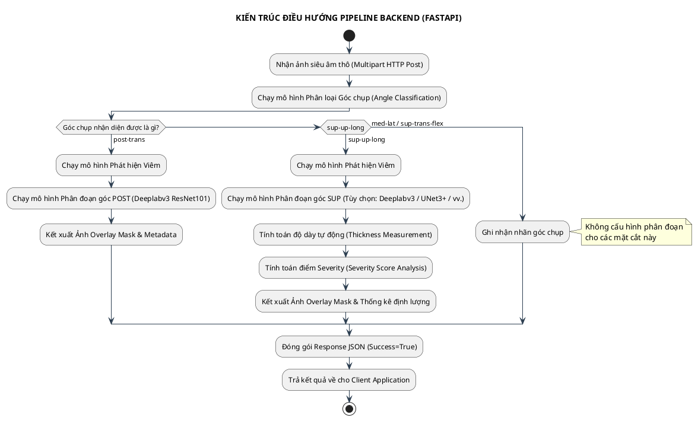

# KNEE ULTRASOUND ANALYSIS API: TÀI LIỆU KỸ THUẬT & HƯỚNG DẪN SỬ DỤNG

**Phiên bản:** 1.0 | **Ngày:** 03/2026 
**Framework:** FastAPI + PyTorch | **Python:** 3.10+ 

---

## 1. Tổng quan hệ thống

Knee Ultrasound Analysis API được xây dựng bằng FastAPI, chuyên phục vụ tác vụ phân tích ảnh siêu âm đầu gối. Hệ thống tích hợp nhiều mô hình Học máy sâu (Deep Learning) nhằm tự động hóa quy trình phân loại mặt cắt, phát hiện dấu hiệu viêm, phân đoạn cấu trúc giải phẫu và đo lường kích thước tổn thương định lượng.

### 1.1 Các chức năng chính

* **Phân loại góc chụp siêu âm (Angle Classification):** Tự động nhận dạng mặt cắt/góc chụp từ ảnh đầu vào bao gồm các nhãn: `med-lat`, `post-trans`, `sup-trans-flex`, và `sup-up-long`.

* **Phát hiện viêm (Inflammation Detection):** Xác định sự hiện diện của tình trạng viêm khớp gối qua hai góc chụp chính là `sup-up-long` và `post-trans`.

* **Phân đoạn ảnh ngữ nghĩa (Segmentation):** Tách biệt các cấu trúc giải phẫu đích (dịch khớp, gân, xương, màng hoạt dịch...) thành các phân vùng mặt nạ màu riêng biệt.

* **Đo độ dày tự động (Thickness Measurement):** Tự động tính toán khoảng cách hình học theo đơn vị milimét ($mm$) giữa các phân vùng mô mềm đã được phân đoạn (chỉ áp dụng đối với mặt cắt góc `sup-up-long`).

* **Đánh giá mức độ viêm (Severity Analysis):** Xếp hạng thang điểm mức độ nghiêm trọng của viêm từ cấp độ 0 (Rất nhẹ) đến cấp độ 3 (Nặng) dựa trên tỷ lệ diện tích dịch khớp và sự tăng sinh màng hoạt dịch.


### 1.2 Luồng xử lý dữ liệu tổng thể (Pipeline Processing)

Khi nhận tập tin ảnh từ máy trạm (Client), hệ thống sẽ thực hiện phân nhánh xử lý logic động dựa trên kết quả của khối phân loại góc chụp:

| Góc chụp phát hiện | Quy trình xử lý chi tiết trong Backend pipeline |
| --- | --- |
| **`post-trans`** | Phân loại góc $\rightarrow$ Phát hiện viêm $\rightarrow$ Phân đoạn ảnh POST $\rightarrow$ Trả kết quả JSON & Mask.|
| **`sup-up-long`** | Phân loại góc $\rightarrow$ Phát hiện viêm $\rightarrow$ Phân đoạn ảnh SUP $\rightarrow$ Đo độ dày mô $\rightarrow$ Đánh giá mức độ nặng $\rightarrow$ Trả kết quả.|
| **`med-lat`** or **`sup-trans-flex`** | Chỉ thực hiện phân loại góc $\rightarrow$ Trả kết quả trực tiếp (Bỏ qua nhánh phân đoạn & đo lường).|



---

## 2. Hướng dẫn cài đặt & Triển khai môi trường

### 2.1 Yêu cầu hệ thống tối thiểu

| Thành phần cấu phần | Thông số kỹ thuật yêu cầu tối thiểu |
| --- | --- |
| **Hệ điều hành** | Ubuntu 20.04+ / Windows 10+ / macOS 12+ |
| **Môi trường Python** | Phiên bản 3.10 cố định |
| **Bộ nhớ RAM** | 16 GB trở lên |
| **Bộ xử lý đồ họa (GPU)** | NVIDIA GPU hỗ trợ nền tảng CUDA 12.4 (Khuyến nghị để tối ưu tốc độ) |
| **Dung lượng VRAM** | Tối thiểu 8 GB (Khuyến nghị 16 GB nếu chạy song song đồng thời nhiều mô hình)|
| **Ổ cứng lưu trữ** | Tối thiểu 15 GB dung lượng trống (Dành cho bộ cài đặt và file weights `.pth`) |
| **Bộ công cụ bổ trợ** | CUDA Toolkit 12.4 & cuDNN 9.x tương thích tương ứng|

### 2.2 Khởi tạo môi trường ảo

Tải mã nguồn dự án từ kho lưu trữ Git:

```bash
git clone https://github.com/itvkist/vkist-ultrasound.git
cd vkist-ultrasound

```

Khuyến nghị thiết lập môi trường bằng **Conda** nhằm quản lý và cô lập các gói phụ thuộc:

```bash
conda create -n vkist-ultrasound python=3.10 -y
conda activate vkist-ultrasound

```

*Hoặc khởi tạo nhanh bằng mô-đun thư viện chuẩn `venv` nếu hệ thống chưa cài đặt Anaconda*:

```bash
# Trên nền tảng hệ điều hành Linux / macOS
python3.10 -m venv venv
source venv/bin/activate

# Trên nền tảng hệ điều hành Windows
venv\Scripts\activate

```

### 2.3 Cài đặt các gói thư viện phụ thuộc (Dependencies)

Thực hiện cài đặt các thư viện lõi quy định trong tệp cấu hình:

```bash
pip install -r requirements.txt

```

Trong trường hợp nhân của khung phần mềm PyTorch không nhận diện được phần cứng CUDA, tiến hành ghi đè cài đặt thủ công phiên bản biên dịch GPU:

```bash
pip install torch==2.5.0+cu124 torchvision==0.20.0+cu124 --index-url https://download.pytorch.org/whl/cu124

```

> ⚠️ **LƯU Ý QUAN TRỌNG VỀ PACKAGE NATTEN:**
> Dòng cấu hình cài đặt gói `natten==0.17.3+torch250cu124` mặc định đã bị gắn chú thích (`#` comment out) trong tệp `requirements.txt`. Nếu bạn sử dụng các kiến trúc mạng Transformer nâng cao yêu cầu gói này, bắt buộc cài đặt thủ công qua liên kết phân phối bánh xe (wheels) chính thức:
> `pip install natten==0.17.3+torch250cu124 -f https://shi-labs.com/natten/wheels/` 
> 
> 

### 2.4 Cấu trúc cây thư mục dự án chuẩn

Để đảm bảo hệ thống FastAPI khởi chạy chính xác và tự động nạp các tệp trọng số mô hình, cấu trúc cây thư mục dự án cần được sắp xếp như sau:

```text
project/
├── app.py                     # Trình khởi chạy máy chủ chính - FastAPI Server
├── requirements.txt           # Danh sách các gói thư viện phụ thuộc hệ thống
├── arch/                      # Thư mục mã nguồn chứa định nghĩa kiến trúc mạng Custom
│   ├── efficientfeedback.py   # Định nghĩa mạng EfficientFeedbackNetwork
│   └── unet3plus_att.py       # Định nghĩa mạng phân đoạn UNet3Plus_Attention
├── models/                    # Thư mục lưu trữ tệp trọng số nhị phân (.pth)
│   ├── best_convnext_tiny.pth
│   ├── best_densenet.pth
│   ├── best_resnet50.pth
│   ├── best_efficientnet_b2.pth
│   ├── best_swin_v2_s.pth
│   ├── efficientnet_b0_ultrasound_2_class.pth
│   ├── best_model_Deeplav3.pth
│   ├── unet_resnet101.pth
│   ├── efficientfeedback.pth
│   ├── unet3plus_att.pth
│   └── best_model_deeplabv3_resnet101_seed_16.pth
├── templates/                 # Các tài nguyên phục vụ giao diện Web tích hợp
│   ├── index.html
│   ├── css/
│   └── js/
├── uploads/                   # Thư mục lưu trữ tạm ảnh thô đầu vào (Tự động khởi tạo)
└── results/                   # Thư mục lưu trữ ảnh kết quả phân đoạn (Tự động khởi tạo)

```

### 2.5 Khởi động máy chủ dịch vụ

Thực thi lệnh chạy máy chủ tại thư mục gốc:

```bash
python app.py

```

**Mô phỏng nhật ký màn hình console khi máy chủ khởi chạy thành công:**

```độc_thoại
[INFO] Loading deep learning weights safely to memory...
[INFO] Device successfully mapped: cuda (NVIDIA GeForce RTX 4090)
[INFO] FastAPI Application core initialized.
[INFO] Uvicorn server running on http://localhost:8000 (Press CTRL+C to quit)

```

* **Giao diện Web UI kiểm thử trực quan:** `http://localhost:8000` 


* **Tài liệu API tương tác tự động (Swagger UI):** `http://localhost:8000/docs` 


---

## 3. Tài liệu đặc tả API (API Reference)

### 3.1 Trạng thái hoạt động (Health Check)

* **Endpoint:** `GET /api/health` 


* **Chức năng:** Kiểm tra tính sẵn sàng phục vụ của cụm dịch vụ API Backend.


* **Định dạng dữ liệu phản hồi (Response JSON):**
```json
{
  "status": "healthy"
}

```


### 3.2 Phân tích ảnh siêu âm chính - `POST /api/analyze`

Mã hóa dữ liệu đầu vào dưới dạng tệp tin `multipart/form-data` để gửi tới mạng mạng nơ-ron xử lý.

#### Các tham số yêu cầu (Request Parameters)

| Tham số cấu hình | Phương thức truyền | Kiểu dữ liệu | Giá trị mặc định | Định nghĩa chức năng chi tiết |
| --- | --- | --- | --- | --- |
| **`image`** | Multipart Form | Binary File | *Bắt buộc* | Tệp tin ảnh siêu âm đầu gối cần xử lý (Hỗ trợ mở rộng định dạng: `.jpg`, `.png`, `.bmp`).|
| **`angle_model`** | Query String | String | `convnext` | Tên định danh mô hình đảm nhận tác vụ phân loại góc chụp.|
| **`inflammation_model`** | Query String | String | `efficientnet_b0` | Mô hình phát hiện tình trạng viêm (Hiện tại cố định cấu hình mạng).|
| **`segment_model_sup`** | Query String | String | `deeplabv3` | Mô hình phân đoạn cấu trúc giải phẫu dành cho mặt cắt góc `sup-up-long`.|
| **`segment_model_post`** | Query String | String | `deeplabv3_resnet101` | Mô hình phân đoạn cấu trúc giải phẫu dành cho mặt cắt góc `post-trans`.|

#### Danh sách định danh mô hình khả dụng trong hệ thống

| Phân nhóm Task | Tên tham số truyền vào | Kiến trúc mạng nơ-ron gốc | Mô tả đặc tính đầu ra |
| --- | --- | --- | --- |
| **Phân loại Góc chụp** | `convnext` | ConvNeXt Tiny | Phân cấp phân loại ra 4 lớp nhãn đầu ra.|
|  | `densenet` | DenseNet-121 | Mạng kết nối dày đặc.|
|  | `resnet50` | ResNet-50 | Kiến trúc mạng dư thừa tiêu chuẩn.|
|  | `efficientnet_b2` | EfficientNet-B2 | Tối ưu hóa đa quy mô tài nguyên mạng.|
|  | `swin` | Swin Transformer V2-S | Kiến trúc Attention cửa sổ dịch chuyển.|
| **Phân đoạn góc SUP** | `deeplabv3` | DeepLabV3 ResNet-50 | Trích xuất đặc trưng đa tỷ lệ với 7 lớp đầu ra.|
|  | `unet_resnet101` | UNet + ResNet-101 | Kiến trúc Encoder-Decoder kết hợp ResNet.|
|  | `efficientfeedback` | EfficientFeedbackNetwork | Thiết kế tùy biến riêng có liên kết phản hồi dữ liệu.|
|  | `unet3plus` | UNet3+ with Attention | Cơ chế Attention kết hợp kết nối toàn diện Full-scale.|
| **Phân đoạn góc POST** | `deeplabv3_resnet101` | DeepLabV3 ResNet-101 | Cấu trúc chuyên sâu phân đoạn góc nhìn mặt sau.|

#### Cấu trúc dữ liệu JSON phản hồi (Response Body Schema)

```json
{
  "success": true,
  "filename": "d3b07384-d113-4ec8-a141-8664b07fb8d3.jpg",
  "images": {
    "original": "/uploads/d3b07384-d113-4ec8-a141-8664b07fb8d3.jpg",
    "segmented": "/results/seg_d3b07384-d113-4ec8-a141-8664b07fb8d3.jpg"
  },
  "models_used": {
    "angle_model": "convnext",
    "inflammation_model": "efficientnet_b0",
    "segmentation_model": "deeplabv3"
  },
  "angle": {
    "class": "sup-up-long",
    "confidence": 98.45
  },
  "inflammation": {
    "detected": true,
    "confidence": 94.20
  },
  "segmentation": {
    "angle_type": "sup",
    "classes_detected": ["background", "effusion", "fat", "femur", "synovium", "tendon"],
    "color_legend": {
      "background": [0, 0, 0],
      "effusion": [255, 0, 0],
      "synovium": [255, 0, 255]
    }
  },
  "measurement": {
    "thickness_mm": 6.87,
    "thickness_px": 100,
    "location_x": 256
  },
  "severity": {
    "level": 3,
    "severity": "Nặng",
    "combined_score": 18.4,
    "effusion": {
      "pixels": 25400,
      "ratio": 0.096,
      "thickness": 6.87
    },
    "synovium": {
      "pixels": 12500,
      "ratio": 0.047
    }
  }
}

```

#### Ví dụ mã triển khai gọi dịch vụ (Client Invocations)

* **Sử dụng lệnh Client cURL CLI:**

```bash
curl -X POST "http://localhost:8000/api/analyze?angle_model=convnext&segment_model_sup=deeplabv3" \
  -F "image=@/data/medical/knee_sample.jpg"

```

* **Triển khai ứng dụng gọi qua script Python (Requests):**

```python
import requests

url = "http://localhost:8000/api/analyze"
query_parameters = {
    "angle_model": "swin", 
    "segment_model_sup": "unet3plus"
}

target_image_path = "path/to/clinical_knee.jpg"
with open(target_image_path, "rb") as image_file:
    payload = {"image": image_file}
    api_response = requests.post(url, params=query_parameters, files=payload)
    
parsed_result = api_response.json()
print("Phân loại góc:", parsed_result["angle"]["class"])
print("Số liệu đo lường hình học:", parsed_result.get("measurement"))

```

---

## 4. Các thông số cấu hình lõi hệ thống

### 4.1 Hằng số hệ thống trong `app.py`

| Tên định danh hằng số | Giá trị mặc định | Diễn giải chức năng kỹ thuật |
| --- | --- | --- |
| `UPLOAD_FOLDER` | `'uploads'` | Đường dẫn cục bộ lưu trữ file ảnh thô nhận từ máy trạm.|
| `RESULTS_FOLDER` | `'results'` | Đường dẫn lưu ảnh màu sau phân đoạn (Color Mask Overlayed).|
| `TEMPLATES_FOLDER` | `'templates'` | Thư mục chứa mã nguồn giao diện phân tích Web UI.|
| `PIXEL_TO_MM` | $\frac{45.0}{655.0} \approx 0.0687$ | Hệ số chuyển đổi từ độ phân giải pixel sang kích thước thực tế ($mm$). Phụ thuộc cố định vào cấu hình đầu ra của phần cứng máy quét siêu âm.|
| `DEFAULT_MEASURE_IDS` | `[1, 5]` | Danh sách mảng chứa ID nhãn lớp cấu trúc giải phẫu kích hoạt thuật toán đo độ dày: `1 = effusion` (Dịch khớp), `5 = synovium` (Màng hoạt dịch).|
| `device` | `cuda` hoặc `cpu` | Khối phần cứng thực thi tính toán đồ họa (Tự động thiết lập dựa trên tính khả dụng của driver NVIDIA).|

### 4.2 Cấu hình Pipeline tiền xử lý và biến đổi ma trận ảnh (Transforms)

Hệ thống phân tách ảnh đầu vào thành các luồng biến đổi riêng biệt trước khi nạp vào tensor mô hình tùy thuộc vào mục tiêu xử lý chuyên biệt:

| Luồng xử lý Pipeline ảnh | Kích thước chuyển đổi (Resize) | Quy định chuẩn hóa phân phối ma trận (Normalization) |
| --- | --- | --- |
| **Phân loại góc & Phát hiện viêm** | <br>$224 \times 224$ pixel | Áp dụng phân phối phân cấp:<br> $\text{mean} = [0.485, 0.456, 0.406]$, <br> $\text{std} = [0.229, 0.224, 0.225]$ |
| **Phân đoạn cấu trúc (Segmentation)** | <br>$512 \times 512$ pixel | Không áp dụng chuẩn hóa phân phối (Chỉ thực thi hàm chuyển đổi tensor `ToTensor()`) |

---

## 5. Ràng buộc kỹ thuật & Quy tắc thiết kế hệ thống

### 5.1 Quản lý và giải phóng tài nguyên bộ nhớ GPU (VRAM Leak Warning)

Trong phiên bản hiện tại, logic xử lý nội tại của API kích hoạt các hàm `load_angle_model()`, `load_inflammation_model()`, và `load_segmentation_model_*()` trực tiếp bên trong vòng đời của mỗi phiên request nhận về. Hành vi này ép buộc GPU liên tục nạp lại dữ liệu tệp `.pth` vào VRAM cho mỗi giao dịch HTTP, sinh ra độ trễ (Overhead) I/O lớn và tiềm ẩn nguy cơ tràn bộ nhớ hệ thống. Khi triển khai môi trường Production, bắt buộc phải tái cấu trúc chuyển các hàm này thành Singleton dịch vụ (Tải một lần duy nhất lúc khởi động tiến trình Web Server).

### 5.2 Ràng buộc phi tuyến tính của tham số vật lý `PIXEL_TO_MM`

Hằng số quy đổi $\text{PIXEL\_TO\_MM} = \frac{45.0}{655.0}$ là một giá trị được cấu hình cứng (Hardcoded) trong mã nguồn, đặc trưng duy nhất cho một dòng máy siêu âm lâm sàng có tỷ lệ hiển thị $45mm$ tương đương với độ phân giải vùng quét $655\text{ px}$. Khi hệ thống thu thập ảnh siêu âm từ các thiết bị chuẩn đoán hình ảnh khác, hoặc thay đổi độ phân giải ảnh xuất ra, số liệu đo khoảng cách tổn thương sẽ sai lệch nghiêm trọng nếu hằng số này không được hiệu chuẩn lại thông qua ma trận nội quan của máy quét mới.

### 5.3 Quy tắc ánh xạ phân lớp (Class Remapping Matrix) đối với mô hình Custom

Hai mô hình tùy biến sâu phục vụ mặt cắt góc nhìn phía trên bánh chè (`UNet3+` và `EfficientFeedback Network`) được huấn luyện trên tập dữ liệu đặc thù sở hữu thứ tự cấu trúc mảng nhãn đầu ra lệch pha hoàn toàn so với kiến trúc phân cấp chuẩn của hệ thống. Để thống nhất dữ liệu trả về cho Client, khối Backend API thực hiện cơ chế tự động chuyển đổi chỉ mục mảng (Index Remapping) theo bảng đặc tả logic dưới đây:

| Chỉ mục Mô hình gốc (Output Model Index) | Chỉ mục chuẩn hóa hệ thống (Standard System Index) | Tên nhãn lớp giải phẫu tương ứng (Anatomical Label Class) |
| --- | --- | --- |
| `0` | `0` | **`background`** (Nền ảnh không chứa cấu trúc) |
| `1` | `2` | **`fat`** (Lớp mô mỡ dưới da) |
| `2` | `6` | **`tendon`** (Cấu trúc gân cơ) |
| `3` | `1` | **`effusion`** (Vùng tụ dịch khớp gối ổ viêm) |
| `4` | `4` | **`femur`** (Ranh giới cấu trúc xương đùi) |
| `5` | `5` | **`synovium`** (Màng hoạt dịch bao quanh khớp) |
| `6` | `3` | **`fat-pat`** (Tổ chức mỡ Hoffa) |

### 5.4 Cơ chế tự động dọn dẹp tập tin tồn đọng (Garbage Collection Task)

Các tập tin ảnh thô tải lên thư mục `uploads/` và ảnh xử lý nhị phân kết xuất lưu trong `results/` được ghi dưới dạng định danh chuỗi không trùng lặp UUID và lưu trữ vô thời hạn trên đĩa cứng hệ thống. Hệ thống lõi của ứng dụng không tích hợp cơ chế tự động giải phóng (Auto-deletion) các tệp cũ. Khi chạy vận hành dài hạn trong hệ thống y tế thực tế, bắt buộc phải cấu hình thêm Background Task (sử dụng thư viện Asyncio) hoặc thiết lập dịch vụ Cronjob của hệ điều hành để dọn dẹp định kỳ tránh cạn kiệt dung lượng ổ đĩa lưu trữ.

---

## 6. Giải pháp mở rộng tính năng mã nguồn (Backend Optimization Guide)

### 6.1 Tăng tốc độ phản hồi bằng Cơ chế Caching Mô hình Toàn cục

Thay thế kiến trúc nạp tải mô hình cũ bằng một kho lưu trữ Cache tĩnh trong bộ nhớ RAM, tối ưu hóa thời gian xử lý request từ mức giây xuống mức mili-giây:

```python
# Cấu hình biến lưu trữ toàn cục ở đầu tệp app.py
global_model_cache = {}

def get_cached_angle_model(selected_model_name: str):
    cache_lookup_key = f"angle_classification_{selected_model_name}"
    if cache_lookup_key not in global_model_cache:
        # Thực hiện nạp trọng số mô hình từ đĩa cứng lần đầu tiên
        global_model_cache[cache_lookup_key] = load_angle_model(selected_model_name)
    return global_model_cache[cache_lookup_key]

# Áp dụng logic tương tự cho get_inflammation_model(), get_seg_model_sup(), get_seg_model_post()

```

### 6.2 Thêm mới một kiến trúc phân loại góc chụp (Ví dụ: Vision Transformer - ViT)

Để tích hợp một mạng nơ-ron mới vào hệ thống xử lý, tuân thủ nghiêm ngặt quy trình 3 bước sau:

* **Bước 1:** Bổ sung khối xử lý điều kiện rẽ nhánh logic vào hàm khởi tạo mô hình `load_angle_model()`:

```python
elif model_name == 'vit':
    from torchvision.models import vit_b_16
    # Khởi tạo mạng mạng ViT không nạp trọng số mặc định ImageNet
    model = vit_b_16(weights=None)
    # Tái cấu trúc tầng phân loại tuyến tính cuối cùng tương thích với 4 lớp nhãn đầu gối
    model.heads[0] = nn.Linear(model.heads[0].in_features, 4)
    # Tải tệp trọng số huấn luyện cục bộ từ thư mục mô hình
    checkpoint_tensor = torch.load('models/best_vit_b16.pth', map_location=device, weights_only=False)
    model.load_state_dict(checkpoint_tensor)

```

* **Bước 2:** Di chuyển tệp trọng số huấn luyện nhị phân của mạng (`best_vit_b16.pth`) vào chính xác không gian lưu trữ của thư mục `/models/`.

* **Bước 3:** Ứng dụng phía Client có thể kích hoạt mạng mới bằng cách truyền giá trị định danh qua tham số URL: `/api/analyze?angle_model=vit`.


### 6.3 Xử lý luồng dữ liệu phân đoạn song song đồng thời (Batch Processing API)

Tối ưu hóa năng lực phục vụ của Server đối với bài toán nhận diện hàng loạt ảnh cùng lúc từ phòng khám bằng endpoint xử lý không đồng bộ:

```python
from fastapi import errors, status
from fastapi.responses import JSONResponse
from typing import List

@app.post('/api/analyze_batch', status_code=status.HTTP_200_OK)
async def analyze_batch_images(images: List[UploadFile] = File(...)):
    import asyncio
    
    # Đóng gói các tác vụ phân tích ảnh đơn lẻ vào một danh sách hàng đợi task không đồng bộ
    async_tasks_queue = [analyze_single_image_pipeline(img) for img in images]
    
    # Kích hoạt thực thi đồng thời trên luồng phần cứng thông qua gather cơ chế
    compiled_batch_results = await asyncio.gather(*async_tasks_queue)
    
    return JSONResponse({
        "results": compiled_batch_results,
        "processed_count": len(compiled_batch_results)
    })

```

### 6.4 Bản đóng gói container hóa ứng dụng (Production Dockerfile)

Đóng gói toàn bộ ML Stack bao gồm trình điều khiển GPU NVIDIA CUDA để triển khai đồng bộ trên các hạ tầng Cloud hoặc máy chủ On-Premise của bệnh viện:

```dockerfile
# Sử dụng Base Image chứa sẵn môi trường CUDA 12.4 và cuDNN 9 của NVIDIA
FROM nvidia/cuda:12.4.0-cudnn9-runtime-ubuntu22.04

# Cài đặt môi trường Python 3.10 và các gói hệ thống cốt lõi
RUN apt-get update && apt-get install -y \
    python3.10 \
    python3-pip \
    git \
    && rm -rf /var/lib/apt/lists/*

# Thiết lập không gian làm việc nội bộ bên trong container
WORKDIR /app

# Sao chép và cài đặt danh sách các thư viện Python
COPY requirements.txt .
RUN pip install --no-cache-dir -r requirements.txt

# Sao chép toàn bộ mã nguồn ứng dụng vào Container
COPY . .

# Lắng nghe và kích hoạt ứng dụng Web Server FastAPI
CMD ["python", "app.py"]

```

* **Lệnh khởi dựng Image hệ thống:** `docker build -t medical-api-service .` 

* **Lệnh kích hoạt Container chia sẻ tài nguyên phần cứng GPU vật lý:**

```bash
docker run --gpus all -p 8000:8000 -v $(pwd)/models:/app/models medical-api-service

```

### 6.5 Bộ chuyển đổi tiếp nhận trực tiếp luồng dữ liệu ảnh y tế chuẩn DICOM

Mở rộng chức năng cho phép hệ thống API đọc trực tiếp tệp tin ảnh gốc dạng `.dcm` trích xuất trực tiếp từ các thiết bị siêu âm chuẩn lâm sàng trong bệnh viện mà không cần qua bước chuyển đổi định dạng thủ công:

```python
import pydicom
from PIL import Image
import io

@app.post('/api/analyze_dicom')
async def analyze_dicom_file(file: UploadFile = File(...)):
    # Đọc luồng byte nhị phân trực tiếp từ tệp DICOM tải lên
    dicom_dataset = pydicom.dcmread(file.file)
    
    # Trích xuất ma trận pixel thô từ thẻ DICOM Pixel Data
    raw_pixel_array = dicom_dataset.pixel_array
    
    # Chuyển đổi ma trận mảng Numpy sang định dạng ảnh PIL tương thích với Pipeline biến đổi
    converted_image_pil = Image.fromarray(raw_pixel_array).convert('RGB')
    
    # Chuyển tiếp ảnh đã đổi định dạng vào luồng xử lý tự động nội bộ của API
    analysis_output_json = await execute_core_analysis_pipeline(converted_image_pil)
    return analysis_output_json

```

---

## Phụ lục: Đặc tả Dữ liệu định lượng lâm sàng

### Phụ lục A: Bảng phân định mã màu mặt nạ phân đoạn ngữ nghĩa (Color Map Legend)

1. Cấu trúc Mặt cắt mặt trên bánh chè - Góc SUP (`sup-up-long`) 

Góc SUP tập trung khoanh vùng các lớp mô mềm phía trước đầu gối phục vụ thuật toán tính toán độ dày dịch tụ.

| Từ khóa nhãn (Key) | Cấu trúc giải phẫu đích | Mã màu hiển thị (RGB) | Trực quan hóa màu sắc |
| --- | --- | --- | --- |
| `background` | Nền ảnh siêu âm | `[0, 0, 0]` | ⬛ Đen (Không chứa dữ liệu) |
| `effusion` | Vùng dịch khớp tụ ổ viêm | `[255, 0, 0]` | 🟥 Đỏ |
| `fat` | Tổ chức mô mỡ dưới da | `[255, 255, 0]` | 🟨 Vàng |
| `fat-pat` | Khối mỡ Hoffa | `[0, 255, 255]` | 🟦 Lam sáng |
| `femur` | Cấu trúc bề mặt xương đùi | `[0, 255, 0]` | 🟩 Xanh lá |
| `synovium` | Lớp màng hoạt dịch tăng sinh | `[255, 0, 255]` | 🟪 Tím |
| `tendon` | Vùng bó gân cơ | `[0, 0, 255]` | 🟦 Xanh dương |

> 🔄 **QUY TẮC CHUYỂN ĐỔI CHUYỂN GÓC (SUP $\rightarrow$ POST):**
> Khi hệ thống chuyển đổi trạng thái phân tích sang mặt cắt phía sau khớp gối (Góc `POST`), ma trận thuật toán phân đoạn sẽ tự động tái cấu trúc màu sắc ngữ nghĩa: Vùng tổn thương chứa **`effusion`** (màu đỏ) sẽ chuyển trạng thái biểu diễn thành **`baker's cyst`** (Kén Baker), và tổ chức cấu trúc vùng **`fat-pat`** (màu lam sáng) sẽ hoán đổi ý nghĩa thành vùng **`muscle`** (Cơ bắp vùng khoeo).
> 
> 

2. Cấu trúc Mặt cắt mặt sau vùng khoeo chân - Góc POST (`post-trans`) 

| Từ khóa nhãn (Key) | Cấu trúc giải phẫu đích | Mã màu hiển thị (RGB) | Trực quan hóa màu sắc |
| --- | --- | --- | --- |
| `background` | Nền ảnh siêu âm | `[0, 0, 0]` | ⬛ Đen |
| `baker's cyst` | Tổ chức kén hoạt dịch vùng khoeo (Baker) | `[255, 0, 0]` | 🟥 Đỏ |
| `fat` | Lớp mô mỡ | `[255, 255, 0]` | 🟨 Vàng |
| `muscle` | Các nhóm cơ bắp vùng sau gối | `[0, 255, 255]` | 🟦 Lam sáng |
| `femur` | Cấu trúc xương đùi sau | `[0, 255, 0]` | 🟩 Xanh lá |
| `synovium` | Màng hoạt dịch mặt sau | `[255, 0, 255]` | 🟪 Tím |
| `tendon` | Hệ thống gân cơ mặt sau | `[0, 0, 255]` | 🟦 Xanh dương |

---

### Phụ lục B: Thang điểm đánh giá mức độ nghiêm trọng của ổ viêm (Clinical Severity Score)

Hệ thống chấm điểm toán học tự động căn cứ trên trọng số diện tích và độ dày phân tách để đưa ra kết luận mức độ bệnh lý lâm sàng thông qua phương trình tuyến tính tổng hợp:

$$\text{combined\_score} = \text{effusion\_score} \times 0.6 + \text{synovium\_score} \times 0.4$$

Dựa trên kết quả giá trị của biến số $\text{combined\_score}$, hệ thống tự động phân cấp thành 4 ngưỡng trạng thái lâm sàng tương ứng:

* **Mức 0 - Rất nhẹ ($\text{score} < 3$):** Trạng thái ổ dịch khớp và cấu trúc màng hoạt dịch nằm hoàn toàn trong giới hạn sinh lý bình thường của cơ thể.
* **Mức 1 - Nhẹ ($\text{score}$ từ $3$ đến $7.9$):** Xuất hiện hiện tượng tụ dịch khớp lớp mỏng, màng hoạt dịch có dấu hiệu tăng sinh nhẹ cấu trúc màng.
* **Mức 2 - Trung bình ($\text{score}$ từ $8$ đến $15$):** Lượng dịch tụ khớp gối ở mức độ vừa phải, màng hoạt dịch bắt đầu phì đại và tăng sinh rõ nét.
* **Mức 3 - Nặng ($\text{score} > 15$):** Lớp tụ dịch khớp gối dày kích thước lớn, màng hoạt dịch tăng sinh phì đại mạnh, lan rộng diện tích cấu trúc giải phẫu xung quanh.