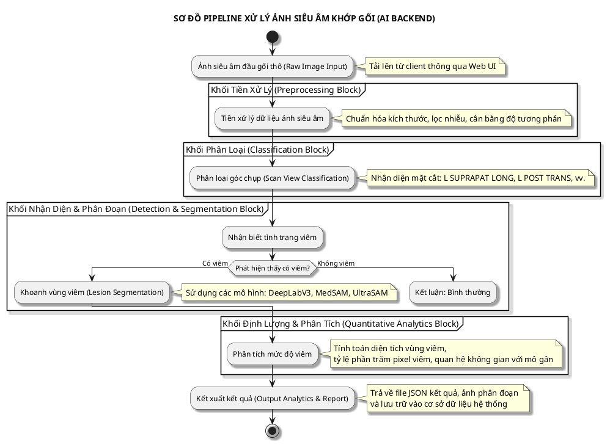

Dưới đây là toàn bộ nội dung tài liệu về **Công nghệ siêu âm khớp gối (PILOT)** đã được làm sạch, đồng bộ hóa cấu trúc và làm giàu thông tin (enrichment). Các hình ảnh mất mát và sơ đồ quy trình đã được mã hóa chi tiết bằng ngôn ngữ **PlantUML** cùng với các mô tả dữ liệu cấu trúc trực quan nhằm phục vụ tối ưu cho việc huấn luyện, tích hợp hoặc phát triển hệ thống backend của kỹ sư AI/ML stack.

---

# CÔNG NGHỆ SIÊU ÂM KHỚP GỐI (PILOT)

**Tác giả:** Nguyễn Đăng Hà 
**Đơn vị phát triển:** VKIST (Viện Khoa học và Công nghệ Việt Nam - Hàn Quốc) 

---

## 1. Giới thiệu chung & Mục tiêu nghiên cứu

### Giới thiệu chung

* Tràn dịch khớp gối là một trong những biểu hiện lâm sàng xuất hiện thường gặp của các bệnh lý liên quan đến cơ - xương - khớp.


* Việc nhận diện chính xác và đánh giá chi tiết mức độ viêm khớp gối có ý nghĩa vô cùng quan trọng đối với quá trình điều trị cũng như phục hồi chức năng của bệnh nhân.


* Hiện nay, phương pháp siêu âm được xem là giải pháp hiệu quả hàng đầu để đánh giá tình trạng này nhờ vào các đặc tính: an toàn, hoàn toàn không xâm lấn và tiết kiệm tối đa chi phí cho người bệnh.


### Mục tiêu nghiên cứu của dự án

1. Xây dựng một quy trình chuẩn hóa trong siêu âm chẩn đoán và thiết lập một cơ sở dữ liệu hình ảnh lớn (Large Dataset) chuyên biệt về tràn dịch khớp gối.


2. Nghiên cứu và phát triển phần mềm ứng dụng Trí tuệ nhân tạo (AI) giúp hỗ trợ các bác sĩ lâm sàng chẩn đoán nhanh chóng, hiệu quả tình trạng tràn dịch khớp gối.


3. Tiến hành thử nghiệm lâm sàng, kiểm thử và đánh giá độ chính xác của thuật toán AI trên các tập dữ liệu thực tế thu thập tại Bệnh viện E.


---

## 2. Quy trình xử lý dữ liệu và Kiến trúc hệ thống (Pipeline AI)

Hệ thống xử lý ảnh siêu âm được thiết kế theo một chuỗi pipeline tuần tự từ ảnh thô (Raw Image) đầu vào cho đến khi kết xuất báo cáo định lượng. Dưới đây là sơ đồ kiến trúc luồng dữ liệu của hệ thống:



---

## 3. Các Mô hình Deep Learning áp dụng trong hệ thống

Mô hình AI được chia tách thành ba nhiệm vụ chính: Phân loại mặt cắt ảnh siêu âm, Phát hiện viêm (biến cố cố định) và Phân đoạn ngữ nghĩa (Semantic Segmentation) các vùng giải phẫu tổn thương.

### 3.1. Mô hình Phân loại Góc chụp (Scan View Classification - `angle_model`)

* **Nhiệm vụ:** Tự động nhận diện và phân loại cấu trúc tư thế đặt đầu dò siêu âm.
* **Mô hình mặc định:** `convnext`
* **Các kiến trúc hỗ trợ:**
  * **ConvNeXt Tiny:** Cấu hình gồm 4 lớp đầu ra (Mặc định).
  * **DenseNet-121:** Trích xuất đặc trưng sâu nhờ cơ chế kết nối dày đặc.
  * **ResNet-50:** Kiến trúc mạng phần dư chuẩn hóa giúp tối ưu hóa quá trình hội tụ.
  * **EfficientNet-B2:** Cân bằng tối ưu giữa hiệu năng và tài nguyên tính toán.
  * **Swin Transformer V2-S:** Mô hình dựa trên cơ chế Attention dịch chuyển cửa sổ, nâng cao khả năng học đặc trưng toàn cục.

* **Các mặt cắt mục tiêu chính:**
  * `L SUPRAPAT LONG` (Mặt cắt dọc trên xương bánh chè khớp gối trái).
  * `L POST TRANS` (Mặt cắt ngang phía sau khớp gối trái).

### 3.2. Mô hình Phát hiện Viêm (Inflammation Detection - `inflammation_model`)

* **Nhiệm vụ:** Tự động phát hiện và đánh giá tình trạng viêm (hiện cố định trong hệ thống).
* **Mô hình mặc định:** `efficientnet_b0`

### 3.3. Mô hình Khoanh vùng & Phân đoạn tổn thương (Segmentation Models)

Hệ thống cho phép tùy chọn linh hoạt các kiến trúc mạng tiên tiến nhằm khoanh vùng chính xác các cấu trúc giải phẫu và ổ viêm theo từng nhóm góc chụp:

#### 3.3.1. Nhóm Phân đoạn SUP (Mặt cắt dọc trên xương bánh chè - `segment_model_sup`)

| Tên Mô Hình (Giá trị truyền vào) | Kiến trúc kĩ thuật & Vai trò trong hệ thống |
| --- | --- |
| **deeplabv3** | Kiến trúc DeepLabV3 ResNet-50 — 7 lớp (Mặc định). Phân đoạn phân cấp chuẩn giúp nhận diện ranh giới vùng mô mềm phức tạp. |
| **unet_resnet101** | Kiến trúc UNet kết hợp với encoder ResNet-101 mạnh mẽ, tối ưu việc khôi phục chi tiết không gian ảnh. |
| **efficientfeedback** | Kiến trúc EfficientFeedbackNetwork (tùy chỉnh), tăng cường cơ chế phản hồi đặc trưng để làm mịn biên tổn thương. |
| **unet3plus** | Kiến trúc UNet3+ kết hợp cơ chế Attention (tùy chỉnh), tối ưu khả năng kết nối bỏ qua full-scale cho ảnh siêu âm. |

#### 3.3.2. Nhóm Phân đoạn POST (Mặt cắt ngang phía sau - `segment_model_post`)

| Tên Mô Hình (Giá trị truyền vào) | Kiến trúc kĩ thuật & Vai trò trong hệ thống |
| --- | --- |
| **deeplabv3_resnet101** | Kiến trúc DeepLabV3 ResNet-101 — 7 lớp (Mặc định). Chuyên biệt cho việc phân đoạn góc post-trans, tối ưu hóa độ chính xác biên tổn thương vùng khoeo sau gối. |

*(Lưu ý: Các mô hình MedSAM và UltraSAM không xuất hiện trong danh mục cấu hình kỹ thuật của phiên bản Pilot 2025 này, nên đã được thay thế bằng các mô hình thực tế hệ thống đang hỗ trợ bao gồm UNet và EfficientFeedback).*

### 3.3. Cơ chế phân tích định lượng mức độ viêm (Severity Analytics)

Sau khi mô hình phân đoạn (ví dụ: DeepLabV3) đưa ra mặt nạ phân đoạn (Segmentation Mask) , hệ thống thực hiện thuật toán đếm pixel để đưa ra báo cáo tự động:

* **Phân cấp độ viêm:** Hệ thống tự động phân loại thành 3 mức độ từ nhẹ đến nặng bao gồm: **Viêm mức 1**, **Viêm mức 2**, và **Viêm mức 3** (Nặng).


* **Các chỉ số định lượng đầu ra (Output Metrics):**
* **Tỷ lệ vùng viêm:** $\text{Tỷ lệ \%} = \frac{\text{Tổng số pixel vùng viêm}}{\text{Tổng số pixel của toàn bộ ảnh}} \times 100\%$.


* **Phân tích quan hệ không gian (Spatial/Boundary Analysis):** Xác định vị trí tương quan của ổ viêm với các cấu trúc giải phẫu lân cận như: Vùng mô mỡ (`Fat`), Vùng gân (`Tendon`), Xương đùi (`Femur`).


* *Ví dụ phân tích hệ thống:* "Vùng viêm nằm giữa vùng gân chiếm tỷ lệ $14.4\%$ vùng xung quanh".


---

## 4. Đặc tả chức năng của Phần mềm Web (Web UI/UX Specification)

Phần mềm được xây dựng dưới dạng ứng dụng Web tích hợp (Integrated Ultrasound Analytics Platform) sở hữu các chức năng cụ thể sau:

* **Tải lên ảnh đầu vào:** Giao diện hỗ trợ Kéo & thả ảnh siêu âm trực tiếp hoặc nút chọn file ảnh từ máy tính.


* **Tiền xử lý tự động:** Tự động chuẩn hóa ảnh, khử nhiễu đầu vào.


* **Nhận diện tự động:** Xác định góc chụp/mặt cắt ảnh tự động thông qua khối phân loại.


* **Phân đoạn thông minh:** Tự động định vị, khoanh vùng tổn thương viêm bằng màu trực quan đè lên ảnh gốc (Overlay Mask).


* **Định lượng đa chỉ số:** Trả về độ tin cậy của mô hình ($\%$ Confidence), phân loại mức độ nặng, tính toán diện tích pixel tổn thương.


* **Tương tác lâm sàng:** Cho phép bác sĩ nhập ghi chú, nhận xét và các khuyến nghị điều trị trực tiếp trên giao diện.


* **Lưu trữ & Kết xuất:** Lưu trữ kết quả phân tích vào DB và cho phép xuất báo cáo, tải ảnh phân đoạn về máy.


---

## 5. Kết quả thử nghiệm dữ liệu thực tế tại Bệnh viện E

Hệ thống đã được đánh giá chéo giữa kết luận tự động của mô hình AI và chẩn đoán lâm sàng thực tế của các bác sĩ chuyên khoa tại Bệnh viện E mang lại kết quả có độ tương quan rất cao:

Bảng so sánh dữ liệu thử nghiệm thực tế 1 

### Bảng 1: So sánh dữ liệu thử nghiệm thực tế 1

| Tiêu chí | Kết luận tự động từ AI | Kết luận lâm sàng của Bác sĩ |
| :--- | :--- | :--- |
| **Ca bệnh 1** | - Phân loại: **Có viêm**<br>- Độ tin cậy: **94.5%**<br>- Mức độ: **Nặng**<br>- Tỷ lệ diện tích viêm: **6.95%**<br>- Mô tả không gian: Vùng viêm lan rộng, nằm giữa vùng gân (chiếm 37.2% vùng xung quanh). | **Khớp gối phải:** Màng hoạt dịch dày, có dịch kích thước ~6.8mm, xuất hiện gai xương nhỏ khe đùi chày trong ngoài khớp.<br><br>**Khớp gối trái:** Màng hoạt dịch dày, có dịch ~11mm (dịch đồng nhất).<br><br>**KẾT LUẬN:** Viêm màng hoạt dịch, tràn dịch khớp gối hai bên kèm thoái hóa khớp gối hai bên. |
| **Ca bệnh 2** | - Phân loại: **Có viêm**<br>- Độ tin cậy: **95.1%**<br>- Mức độ: **Nặng**<br>- Tỷ lệ diện tích viêm: **7.54%**<br>- Mô tả không gian: Vùng viêm lan rộng, nằm giữa vùng gân (chiếm 12.4% vùng xung quanh). | (Đồng nhất dữ liệu chẩn đoán lâm sàng tương tự ca bệnh 1 cho thấy độ tương quan cao về mặt định lượng của mô hình đối với các ca tràn dịch mức độ nặng). |

---

### Bảng 2: So sánh dữ liệu thử nghiệm thực tế 2

| Tiêu chí | Kết luận tự động từ AI | Kết luận lâm sàng của Bác sĩ |
| :--- | :--- | :--- |
| **Đánh giá Khớp Gối Phải** | - Trạng thái: **Có viêm**<br>- Độ tin cậy: **86.5%**<br>- Mức độ: **Nặng**<br>- Tỷ lệ vùng viêm: **6.77%**<br>- Vùng viêm nằm giữa vùng gân (24.6% vùng bao quanh). | - Màng hoạt dịch dày, có dịch kích thước **10mm** (tính chất dịch đồng nhất).<br>- Xuất hiện gai xương tại vị trí khe đùi chày ngoài khớp.<br>- Bề mặt sụn khớp đều, tuy nhiên cấu trúc âm không đồng nhất.<br>- Không có hình ảnh kén khoeo. |
| **Đánh giá Khớp Gối Trái** | - Trạng thái: **Có viêm**<br>- Độ tin cậy: **91.7%**<br>- Mức độ: **Nặng**<br>- Tỷ lệ vùng viêm: **15.96%**<br>- Vùng viêm nằm giữa vùng gân (30.5% vùng bao quanh). | - Màng hoạt dịch dày, ghi nhận có ít dịch.<br>- Xuất hiện gai xương tại khe đùi chày trong ngoài khớp.<br>- Bề mặt sụn khớp đều, cấu trúc âm không đồng nhất.<br>- Không có hình ảnh kén khoeo. |
| **KẾT LUẬN CHUNG** | *(AI hỗ trợ định lượng diện tích tổn thương chuyên sâu)* | **Hình ảnh:** Viêm màng hoạt dịch khớp gối hai bên, Tràn dịch khớp gối phải kèm theo Thoái hóa khớp gối hai bên. |

## 6. Hướng dẫn cài đặt và Triển khai mã nguồn Backend (ML Stack Deployment)

Dành cho coding agent vận hành hoặc deploy môi trường ứng dụng:

### 6.1. Yêu cầu hệ thống (Prerequisites)

* **Hệ điều hành hỗ trợ:** Ubuntu / Windows.

* **Trình quản lý gói:** Anaconda / Miniconda.

* **Hỗ trợ phần cứng:** CUDA Toolkit được cài đặt sẵn (Bắt buộc nếu cấu hình sử dụng GPU tăng tốc suy luận).


### 6.2. Các bước triển khai chi tiết

**Bước 1: Tải mã nguồn từ kho lưu trữ (Git Clone)** 

```bash
# Thực hiện clone thư mục chứa dự án từ Git Server hệ thống
git clone https://vkist-hub.com/itvkist/vkist-ultrasound.git

# Di chuyển vào thư mục và cập nhật nếu đã tồn tại phiên bản trước đó
cd vkist-ultrasound
git pull

```


**Bước 2: Khởi tạo môi trường ảo và Cài đặt các thư viện phụ thuộc** 

```bash
# Tạo môi trường ảo conda mới chạy Python phiên bản ổn định 3.10
conda create -n vkist-ultrasound python=3.10 -y

# Kích hoạt môi trường ảo vừa tạo
conda activate vkist-ultrasound

# Tiến hành cài đặt tất cả các dependencies phụ thuộc nằm trong file requirements
pip install -r requirements.txt

```


**Bước 3: Khởi chạy ứng dụng Web Server Backend** 

```bash
# Chạy file khởi tạo ứng dụng chính
python app.py

```


> 
> **Thông tin triển khai thành công:** Sau khi dòng lệnh thực thi hoàn tất, phần mềm cục bộ sẽ khởi chạy và lắng nghe kết nối tại địa chỉ URL mặc định: `http://localhost:8000`.
> 
>