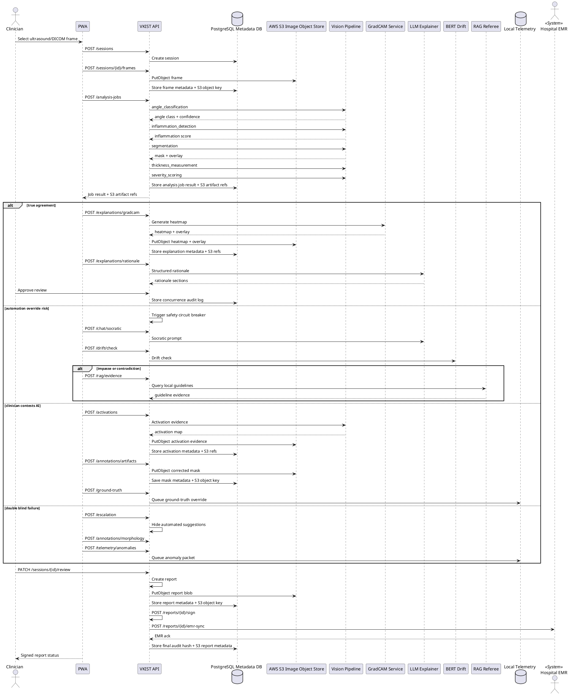

# VKIST MSK API Contract Draft

**Scope:** API design for VKIST knee ultrasound analysis backend and FR-25 Synovitis Grading Workspace.  
**Target stack:** FastAPI + PyTorch + local ML services + AWS S3 image object store. Optional local LLM/RAG/BERT services for FR-25 safety workflows.  
**Draft version:** 0.2.1.  
**Source inputs:**
- `PROJECT_VIS.md`
- `FR_25_UC_SPEC.md`
- `CONTEXT_FR_25_UC_ELIT.md`
- `UseCase/full_usecase_planuml.md`
- `Instruction_Manunal_API_Doc_Setup_pilot.md`

---

## 1. API Goals

The API must support two boundary layers:

1. **Clinical workflow API:** load scan sessions, run vision analysis, review results, sign reports, sync to EMR, and submit feedback.
2. **Internal/local safety API:** GradCAM, structured rationale, Socratic dialogue, BERT drift checks, RAG evidence arbitration, activation exposure, artifact isolation, escalation, morphology annotation, and anomaly telemetry.

Primary API consumers:

| Consumer | Use |
| --- | --- |
| PWA Frontend | Upload ultrasound/DICOM frame, display analysis result, request GradCAM/explanations, run review and safety workflows. |
| Vision ML Pipeline | Run angle classification, inflammation detection, segmentation, measurement, severity scoring, GradCAM, and activation evidence. |
| Local LLM/RAG/BERT Services | Generate structured rationale, Socratic prompts, drift checks, and guideline evidence. |
| Hospital EMR | Receive finalized signed report payload after clinician validation. |
| Engineering Telemetry | Receive anonymized disagreement, ground-truth override, and anomaly cases for model improvement. |

---

## 2. Design Principles

1. **Health data first:** No PHI in query strings, filenames, logs, telemetry, or artifact paths.
2. **Deterministic contracts:** Every endpoint returns stable JSON shapes.
3. **Human-in-the-loop:** ML output is never treated as final diagnosis without clinician confirmation.
4. **Auditability:** Every analysis result gets `session_id`, `job_id`, model versions, decision status, and audit hash.
5. **Privacy boundary:** Sensitive files and payloads must be scrubbed before storage, export, or telemetry.
6. **Extensible ML routing:** Model names are versioned and validated through a registry, not arbitrary strings.
7. **Workflow boundary over model coupling:** Split endpoints by clinical capability, not by model architecture.
8. **Internal safety stack:** LLM Explainer, BERT Hallucination Detector, and RAG-Referee are internal/local FR-25 subsystems, not generic public API services.
9. **Async-ready pipeline:** Analysis jobs expose step status for partial results, retries, UI progress, and safety branching.
10. **Object-store image persistence:** Clinical image data and image-derived artifacts shall be persisted on AWS S3. PostgreSQL stores only object keys, checksums, metadata, and audit references.
11. **DICOM-ready ingestion:** Accept DICOM/raw ultrasound frame metadata where available, while retaining image upload support for PoC.

---

## 3. API Layering

### 3.1 Public clinical endpoints

These endpoints are intended for the PWA/backend clinical workflow.

```text
GET  /api/v1/health
GET  /api/v1/model-registry

POST /api/v1/sessions
GET  /api/v1/sessions/{session_id}
POST /api/v1/sessions/{session_id}/frames

POST /api/v1/analysis-jobs
GET  /api/v1/analysis-jobs/{job_id}
GET  /api/v1/analysis-jobs/{job_id}/steps

PATCH /api/v1/sessions/{session_id}/review

POST /api/v1/reports
POST /api/v1/reports/{report_id}/sign
POST /api/v1/reports/{report_id}/emr-sync

POST /api/v1/feedback
```

### 3.2 Internal/local safety endpoints

These endpoints are intended for local workspace use only. They must require local deployment auth and must not be exposed as generic public services.

```text
POST /api/v1/sessions/{session_id}/explanations/gradcam
POST /api/v1/sessions/{session_id}/explanations/rationale

POST /api/v1/sessions/{session_id}/safety/circuit-breaker
POST /api/v1/sessions/{session_id}/chat/socratic
POST /api/v1/sessions/{session_id}/drift/check
POST /api/v1/sessions/{session_id}/rag/evidence

POST /api/v1/sessions/{session_id}/activations
POST /api/v1/sessions/{session_id}/annotations/artifacts
POST /api/v1/sessions/{session_id}/ground-truth

POST /api/v1/sessions/{session_id}/escalation
POST /api/v1/sessions/{session_id}/annotations/morphology
POST /api/v1/sessions/{session_id}/telemetry/anomalies
```

### 3.3 Image/Object Storage Contract

Clinical image data shall be persisted on an **AWS S3 bucket**. API responses may expose `asset_ref` values as S3 URIs or short-lived signed URLs generated by FastAPI.

Contract rules:
1. `POST /api/v1/sessions/{session_id}/frames` writes accepted image payloads to AWS S3.
2. PostgreSQL stores only `session_id`, `frame_id`, `object_key`, `content_hash`, `content_type`, `byte_size`, `created_at`, and audit metadata.
3. Image-derived artifacts, including masks, overlays, GradCAM heatmaps, activation evidence, and finalized report blobs, are persisted under the same S3 image object store.
4. Object keys must use opaque session/frame IDs only. No raw patient identifiers, names, or PHI in S3 keys.
5. Clients must retrieve sensitive artifacts through controlled API endpoints or short-lived signed URLs, not direct bucket credentials.

### 3.4 PoC compatibility endpoint

```text
POST /api/v1/analysis
```

`POST /api/v1/analysis` may remain as a synchronous wrapper around `POST /api/v1/analysis-jobs` for PoC compatibility. Production workflow should prefer async job endpoints.

---

## 4. Versioning

Use path-based versioning.

```text
/api/v1/health
/api/v1/model-registry
/api/v1/sessions
/api/v1/analysis-jobs
/api/v1/reports
/api/v1/feedback
```

Reason: easier to keep PoC endpoints stable while adding clinical workflow, safety, and EMR endpoints.

---

## 5. Core Endpoint Contracts

### 5.1 Health Check

```http
GET /api/v1/health
```

Purpose: verify API availability and optional dependency readiness.

Response:

```json
{
  "status": "healthy",
  "version": "0.2.1",
  "service": "vkist-msk-api",
  "dependencies": {
    "pytorch": "available",
    "model_cache": "ready",
    "vision_models": "ready",
    "gradcam_service": "ready",
    "llm_explainer": "ready",
    "bert_drift_detector": "ready",
    "rag_referee": "ready",
    "s3_image_store": "ready",
    "emr_sync": "unavailable"
  }
}
```

Status codes:

| Code | Meaning |
| --- | --- |
| 200 | API ready. |
| 503 | API running but one or more dependencies not ready. |

---

### 5.2 Model Registry

```http
GET /api/v1/model-registry
```

Purpose: expose approved model names, versions, tasks, input/output contracts, and defaults.

Response:

```json
{
  "models": [
    {
      "task": "angle_classification",
      "name": "convnext",
      "version": "2026.06.1",
      "default": true,
      "input_spec": {
        "resize": [224, 224],
        "normalization": "imagenet"
      },
      "output_classes": ["med-lat", "post-trans", "sup-trans-flex", "sup-up-long"]
    },
    {
      "task": "inflammation_detection",
      "name": "efficientnet_b0",
      "version": "2026.06.1",
      "default": true,
      "input_spec": {
        "resize": [224, 224],
        "normalization": "imagenet"
      },
      "output_classes": ["not_detected", "detected"]
    },
    {
      "task": "segmentation_sup",
      "name": "deeplabv3",
      "version": "2026.06.1",
      "default": true,
      "input_spec": {
        "resize": [512, 512],
        "normalization": "tensor_only"
      },
      "output_classes": ["background", "effusion", "fat", "femur", "synovium", "tendon"]
    },
    {
      "task": "segmentation_post",
      "name": "deeplabv3_resnet101",
      "version": "2026.06.1",
      "default": true,
      "input_spec": {
        "resize": [512, 512],
        "normalization": "tensor_only"
      },
      "output_classes": ["background", "effusion", "fat", "femur", "synovium", "tendon"]
    }
  ]
}
```

Status codes:

| Code | Meaning |
| --- | --- |
| 200 | Registry available. |
| 503 | Registry/model cache unavailable. |

---

### 5.3 Create Session

```http
POST /api/v1/sessions
```

Purpose: initialize a structured clinical review session.

Request:

```json
{
  "patient_session_hash": "sha256_...",
  "source_modality": "ultrasound",
  "scan_angle": "unknown",
  "calibration": {
    "pixel_to_mm": 0.0687,
    "pixel_spacing_mm": {
      "x": 0.0687,
      "y": 0.0687
    },
    "device_id_hash": "sha256_..."
  },
  "metadata": {
    "acquisition_time": "2026-06-12T07:50:00Z",
    "operator_id_hash": "sha256_..."
  }
}
```

Response:

```json
{
  "session_id": "0197d4d2-0b9b-7d6d-9b5c-9e8f4a0f9d13",
  "status": "active",
  "created_at": "2026-06-12T07:52:15Z",
  "calibration_status": "provided"
}
```

Status codes:

| Code | Meaning |
| --- | --- |
| 201 | Session created. |
| 400 | Invalid session hash, modality, or calibration. |
| 422 | Validation error. |

---

### 5.4 Get Session

```http
GET /api/v1/sessions/{session_id}
```

Purpose: retrieve session state, frame references, latest job status, review status, and report status.

Response:

```json
{
  "session_id": "0197d4d2-0b9b-7d6d-9b5c-9e8f4a0f9d13",
  "status": "active",
  "frames": [
    {
      "frame_id": "frm_0197d4d2_001",
      "source_modality": "ultrasound",
      "asset_ref": "s3://vkist-clinical-images/sessions/0197d4d2/frames/frm_001.dcm",
      "object_key": "sessions/0197d4d2/frames/frm_001.dcm",
      "content_hash": "sha256_...",
      "calibration_status": "provided"
    }
  ],
  "latest_job_id": "job_0197d4d2",
  "review_status": "needs_clinician_review",
  "report_status": "not_created"
}
```

---

### 5.5 Upload Frame

```http
POST /api/v1/sessions/{session_id}/frames
Content-Type: multipart/form-data
```

Purpose: attach one DICOM/raw ultrasound frame or anonymized image to a session.

Request fields:

| Field | Location | Required | Type | Notes |
| --- | --- | --- | --- | --- |
| `frame` | form | Yes | File | DICOM, JPEG, PNG, BMP. Must be anonymized before upload. Persisted to AWS S3 as image object; PostgreSQL stores object key and checksum. |
| `frame_index` | form | No | integer | Sequence index for multi-frame studies. |
| `source_modality` | form | No | enum | `dicom`, `ultrasound_image`. |
| `pixel_to_mm` | form | No | number | Calibration factor. Required for reliable measurement. |
| `device_id_hash` | form | No | string | Hashed device identifier. |
| `content_hash` | form | No | string | Optional client-side SHA-256 used for post-upload integrity verification. |

Response:

```json
{
  "frame_id": "frm_0197d4d2_001",
  "session_id": "0197d4d2-0b9b-7d6d-9b5c-9e8f4a0f9d13",
  "asset_ref": "s3://vkist-clinical-images/sessions/0197d4d2/frames/frm_001.dcm",
  "object_key": "sessions/0197d4d2/frames/frm_001.dcm",
  "content_hash": "sha256_...",
  "content_type": "application/dicom",
  "byte_size": 2048000,
  "calibration_status": "provided",
  "status": "ready_for_analysis"
}
```

Status codes:

| Code | Meaning |
| --- | --- |
| 201 | Frame attached. |
| 400 | Invalid file, unsupported modality, missing calibration. |
| 413 | File too large. |
| 409 | Checksum mismatch or asset already exists. |
| 422 | Validation error. |

---

### 5.6 Create Analysis Job

```http
POST /api/v1/analysis-jobs
```

Purpose: start the current FR-25 vision pipeline for one frame/session.

Request:

```json
{
  "session_id": "0197d4d2-0b9b-7d6d-9b5c-9e8f4a0f9d13",
  "frame_id": "frm_0197d4d2_001",
  "pipeline": {
    "angle_model": "convnext",
    "inflammation_model": "efficientnet_b0",
    "segmentation_model_sup": "deeplabv3",
    "segmentation_model_post": "deeplabv3_resnet101",
    "include_gradcam": false,
    "include_activation_evidence": false
  },
  "calibration": {
    "pixel_to_mm": 0.0687
  }
}
```

Response:

```json
{
  "job_id": "job_0197d4d2",
  "session_id": "0197d4d2-0b9b-7d6d-9b5c-9e8f4a0f9d13",
  "frame_id": "frm_0197d4d2_001",
  "status": "queued",
  "created_at": "2026-06-12T07:52:16Z",
  "trace_id": "trace_20260612_0001"
}
```

Status codes:

| Code | Meaning |
| --- | --- |
| 202 | Job accepted. |
| 400 | Invalid frame, unsupported model, missing calibration. |
| 409 | Session/frame not ready. |
| 422 | Validation error. |
| 429 | Too many concurrent analyses. |
| 503 | Required model dependency unavailable. |

---

### 5.7 Get Analysis Job

```http
GET /api/v1/analysis-jobs/{job_id}
```

Purpose: retrieve final or current job state.

Response:

```json
{
  "job_id": "job_0197d4d2",
  "session_id": "0197d4d2-0b9b-7d6d-9b5c-9e8f4a0f9d13",
  "frame_id": "frm_0197d4d2_001",
  "status": "completed",
  "trace_id": "trace_20260612_0001",
  "result": {
    "angle": {
      "class": "sup-up-long",
      "confidence": 0.9845
    },
    "inflammation": {
      "detected": true,
      "confidence": 0.942
    },
    "segmentation": {
      "angle_type": "sup",
      "classes_detected": ["background", "effusion", "fat", "femur", "synovium", "tendon"],
      "mask_ref": "s3://vkist-clinical-images/sessions/0197d4d2/masks/seg_001.png",
      "mask_object_key": "sessions/0197d4d2/masks/seg_001.png",
      "mask_hash": "sha256_...",
      "overlay_ref": "s3://vkist-clinical-images/sessions/0197d4d2/overlays/overlay_001.png",
      "overlay_object_key": "sessions/0197d4d2/overlays/overlay_001.png",
      "overlay_hash": "sha256_...",
      "color_legend": {
        "background": [0, 0, 0],
        "effusion": [255, 0, 0],
        "fat": [255, 255, 0],
        "fat-pat": [0, 255, 255],
        "femur": [0, 255, 0],
        "synovium": [255, 0, 255],
        "tendon": [0, 0, 255]
      }
    },
    "measurement": {
      "thickness_mm": 6.87,
      "thickness_px": 100,
      "location_x": 256,
      "pixel_to_mm": 0.0687
    },
    "severity": {
      "level": 3,
      "label": "severe",
      "combined_score": 18.4,
      "effusion": {
        "pixels": 25400,
        "ratio": 0.096,
        "thickness_mm": 6.87
      },
      "synovium": {
        "pixels": 12500,
        "ratio": 0.047
      }
    },
    "models_used": {
      "angle_model": {
        "name": "convnext",
        "version": "2026.06.1"
      },
      "inflammation_model": {
        "name": "efficientnet_b0",
        "version": "2026.06.1"
      },
      "segmentation_model": {
        "name": "deeplabv3",
        "version": "2026.06.1"
      }
    }
  },
  "review": {
    "status": "needs_clinician_review",
    "editable_fields": [
      "synovitis_grade",
      "artifact_mask",
      "measurement_override",
      "clinical_comment"
    ]
  }
}
```

Status codes:

| Code | Meaning |
| --- | --- |
| 200 | Job state retrieved. |
| 404 | Job not found. |

---

### 5.8 Get Analysis Job Steps

```http
GET /api/v1/analysis-jobs/{job_id}/steps
```

Purpose: retrieve step-level pipeline state for UI progress, audit, retry, and safety branching.

Response:

```json
{
  "job_id": "job_0197d4d2",
  "steps": [
    {
      "name": "angle_classification",
      "status": "completed",
      "model": {
        "task": "angle_classification",
        "name": "convnext",
        "version": "2026.06.1"
      },
      "started_at": "2026-06-12T07:52:17Z",
      "finished_at": "2026-06-12T07:52:18Z",
      "output_ref": "s3://vkist-clinical-images/sessions/0197d4d2/outputs/angle_001.json"
    },
    {
      "name": "inflammation_detection",
      "status": "completed",
      "model": {
        "task": "inflammation_detection",
        "name": "efficientnet_b0",
        "version": "2026.06.1"
      },
      "started_at": "2026-06-12T07:52:18Z",
      "finished_at": "2026-06-12T07:52:19Z",
      "output_ref": "s3://vkist-clinical-images/sessions/0197d4d2/outputs/inflammation_001.json"
    },
    {
      "name": "segmentation",
      "status": "completed",
      "model": {
        "task": "segmentation_sup",
        "name": "deeplabv3",
        "version": "2026.06.1"
      },
      "started_at": "2026-06-12T07:52:19Z",
      "finished_at": "2026-06-12T07:52:22Z",
      "output_ref": "s3://vkist-clinical-images/sessions/0197d4d2/outputs/segmentation_001.json"
    },
    {
      "name": "thickness_measurement",
      "status": "completed",
      "started_at": "2026-06-12T07:52:22Z",
      "finished_at": "2026-06-12T07:52:23Z",
      "output_ref": "s3://vkist-clinical-images/sessions/0197d4d2/outputs/measurement_001.json"
    },
    {
      "name": "severity_scoring",
      "status": "completed",
      "started_at": "2026-06-12T07:52:23Z",
      "finished_at": "2026-06-12T07:52:24Z",
      "output_ref": "s3://vkist-clinical-images/sessions/0197d4d2/outputs/severity_001.json"
    }
  ]
}
```

Step statuses:

```text
queued
running
completed
failed
skipped
cancelled
```

---

### 5.9 Submit Clinician Review

```http
PATCH /api/v1/sessions/{session_id}/review
```

Purpose: record clinician verification, correction, artifact mask, or override.

Request:

```json
{
  "job_id": "job_0197d4d2",
  "clinician_decision": {
    "status": "corrected",
    "final_synovitis_grade": 2,
    "overrides": [
      {
        "field": "measurement",
        "original_value": 6.87,
        "corrected_value": 6.5,
        "reason": "manual caliper adjustment"
      }
    ],
    "artifact_mask_applied": true,
    "artifact_mask_ref": "s3://vkist-clinical-images/sessions/0197d4d2/masks/corrected_001.png",
    "artifact_mask_object_key": "sessions/0197d4d2/masks/corrected_001.png",
    "artifact_mask_hash": "sha256_...",
    "clinical_comment": "Effusion confirmed in suprapatellar recess."
  }
}
```

Response:

```json
{
  "session_id": "0197d4d2-0b9b-7d6d-9b5c-9e8f4a0f9d13",
  "job_id": "job_0197d4d2",
  "review_status": "corrected",
  "final_synovitis_grade": 2,
  "audit_hash": "sha256_...",
  "updated_at": "2026-06-12T08:10:00Z"
}
```

Allowed `clinician_decision.status` values:

```text
approved
corrected
rejected
needs_escalation
```

Status codes:

| Code | Meaning |
| --- | --- |
| 200 | Review saved. |
| 400 | Invalid review state or missing required correction data. |
| 409 | Session already finalized. |
| 422 | Validation error. |

---

### 5.10 Generate GradCAM Explanation

```http
POST /api/v1/sessions/{session_id}/explanations/gradcam
```

Purpose: generate GradCAM heatmap for a completed vision inference step.

Request:

```json
{
  "job_id": "job_0197d4d2",
  "target_task": "severity_scoring",
  "target_model": {
    "name": "deeplabv3",
    "version": "2026.06.1"
  },
  "target_class": "synovium",
  "overlay_mode": "soft",
  "confidence_threshold": 0.5
}
```

Response:

```json
{
  "explanation_id": "exp_0197d4d2_gradcam_001",
  "session_id": "0197d4d2-0b9b-7d6d-9b5c-9e8f4a0f9d13",
  "job_id": "job_0197d4d2",
  "type": "gradcam",
  "status": "completed",
  "heatmap_ref": "s3://vkist-clinical-images/sessions/0197d4d2/explanations/gradcam_001.png",
  "heatmap_object_key": "sessions/0197d4d2/explanations/gradcam_001.png",
  "heatmap_hash": "sha256_...",
  "overlay_ref": "s3://vkist-clinical-images/sessions/0197d4d2/explanations/gradcam_overlay_001.png",
  "overlay_object_key": "sessions/0197d4d2/explanations/gradcam_overlay_001.png",
  "overlay_hash": "sha256_...",
  "target_task": "severity_scoring",
  "target_class": "synovium",
  "confidence": 0.942,
  "audit_hash": "sha256_..."
}
```

Status codes:

| Code | Meaning |
| --- | --- |
| 202 | Explanation job accepted. |
| 400 | Invalid target task, model, or class. |
| 409 | Vision job not completed. |
| 503 | GradCAM dependency unavailable. |

---

### 5.11 Generate Structured Rationale

```http
POST /api/v1/sessions/{session_id}/explanations/rationale
```

Purpose: generate structured clinical rationale from vision outputs, GradCAM references, and optional guideline evidence.

Request:

```json
{
  "job_id": "job_0197d4d2",
  "evidence_refs": [
    "s3://vkist-clinical-images/sessions/0197d4d2/explanations/gradcam_001.png"
  ],
  "prompt_profile": "synovitis_grade_summary",
  "include_audit_log": true
}
```

Response:

```json
{
  "rationale_id": "rat_0197d4d2_001",
  "session_id": "0197d4d2-0b9b-7d6d-9b5c-9e8f4a0f9d13",
  "job_id": "job_0197d4d2",
  "status": "completed",
  "rationale_sections": [
    {
      "section": "visual_evidence",
      "text": "Synovial contour and effusion ratio support Grade 3 severity."
    },
    {
      "section": "measurement_evidence",
      "text": "Thickness measurement is 6.87 mm after pixel-to-mm calibration."
    }
  ],
  "risk_flags": [],
  "audit_hash": "sha256_..."
}
```

Status codes:

| Code | Meaning |
| --- | --- |
| 202 | Rationale job accepted. |
| 400 | Invalid evidence refs or prompt profile. |
| 503 | LLM explainer unavailable. |

---

### 5.12 Trigger Safety Circuit Breaker

```http
POST /api/v1/sessions/{session_id}/safety/circuit-breaker
```

Purpose: mark review as safety-interrupted when friction, hesitation, override risk, low confidence, or semantic conflict is detected.

Request:

```json
{
  "job_id": "job_0197d4d2",
  "trigger": "clinician_friction_detected",
  "signals": {
    "confidence_below_threshold": false,
    "manual_grade_delta": 1,
    "interaction_friction": true,
    "rag_reference_empty": false
  },
  "requested_actions": ["socratic_dialogue", "drift_check"]
}
```

Response:

```json
{
  "circuit_breaker_id": "cb_0197d4d2_001",
  "session_id": "0197d4d2-0b9b-7d6d-9b5c-9e8f4a0f9d13",
  "status": "active",
  "finalization_blocked": true,
  "next_actions": ["socratic_dialogue", "drift_check"],
  "audit_hash": "sha256_..."
}
```

Status codes:

| Code | Meaning |
| --- | --- |
| 201 | Circuit breaker activated. |
| 409 | Session already finalized. |

---

### 5.13 Socratic Dialogue

```http
POST /api/v1/sessions/{session_id}/chat/socratic
```

Purpose: run localized Socratic safety dialogue for disputed or ambiguous review states.

Request:

```json
{
  "circuit_breaker_id": "cb_0197d4d2_001",
  "message": "I think the effusion area is smaller than the model suggests.",
  "dialogue_state": "active",
  "visual_context": {
    "job_id": "job_0197d4d2",
    "selected_region_ref": "s3://vkist-clinical-images/sessions/0197d4d2/regions/region_001.json"
  }
}
```

Response:

```json
{
  "message_id": "msg_0197d4d2_001",
  "session_id": "0197d4d2-0b9b-7d6d-9b5c-9e8f4a0f9d13",
  "reply": "Please compare the echo-free region against the synovial boundary and confirm whether the thickness marker includes only effusion.",
  "follow_up_questions": [
    "Does the selected region include acoustic shadowing?",
    "Should the measurement line exclude tendon boundary?"
  ],
  "safety_status": "continue_monitoring",
  "audit_hash": "sha256_..."
}
```

Status codes:

| Code | Meaning |
| --- | --- |
| 201 | Dialogue message accepted. |
| 409 | No active circuit breaker. |
| 503 | LLM explainer unavailable. |

---

### 5.14 BERT Drift Check

```http
POST /api/v1/sessions/{session_id}/drift/check
```

Purpose: check dialogue or review text for contradiction, hallucination, or semantic drift.

Request:

```json
{
  "message_ids": ["msg_0197d4d2_001"],
  "visual_context": {
    "job_id": "job_0197d4d2",
    "severity_level": 3,
    "measurement_mm": 6.87
  },
  "thresholds": {
    "drift_score": 0.75,
    "contradiction_score": 0.75
  }
}
```

Response:

```json
{
  "drift_check_id": "dc_0197d4d2_001",
  "session_id": "0197d4d2-0b9b-7d6d-9b5c-9e8f4a0f9d13",
  "drift_detected": false,
  "contradiction_detected": false,
  "scores": {
    "drift_score": 0.18,
    "contradiction_score": 0.22
  },
  "next_action": "continue_review",
  "audit_hash": "sha256_..."
}
```

Status codes:

| Code | Meaning |
| --- | --- |
| 200 | Drift check completed. |
| 503 | BERT drift detector unavailable. |

---

### 5.15 RAG Evidence Arbitration

```http
POST /api/v1/sessions/{session_id}/rag/evidence
```

Purpose: query local clinical guideline references when human-machine disagreement reaches impasse.

Request:

```json
{
  "query_context": "synovitis grade disagreement with measurement 6.87 mm and effusion ratio 0.096",
  "visual_measurements": {
    "effusion_ratio": 0.096,
    "thickness_mm": 6.87,
    "synovium_pixels": 12500
  },
  "grade_candidates": [2, 3]
}
```

Response:

```json
{
  "rag_evidence_id": "rag_0197d4d2_001",
  "session_id": "0197d4d2-0b9b-7d6d-9b5c-9e8f4a0f9d13",
  "status": "completed",
  "evidence_items": [
    {
      "source": "local://guidelines/omeract_synovitis.md",
      "section": "Grade 3 criteria",
      "text": "Severe synovial hypertrophy with distension and measurable effusion boundary.",
      "relevance_score": 0.91
    }
  ],
  "empty_reference": false,
  "audit_hash": "sha256_..."
}
```

Status codes:

| Code | Meaning |
| --- | --- |
| 200 | Evidence retrieved. |
| 404 | No guideline reference found. |
| 503 | RAG referee unavailable. |

---

### 5.16 Activation Evidence

```http
POST /api/v1/sessions/{session_id}/activations
```

Purpose: expose pixel-level activation evidence when clinician contests an automated prediction.

Request:

```json
{
  "job_id": "job_0197d4d2",
  "target_task": "severity_scoring",
  "target_class": "synovium",
  "layer_name": "final_block",
  "include_noise_regions": true
}
```

Response:

```json
{
  "activation_id": "act_0197d4d2_001",
  "session_id": "0197d4d2-0b9b-7d6d-9b5c-9e8f4a0f9d13",
  "job_id": "job_0197d4d2",
  "status": "completed",
  "activation_ref": "s3://vkist-clinical-images/sessions/0197d4d2/activations/act_001.png",
  "activation_object_key": "sessions/0197d4d2/activations/act_001.png",
  "activation_hash": "sha256_...",
  "noise_region_ref": "s3://vkist-clinical-images/sessions/0197d4d2/activations/noise_001.json",
  "noise_region_object_key": "sessions/0197d4d2/activations/noise_001.json",
  "noise_region_hash": "sha256_...",
  "target_class": "synovium",
  "audit_hash": "sha256_..."
}
```

---

### 5.17 Artifact Mask Annotation

```http
POST /api/v1/sessions/{session_id}/annotations/artifacts
```

Purpose: save clinician brush/selection mask for acoustic shadowing, bone scattering, or non-synovial clutter.

Request:

```json
{
  "job_id": "job_0197d4d2",
  "mask_ref": "s3://vkist-clinical-images/sessions/0197d4d2/masks/artifact_001.png",
  "excluded_classes": ["artifact", "bone_scatter", "acoustic_shadow"],
  "reason": "exclude acoustic shadow from synovitis scoring",
  "recalculate_metrics": true
}
```

Response:

```json
{
  "annotation_id": "ann_artifact_0197d4d2_001",
  "session_id": "0197d4d2-0b9b-7d6d-9b5c-9e8f4a0f9d13",
  "job_id": "job_0197d4d2",
  "status": "accepted",
  "artifact_mask_object_key": "sessions/0197d4d2/masks/artifact_001.png",
  "artifact_mask_hash": "sha256_...",
  "corrected_metrics": {
    "thickness_mm": 6.5,
    "effusion_ratio": 0.082,
    "synovium_pixels": 11200
  },
  "audit_hash": "sha256_..."
}
```

---

### 5.18 Ground-Truth Commit

```http
POST /api/v1/sessions/{session_id}/ground-truth
```

Purpose: commit clinician-corrected grade, mask, and rationale as validated ground-truth for local retraining telemetry.

Request:

```json
{
  "job_id": "job_0197d4d2",
  "correction": {
    "field": "synovitis_grade",
    "model_value": 3,
    "clinician_value": 2,
    "reason": "artifact_mask_applied"
  },
  "artifact_mask_ref": "s3://vkist-clinical-images/sessions/0197d4d2/masks/corrected_001.png",
  "artifact_mask_object_key": "sessions/0197d4d2/masks/corrected_001.png",
  "artifact_mask_hash": "sha256_...",
  "retraining_consent": true
}
```

Response:

```json
{
  "ground_truth_id": "gt_0197d4d2_001",
  "session_id": "0197d4d2-0b9b-7d6d-9b5c-9e8f4a0f9d13",
  "status": "queued",
  "retraining_queue": "local://telemetry/ground_truth",
  "audit_hash": "sha256_..."
}
```

---

### 5.19 Clinical Escalation

```http
POST /api/v1/sessions/{session_id}/escalation
```

Purpose: activate manual clinical investigation mode when low vision confidence aligns with empty RAG reference or severe anomaly.

Request:

```json
{
  "job_id": "job_0197d4d2",
  "reason": "low_confidence_and_empty_rag",
  "signals": {
    "vision_confidence": 0.48,
    "rag_empty_reference": true,
    "anomaly_detected": true
  }
}
```

Response:

```json
{
  "escalation_id": "esc_0197d4d2_001",
  "session_id": "0197d4d2-0b9b-7d6d-9b5c-9e8f4a0f9d13",
  "status": "active",
  "mode": "manual_investigation",
  "automated_suggestions_hidden": true,
  "required_template": "structured_morphology_annotation",
  "audit_hash": "sha256_..."
}
```

---

### 5.20 Morphology Annotation

```http
POST /api/v1/sessions/{session_id}/annotations/morphology
```

Purpose: save structured manual morphology annotation during clinical investigation mode.

Request:

```json
{
  "escalation_id": "esc_0197d4d2_001",
  "coordinates": [
    {
      "x": 240,
      "y": 180,
      "label": "atypical_lesion_boundary"
    }
  ],
  "measurements": {
    "manual_thickness_mm": 7.1
  },
  "clinical_comment": "Atypical hypoechoic region outside standard synovitis template."
}
```

Response:

```json
{
  "annotation_id": "ann_morph_0197d4d2_001",
  "session_id": "0197d4d2-0b9b-7d6d-9b5c-9e8f4a0f9d13",
  "status": "accepted",
  "next_action": "serialize_telemetry_anomaly",
  "audit_hash": "sha256_..."
}
```

---

### 5.21 Telemetry Anomaly Queue

```http
POST /api/v1/sessions/{session_id}/telemetry/anomalies
```

Purpose: serialize anomalous case data directly to engineering telemetry while bypassing standard EMR report paths.

Request:

```json
{
  "escalation_id": "esc_0197d4d2_001",
  "annotation_ids": ["ann_morph_0197d4d2_001"],
  "asset_refs": {
    "image_hash": "sha256_...",
    "mask_hash": "sha256_...",
    "feature_vector_uri": "local://telemetry/feature_vectors/0197d4d2"
  },
  "anomaly_type": "unmapped_anatomical_variant",
  "clinical_comment_hash": "sha256_..."
}
```

Response:

```json
{
  "telemetry_id": "tel_0197d4d2_001",
  "session_id": "0197d4d2-0b9b-7d6d-9b5c-9e8f4a0f9d13",
  "status": "queued",
  "queue": "local://telemetry/anomalies",
  "audit_hash": "sha256_..."
}
```

---

### 5.22 Export Report

```http
POST /api/v1/reports
```

Purpose: generate a structured report payload after clinician review.

Request:

```json
{
  "session_id": "0197d4d2-0b9b-7d6d-9b5c-9e8f4a0f9d13",
  "job_id": "job_0197d4d2",
  "report_format": "json",
  "include_artifacts": false,
  "include_explanation_refs": true
}
```

Response:

```json
{
  "report_id": "rpt_0197d4d2",
  "session_id": "0197d4d2-0b9b-7d6d-9b5c-9e8f4a0f9d13",
  "format": "json",
  "status": "draft",
  "report_blob_ref": "s3://vkist-clinical-images/sessions/0197d4d2/reports/rpt_0197d4d2.json",
  "report_object_key": "sessions/0197d4d2/reports/rpt_0197d4d2.json",
  "report_hash": "sha256_...",
  "payload": {
    "final_synovitis_grade": 2,
    "measurement_mm": 6.5,
    "severity_label": "moderate",
    "human_status": "corrected",
    "model_trace": {
      "job_id": "job_0197d4d2",
      "angle_model": "convnext",
      "segmentation_model": "deeplabv3",
      "audit_hash": "sha256_..."
    }
  }
}
```

Status codes:

| Code | Meaning |
| --- | --- |
| 201 | Draft report created. |
| 409 | Review not completed. |

---

### 5.23 Sign Report

```http
POST /api/v1/reports/{report_id}/sign
```

Purpose: cryptographically seal the finalized report.

Request:

```json
{
  "signing_clinician_hash": "sha256_...",
  "signature_algorithm": "ed25519",
  "final_synovitis_grade": 2,
  "measurement_mm": 6.5,
  "clinical_comment": "Effusion confirmed in suprapatellar recess."
}
```

Response:

```json
{
  "report_id": "rpt_0197d4d2",
  "status": "signed",
  "signed_at": "2026-06-12T08:20:00Z",
  "audit_hash": "sha256_...",
  "signature_ref": "local://signatures/rpt_0197d4d2.sig"
}
```

Status codes:

| Code | Meaning |
| --- | --- |
| 200 | Report signed. |
| 409 | Report already signed or review incomplete. |

---

### 5.24 EMR Sync

```http
POST /api/v1/reports/{report_id}/emr-sync
```

Purpose: sync signed report to hospital EMR and record acknowledgment.

Request:

```json
{
  "emr_target": "local_emr",
  "idempotency_key": "sha256_...",
  "retry_policy": "local_queue"
}
```

Response:

```json
{
  "report_id": "rpt_0197d4d2",
  "session_id": "0197d4d2-0b9b-7d6d-9b5c-9e8f4a0f9d13",
  "sync_status": "accepted",
  "emr_ack_id": "emr_ack_0197d4d2",
  "synced_at": "2026-06-12T08:21:00Z",
  "audit_hash": "sha256_..."
}
```

Allowed `sync_status` values:

```text
accepted
pending
failed
retry_scheduled
```

---

### 5.25 Submit Feedback / Ground Truth Override

```http
POST /api/v1/feedback
```

Purpose: send anonymized model disagreement or ground-truth correction data to engineering telemetry.

Request:

```json
{
  "session_id": "0197d4d2-0b9b-7d6d-9b5c-9e8f4a0f9d13",
  "job_id": "job_0197d4d2",
  "feedback_type": "ground_truth_override",
  "ground_truth_id": "gt_0197d4d2_001",
  "anonymized_assets": {
    "image_hash": "sha256_...",
    "mask_hash": "sha256_...",
    "feature_vector_uri": "local://telemetry/feature_vectors/0197d4d2"
  },
  "correction": {
    "field": "synovitis_grade",
    "model_value": 3,
    "clinician_value": 2,
    "reason": "artifact_mask_applied"
  }
}
```

Response:

```json
{
  "feedback_id": "fb_0197d4d2",
  "status": "accepted",
  "queued": true
}
```

Allowed `feedback_type` values:

```text
ground_truth_override
model_disagreement
artifact_correction
anomaly_case
```

---

## 6. Shared Error Contract

```json
{
  "error": {
    "code": "INVALID_MODEL_NAME",
    "message": "Model name 'vit' is not supported for angle_classification.",
    "details": {
      "field": "pipeline.angle_model",
      "supported_values": [
        "convnext",
        "densenet",
        "resnet50",
        "efficientnet_b2",
        "swin"
      ]
    },
    "trace_id": "trace_20260612_0001"
  }
}
```

Error codes:

| Code | HTTP | Meaning |
| --- | --- | --- |
| `INVALID_FILE` | 400 | Unsupported or unreadable image/frame. |
| `MISSING_CALIBRATION` | 400 | Calibration required for measurement. |
| `INVALID_MODEL_NAME` | 400 | Unknown model name or model not approved in registry. |
| `SESSION_NOT_READY` | 409 | Session/frame state cannot accept requested action. |
| `JOB_NOT_READY` | 409 | Vision job not completed. |
| `LOW_CONFIDENCE` | 422 | Vision confidence below safety threshold. |
| `EMPTY_RAG_REFERENCE` | 404 | No local guideline reference matched. |
| `SAFETY_CIRCUIT_BREAKER_TRIGGERED` | 409 | Finalization blocked by safety workflow. |
| `CLINICIAN_OVERRIDE_REQUIRED` | 409 | Human correction required before report generation. |
| `PIPELINE_FAILED` | 500 | Internal model pipeline failure. |
| `OBJECT_STORE_UNAVAILABLE` | 503 | AWS S3 image object store unavailable. |
| `ASSET_HASH_MISMATCH` | 409 | Uploaded asset checksum does not match stored S3 object checksum. |
| `MODEL_UNAVAILABLE` | 503 | Model weights or dependency missing. |
| `LLM_UNAVAILABLE` | 503 | Local LLM explainer unavailable. |
| `BERT_UNAVAILABLE` | 503 | BERT drift detector unavailable. |
| `RAG_UNAVAILABLE` | 503 | RAG referee unavailable. |
| `EMR_SYNC_FAILED` | 502 | EMR sync failed after local retry policy. |
| `RATE_LIMITED` | 429 | Too many requests. |

---

## 7. Data Types

### `AngleClass`

```text
med-lat
post-trans
sup-trans-flex
sup-up-long
```

### `SeverityLevel`

```json
{
  "level": 0,
  "label": "none_or_trace"
}
```

```json
{
  "level": 1,
  "label": "mild"
}
```

```json
{
  "level": 2,
  "label": "moderate"
}
```

```json
{
  "level": 3,
  "label": "severe"
}
```

### `JobStatus`

```text
queued
running
completed
failed
cancelled
```

### `StepStatus`

```text
queued
running
completed
failed
skipped
cancelled
```

### `ReviewStatus`

```text
needs_clinician_review
approved
corrected
rejected
needs_escalation
```

### `SafetyStatus`

```text
normal
monitoring
circuit_breaker_active
rag_arbitration_active
manual_investigation
```

### `EMRSyncStatus`

```text
not_synced
accepted
pending
failed
retry_scheduled
```

### `S3ArtifactReference`

```json
{
  "kind": "mask",
  "bucket": "vkist-clinical-images",
  "object_key": "sessions/0197d4d2/masks/corrected_001.png",
  "uri": "s3://vkist-clinical-images/sessions/0197d4d2/masks/corrected_001.png",
  "hash": "sha256_...",
  "content_type": "image/png",
  "byte_size": 1024000,
  "expires_at": "2026-06-13T08:20:00Z"
}
```

### `ArtifactReference`

```json
{
  "kind": "mask",
  "uri": "s3://vkist-clinical-images/sessions/0197d4d2/masks/corrected_001.png",
  "hash": "sha256_...",
  "expires_at": "2026-06-13T08:20:00Z"
}
```

### `AuditHash`

```json
{
  "audit_hash": "sha256_...",
  "hash_inputs": [
    "session_id",
    "job_id",
    "model_versions",
    "review_decision",
    "artifact_hashes",
    "s3_object_keys"
  ]
}
```

---

## 8. Privacy and Security Requirements

1. Reject PHI embedded in query parameters, filenames, logs, or telemetry.
2. Generate server-side trace IDs; never expose raw patient identifiers.
3. Hash patient/session identifiers before storage or logging.
4. Store temporary uploads with random filenames until S3 persistence and checksum verification complete.
5. Add retention policy for AWS S3 object keys under `frames`, `results`, `masks`, `overlays`, `explanations`, `activations`, and `reports`.
6. Return artifact paths as short-lived signed URLs or controlled S3 URIs, not raw storage paths.
7. Require explicit clinician review before report export.
8. Require report signature before EMR sync.
9. Encrypt raw images and corrected masks at rest in AWS S3.
10. Keep engineering telemetry anonymized and separate from EMR reports.
11. Mark LLM/RAG/BERT endpoints as internal/local safety endpoints.
12. Add audit hash for finalized sessions, safety events, ground-truth commits, and EMR sync packets.

---

## 9. OpenAPI Skeleton

```yaml
openapi: 3.1.0
info:
  title: VKIST MSK API
  version: 0.2.1
  description: Knee ultrasound analysis API for local clinical workflow and FR-25 Synovitis Grading Workspace.
servers:
  - url: http://localhost:8000
paths:
  /api/v1/health:
    get:
      summary: Health check
      responses:
        '200':
          description: Service is healthy
        '503':
          description: Dependency not ready

  /api/v1/model-registry:
    get:
      summary: List approved model registry entries
      responses:
        '200':
          description: Model registry

  /api/v1/sessions:
    post:
      summary: Create clinical session
      requestBody:
        required: true
        content:
          application/json:
            schema:
              type: object
      responses:
        '201':
          description: Session created

  /api/v1/sessions/{session_id}:
    get:
      summary: Get session state
      parameters:
        - in: path
          name: session_id
          required: true
          schema:
            type: string
      responses:
        '200':
          description: Session state

  /api/v1/sessions/{session_id}/frames:
    post:
      summary: Upload ultrasound frame or DICOM frame
      parameters:
        - in: path
          name: session_id
          required: true
          schema:
            type: string
      requestBody:
        required: true
        content:
          multipart/form-data:
            schema:
              type: object
              properties:
                frame:
                  type: string
                  format: binary
                frame_index:
                  type: integer
                source_modality:
                  type: string
                  enum: [dicom, ultrasound_image]
                pixel_to_mm:
                  type: number
                device_id_hash:
                  type: string
                content_hash:
                  type: string
      responses:
        '201':
          description: Frame attached

  /api/v1/analysis-jobs:
    post:
      summary: Create vision analysis job
      requestBody:
        required: true
        content:
          application/json:
            schema:
              type: object
      responses:
        '202':
          description: Job accepted
        '400':
          description: Invalid request
        '503':
          description: Model unavailable

  /api/v1/analysis-jobs/{job_id}:
    get:
      summary: Get analysis job result
      parameters:
        - in: path
          name: job_id
          required: true
          schema:
            type: string
      responses:
        '200':
          description: Job state or result

  /api/v1/analysis-jobs/{job_id}/steps:
    get:
      summary: Get analysis job step status
      parameters:
        - in: path
          name: job_id
          required: true
          schema:
            type: string
      responses:
        '200':
          description: Step statuses

  /api/v1/sessions/{session_id}/review:
    patch:
      summary: Submit clinician review
      parameters:
        - in: path
          name: session_id
          required: true
          schema:
            type: string
      requestBody:
        required: true
        content:
          application/json:
            schema:
              type: object
      responses:
        '200':
          description: Review saved

  /api/v1/sessions/{session_id}/explanations/gradcam:
    post:
      summary: Generate GradCAM explanation
      parameters:
        - in: path
          name: session_id
          required: true
          schema:
            type: string
      responses:
        '202':
          description: GradCAM job accepted

  /api/v1/sessions/{session_id}/explanations/rationale:
    post:
      summary: Generate structured clinical rationale
      parameters:
        - in: path
          name: session_id
          required: true
          schema:
            type: string
      responses:
        '202':
          description: Rationale job accepted

  /api/v1/sessions/{session_id}/safety/circuit-breaker:
    post:
      summary: Trigger safety circuit breaker
      parameters:
        - in: path
          name: session_id
          required: true
          schema:
            type: string
      responses:
        '201':
          description: Circuit breaker active

  /api/v1/sessions/{session_id}/chat/socratic:
    post:
      summary: Run Socratic safety dialogue
      parameters:
        - in: path
          name: session_id
          required: true
          schema:
            type: string
      responses:
        '201':
          description: Dialogue message accepted

  /api/v1/sessions/{session_id}/drift/check:
    post:
      summary: Check BERT semantic drift
      parameters:
        - in: path
          name: session_id
          required: true
          schema:
            type: string
      responses:
        '200':
          description: Drift check result

  /api/v1/sessions/{session_id}/rag/evidence:
    post:
      summary: Query local RAG guideline evidence
      parameters:
        - in: path
          name: session_id
          required: true
          schema:
            type: string
      responses:
        '200':
          description: Evidence items
        '404':
          description: No guideline reference found

  /api/v1/sessions/{session_id}/activations:
    post:
      summary: Generate activation evidence
      parameters:
        - in: path
          name: session_id
          required: true
          schema:
            type: string
      responses:
        '202':
          description: Activation job accepted

  /api/v1/sessions/{session_id}/annotations/artifacts:
    post:
      summary: Save artifact mask annotation
      parameters:
        - in: path
          name: session_id
          required: true
          schema:
            type: string
      responses:
        '201':
          description: Artifact annotation accepted

  /api/v1/sessions/{session_id}/ground-truth:
    post:
      summary: Commit clinician ground-truth correction
      parameters:
        - in: path
          name: session_id
          required: true
          schema:
            type: string
      responses:
        '201':
          description: Ground-truth queued

  /api/v1/sessions/{session_id}/escalation:
    post:
      summary: Activate clinical investigation mode
      parameters:
        - in: path
          name: session_id
          required: true
          schema:
            type: string
      responses:
        '201':
          description: Escalation active

  /api/v1/sessions/{session_id}/annotations/morphology:
    post:
      summary: Save structured morphology annotation
      parameters:
        - in: path
          name: session_id
          required: true
          schema:
            type: string
      responses:
        '201':
          description: Morphology annotation accepted

  /api/v1/sessions/{session_id}/telemetry/anomalies:
    post:
      summary: Queue anomaly telemetry
      parameters:
        - in: path
          name: session_id
          required: true
          schema:
            type: string
      responses:
        '201':
          description: Telemetry queued

  /api/v1/reports:
    post:
      summary: Create draft report
      responses:
        '201':
          description: Draft report created

  /api/v1/reports/{report_id}/sign:
    post:
      summary: Sign report
      parameters:
        - in: path
          name: report_id
          required: true
          schema:
            type: string
      responses:
        '200':
          description: Report signed

  /api/v1/reports/{report_id}/emr-sync:
    post:
      summary: Sync signed report to EMR
      parameters:
        - in: path
          name: report_id
          required: true
          schema:
            type: string
      responses:
        '200':
          description: EMR sync accepted
        '502':
          description: EMR sync failed

  /api/v1/feedback:
    post:
      summary: Submit anonymized feedback
      responses:
        '201':
          description: Feedback accepted
```

---

## 10. PlantUML: Full FR-25 Sequence



---

## 11. Next Decisions

1. Confirm final API versioning strategy: path versioning or header versioning.
2. Confirm model registry schema and approved model versions.
3. Confirm pixel-to-mm calibration source and DICOM metadata extraction strategy.
4. Confirm artifact retention duration for frames, masks, overlays, explanations, activations, and signatures.
5. Confirm AWS S3 bucket name, region, encryption, retention, lifecycle, and presigned URL policy.
6. Decide whether S3 artifact refs use short-lived signed URLs or controlled S3 URI scheme.
7. Confirm auth model for local hospital deployment: bearer token, mTLS, or local gateway auth.
8. Confirm EMR payload schema and sync acknowledgment contract.
9. Confirm whether LLM outputs should store raw rationale text, structured rationale only, or both with audit hash.
10. Confirm BERT drift detector interface: REST request/response or WebSocket event stream.
11. Confirm RAG guideline corpus source and update cadence.
12. Confirm telemetry anonymization policy and retraining consent workflow.
13. Confirm whether `POST /api/v1/analysis` remains as deprecated PoC wrapper or is removed before production.
