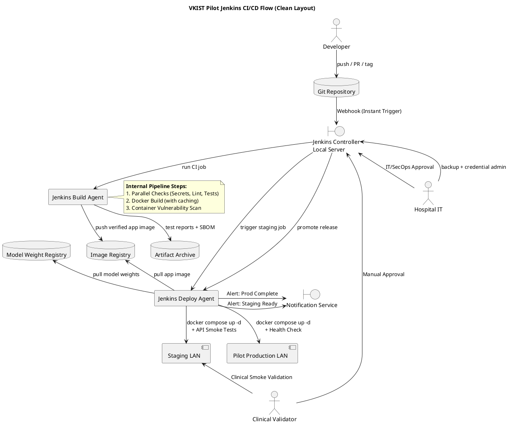
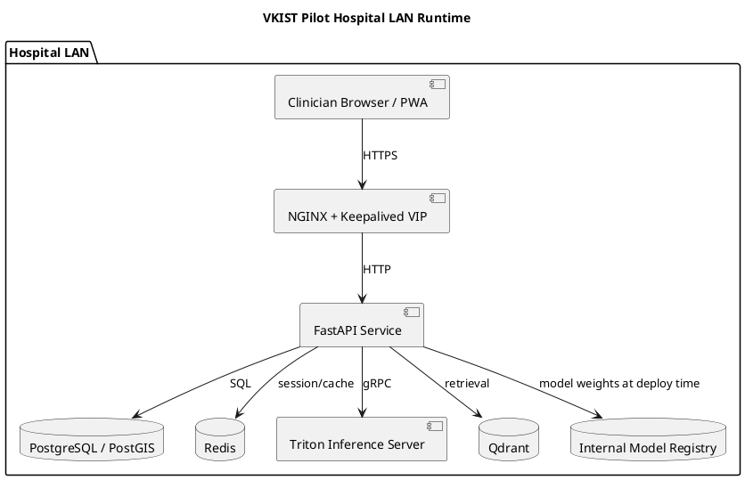

# VKIST MSK Pilot CI/CD Deployment Pipeline

**Version:** 0.1.0  
**Status:** Ready-to-use deployment design baseline  
**Target:** On-premise hospital LAN pilot  
**CI platform:** Jenkins on local server  
**Deployment runtime:** Docker Compose  
**Model weight storage:** internal registry  
**Release cadence:** sprint-based  

---

## 1. Purpose

This document defines the deployment pipeline for the VKIST MSK Pilot software. It turns the pilot architecture into a repeatable CI/CD process for local hospital deployment.

Primary goals:

1. Build and test FastAPI/ML code safely.
2. Keep PHI, patient images, and model weights out of source control.
3. Produce immutable release bundles.
4. Deploy to hospital LAN using Docker Compose.
5. Support staging validation, manual approval, production promotion, and rollback.
6. Align with air-gapped deployment constraints from the solution architecture.

Source inputs:

- `PROJECT_VIS.md`
- `CAVEAT_TASK.md`
- `sprint_1_2/SOLUTION_ARCHITECTURE_SPEC.md`
- `sprint_1_2/SOFTWARE_SYSTEM_DESIGN_FR_25.md`
- `sprint_1_2/Design_Material/VKIST-ML/Instruction_Manunal_API_Doc_Setup_pilot.md`
- `vkist-ultrasound/README.md`
- `vkist-ultrasound/.gitignore`
- `vkist-ultrasound/Dockerfile`
- `vkist-ultrasound/app.py`

---

## 2. Approved CI/CD Decisions

| Decision | Selected Option | Reason |
| --- | --- | --- |
| CI platform | Jenkins on local server | Familiar to hospital IT; runs inside trusted network. |
| Deployment orchestrator | Docker Compose | Fast pilot setup, easy rollback, low cluster overhead. |
| Model weight storage | Internal registry | Avoids Git storage and public artifact leakage. |
| Release cadence | Sprint-based | Matches pilot sprint plan and clinical validation gates. |
| Deployment target | Hospital LAN | Supports air-gapped constraints and local clinical workflow. |
| Runtime | FastAPI container + NGINX | Matches current app entrypoint and local reverse proxy pattern. |
| CI data policy | Synthetic data only | Prevents PHI leakage into Jenkins logs/artifacts. |

---

## 3. Architecture Overview

### 3.1 CI/CD Flow

#### 3.1.1 - the usecase interaction 


#### 3.1.2 - the sequential view of the pipeline
```planuml
@startuml
title VKIST Pilot Jenkins CI/CD Flow (Sequence Diagram)

autonumber
skinparam maxMessageSize 150

actor "Developer" as dev
participant "Git Repo" as git

box "Jenkins Infrastructure" #F0F8FF
participant "Controller" as jenkins
participant "Build Agent" as cpu
participant "Deploy Agent" as deploy
end box

database "Registries\n(Images, Models, Archives)" as reg
participant "Staging LAN" as staging
actor "Clinical Validator" as clinician
actor "IT/SecOps" as it
participant "Production LAN" as prod
participant "Notification\nService" as notify

== Continuous Integration (CI) ==

dev -> git : Push / PR / Tag
git -> jenkins : Webhook (Instant Trigger)
jenkins -> cpu : Trigger CI Job
activate cpu

note over cpu
  **Parallel Phase:**
  - Secret scan
  - Linting
  - Unit tests
end note

cpu -> cpu : docker build (with caching)
cpu -> cpu : Container Vulnerability Scan
cpu -> reg : Push Verified App Image
cpu -> reg : Push Artifacts (SBOM, Test Reports)
deactivate cpu

== Continuous Deployment (CD) - Staging ==

jenkins -> deploy : Trigger Staging Job
activate deploy
deploy -> reg : Pull Model Weights & App Image
deploy -> staging : docker compose up -d
deploy -> staging : Run Automated API & Smoke Tests
staging --> deploy : Tests Passed
deploy -> notify : Alert: Staging Ready for Validation
deactivate deploy

== Manual Validation & Approval ==

clinician -> staging : Perform Clinical Smoke Validation
staging --> clinician : Validation Successful
clinician -> jenkins : Manual Approval (Promote)
opt Optional Security Gate
    it -> jenkins : IT/SecOps Approval
end

== Continuous Deployment (CD) - Production ==

jenkins -> deploy : Trigger Production Job
activate deploy
deploy -> prod : docker compose up -d (Rolling Update)
deploy -> prod : Post-Deploy Health Check
prod --> deploy : Health Check Passed
deploy -> notify : Alert: Production Deployment Complete
deactivate deploy

== Post-Deployment Maintenance ==

it -> jenkins : Backup & Credential Admin

@enduml
```

### 3.2 Runtime Deployment - the component view



---

## 4. Repository and Artifact Boundaries

### 4.1 Repository Contents

The application repository is:

```text
PILOT_PROJECT/vkist-ultrasound/
```

Current app evidence:

- FastAPI app entrypoint is `app.py` at `vkist-ultrasound/app.py:848`.
- Health endpoint exists at `vkist-ultrasound/app.py:729`.
- Analyze endpoint exists at `vkist-ultrasound/app.py:573`.
- Save endpoint exists at `vkist-ultrasound/app.py:747`.
- PDF export endpoint exists at `vkist-ultrasound/app.py:826`.

### 4.2 Ignored Sensitive Paths

These paths must never be committed or sent to CI artifacts:

```text
uploads/
models/
results/
patients/
*.pth
```

Source: `vkist-ultrasound/.gitignore:3`.

### 4.3 CI Safety Rules

| Asset | Allowed in CI? | Handling |
| --- | --- | --- |
| Source code | Yes | Git checkout. |
| Synthetic test images | Yes | Use only in tests. |
| Patient images | No | Never upload to Jenkins. |
| PHI | No | Never store in Jenkins workspace/artifacts. |
| Model weights | No in Git | Pull from internal registry during deploy or optional GPU CI. |
| Docker image | Yes | Push to internal registry. |
| SBOM | Yes | Store as non-PHI artifact. |
| Jenkins credentials | Yes | Jenkins Credentials Binding only. |
| Private keys | Yes | Jenkins secret file credentials only. |

---

## 5. Environments

| Environment | Purpose | Trigger | Approval |
| --- | --- | --- | --- |
| Local developer | Local build and smoke test | Manual | None |
| Jenkins CPU agent | PR and merge CI | PR, merge, tag | None |
| Jenkins GPU agent | Optional ML integration smoke | Manual or tag | None |
| Staging LAN | Pre-production clinical validation | Merge to `main` | None |
| Pilot production LAN | Hospital pilot users | Sprint release tag | Clinical + hospital IT approval |

---

## 6. Branch and Release Strategy

### 6.1 Branches

```text
main              stable pilot development branch
feature/*         short-lived feature branches
release/*         optional release preparation branch
tags              immutable sprint releases
```

### 6.2 Tags

Use sprint-based semantic tags:

```text
v0.1.0-sprint1
v0.2.0-sprint2
v0.3.0-sprint3
```

Tag rule:

- One tag = one deployable release.
- No tag reuse.
- Every tag must have:
  - Docker image tag.
  - SBOM.
  - Trivy scan result.
  - Offline bundle checksum.
  - Deployment manifest.
  - Rollback manifest.

---

## 7. Jenkins Server Setup

### 7.1 Server Assumptions

Recommended baseline:

```text
OS: Ubuntu 22.04 LTS
Runtime: Docker Engine + Docker Compose Plugin
CI: Jenkins LTS
Java: OpenJDK 17
Network: VKIST/hospital IT VLAN
Storage: Jenkins home on local disk with backup
```

### 7.2 Install Jenkins Controller

Run on the Jenkins local server:

```bash
sudo apt update
sudo apt install -y git curl ca-certificates gnupg lsb-release openjdk-17-jre-headless
curl -fsSL https://get.docker.com | sudo sh
sudo usermod -aG docker jenkins
sudo systemctl restart jenkins
```

Install Docker Compose Plugin:

```bash
sudo docker compose version
```

### 7.3 Required Jenkins Plugins

Install these plugins:

```text
Git plugin
Pipeline
Pipeline: Stage View
Credentials Binding
Docker Pipeline
JUnit
Checks API
Warnings NG
Blue Ocean, optional
```

### 7.4 Jenkins Agents

Create agent labels:

```text
python-cpu
gpu-ml
deploy-lan
```

Recommended agents:

| Label | Purpose |
| --- | --- |
| `python-cpu` | Lint, tests, API smoke, CPU Docker build. |
| `gpu-ml` | Optional model integration smoke with GPU and internal model registry access. |
| `deploy-lan` | SSH into staging/production hosts and run Docker Compose. |

### 7.5 Jenkins Credentials

Create Jenkins credentials with these IDs:

| Credential ID | Type | Purpose |
| --- | --- | --- |
| `GITHUB_PAT` | Secret text | GitHub access or SCM polling. |
| `HOSPITAL_REGISTRY_URL` | Secret text | Internal registry URL. |
| `HOSPITAL_REGISTRY_USER` | Username/password | Push/pull app image. |
| `MODEL_REGISTRY_URL` | Secret text | Internal model weight registry. |
| `MODEL_REGISTRY_USER` | Username/password | Pull model weights. |
| `DEPLOY_HOST` | Secret text | Staging/production deploy host. |
| `DEPLOY_USER` | Secret text | Deploy SSH user. |
| `DEPLOY_SSH_KEY` | SSH username with private key | Deploy agent SSH access. |
| `VKIST_ADMIN_EMAIL` | Secret text | Notification recipient. |

Do not store any of these values in Git.

---

## 8. Jenkins Pipeline

### 8.1 Pipeline Triggers

```text
PR:        secret scan, lint, tests, API smoke, Docker build, image scan, SBOM
main:      all PR checks, push image, deploy staging, healthcheck, smoke regression
tag:       full checks, offline bundle, staging deploy, clinical validation, approval, production deploy
```

### 8.2 Jenkinsfile Skeleton

Place this file in:

```text
PILOT_PROJECT/vkist-ultrasound/Jenkinsfile
```

```groovy
pipeline {
  agent { label 'python-cpu' }

  options {
    timestamps()
    disableConcurrentBuilds()
    buildDiscarder(logRotator(numToKeepStr: '30'))
  }

  triggers {
    pollSCM('H/5 * * * *')
  }

  environment {
    REGISTRY = credentials('HOSPITAL_REGISTRY_URL')
    REGISTRY_USER = credentials('HOSPITAL_REGISTRY_USER_USERNAME')
    REGISTRY_PASSWORD = credentials('HOSPITAL_REGISTRY_USER_PASSWORD')
    MODEL_REGISTRY = credentials('MODEL_REGISTRY_URL')
    MODEL_REGISTRY_USER = credentials('MODEL_REGISTRY_USER_USERNAME')
    MODEL_REGISTRY_PASSWORD = credentials('MODEL_REGISTRY_USER_PASSWORD')
    DEPLOY_HOST = credentials('DEPLOY_HOST')
    DEPLOY_USER = credentials('DEPLOY_USER')
    IMAGE_NAME = 'vkist/fastapi'
    VKIST_VERSION = "${env.GIT_COMMIT?.take(12) ?: 'local'}"
  }

  stages {
    stage('Checkout') {
      steps {
        checkout scm
      }
    }

    stage('Secret scan') {
      steps {
        sh 'command -v gitleaks >/dev/null 2>&1 || go install github.com/gitleaks/gitleaks/v8@latest'
        sh 'gitleaks detect --source . --redact --exit-code 1'
      }
    }

    stage('Python quality') {
      steps {
        sh 'python -m compileall .'
        sh 'python -m pip install --upgrade pip'
        sh 'python -m pip install -r requirements.txt'
        sh 'python -m pip install ruff black pytest'
        sh 'ruff check .'
        sh 'black --check .'
      }
    }

    stage('Unit tests') {
      steps {
        sh 'pytest -q'
      }
    }

    stage('API smoke without models') {
      steps {
        sh 'python -m tests.smoke_api || true'
      }
    }

    stage('Docker build') {
      steps {
        sh 'docker build -t ${REGISTRY}/${IMAGE_NAME}:${VKIST_VERSION} .'
      }
    }

    stage('Image scan') {
      steps {
        sh 'docker run --rm -v /var/run/docker.sock:/var/run/docker.sock aquasec/trivy:latest image --exit-code 1 ${REGISTRY}/${IMAGE_NAME}:${VKIST_VERSION}'
        sh 'docker run --rm -v /var/run/docker.sock:/var/run/docker.sock anchore/syft:latest ${REGISTRY}/${IMAGE_NAME}:${VKIST_VERSION} -o spdx-json > sbom-${VKIST_VERSION}.json'
      }
    }

    stage('Archive reports') {
      steps {
        archiveArtifacts artifacts: 'sbom-*.json', fingerprint: true
        junit allowEmptyResults: true, testResults: 'reports/**/*.xml'
      }
    }

    stage('Push image') {
      when {
        anyOf {
          branch 'main'
          expression { env.GIT_TAG != null }
        }
      }
      steps {
        sh 'echo ${REGISTRY_PASSWORD} | docker login ${REGISTRY} -u ${REGISTRY_USER} --password-stdin'
        sh 'docker push ${REGISTRY}/${IMAGE_NAME}:${VKIST_VERSION}'
      }
    }

    stage('Deploy staging') {
      when {
        branch 'main'
      }
      agent { label 'deploy-lan' }
      steps {
        sh '''
          ssh -i ${DEPLOY_SSH_KEY} -o StrictHostKeyChecking=no ${DEPLOY_USER}@${DEPLOY_HOST} \
            "mkdir -p /opt/vkist/staging && docker login ${REGISTRY} -u ${REGISTRY_USER} -p ${REGISTRY_PASSWORD}"
        '''
      }
    }

    stage('Release approval') {
      when {
        expression { env.GIT_TAG != null }
      }
      steps {
        input message: 'Promote ${env.GIT_TAG} to pilot production?', ok: 'Approve production deploy'
      }
    }

    stage('Promote production') {
      when {
        expression { env.GIT_TAG != null }
      }
      agent { label 'deploy-lan' }
      steps {
        sh '''
          ssh -i ${DEPLOY_SSH_KEY} -o StrictHostKeyChecking=no ${DEPLOY_USER}@${DEPLOY_HOST} \
            "mkdir -p /opt/vkist/production && docker login ${REGISTRY} -u ${REGISTRY_USER} -p ${REGISTRY_PASSWORD}"
        '''
      }
    }
  }

  post {
    always {
      cleanWs()
    }
    failure {
      echo 'Pipeline failed. Deployment stopped.'
    }
  }
}
```

### 8.3 Jenkins Pipeline Notes

The skeleton uses placeholders for Jenkins username/password credentials. Jenkins stores split username/password credentials as:

```text
<credential_id>_USERNAME
<credential_id>_PASSWORD
```

If the local Jenkins setup uses plain secret text instead, adjust the `environment` block.

---

## 9. Docker Compose Deployment

### 9.1 Deployment Folder Layout

Create this folder on the hospital deploy host:

```text
/opt/vkist/production/
  docker-compose.yml
  .env
  nginx/
    nginx.conf
  models/
  data/
    uploads/
    results/
  logs/
  release/
    manifest.json
    sbom.json
    checksums.sha256
```

For staging:

```text
/opt/vkist/staging/
```

### 9.2 `docker-compose.yml`

```yaml
services:
  fastapi:
    image: ${REGISTRY}/vkist/fastapi:${VKIST_VERSION}
    container_name: vkist-fastapi
    restart: unless-stopped
    expose:
      - "8000"
    environment:
      VKIST_ENV: ${VKIST_ENV}
      VKIST_VERSION: ${VKIST_VERSION}
      MODEL_WEIGHT_DIR: /app/models
    volumes:
      - ./models:/app/models:ro
      - ./data/uploads:/app/uploads
      - ./data/results:/app/results
      - ./logs:/app/logs
    healthcheck:
      test: ["CMD", "python", "-c", "import urllib.request; urllib.request.urlopen('http://127.0.0.1:8000/api/health', timeout=5)"]
      interval: 30s
      timeout: 5s
      retries: 5
      start_period: 60s

  nginx:
    image: nginx:1.27-alpine
    container_name: vkist-nginx
    restart: unless-stopped
    ports:
      - "${HTTP_PORT}:80"
      - "${HTTPS_PORT}:443"
    volumes:
      - ./nginx/nginx.conf:/etc/nginx/nginx.conf:ro
      - ./nginx/certs:/etc/nginx/certs:ro
    depends_on:
      fastapi:
        condition: service_healthy
```

### 9.3 `.env.example`

```bash
REGISTRY=<internal-registry-host>
VKIST_VERSION=<release-tag>
VKIST_ENV=production
HTTP_PORT=80
HTTPS_PORT=443
```

### 9.4 `nginx.conf`

```nginx
events {}

http {
  upstream vkist_fastapi {
    server fastapi:8000;
  }

  server {
    listen 80;
    server_name _;

    client_max_body_size 50M;

    location /api/ {
      proxy_pass http://vkist_fastapi;
      proxy_http_version 1.1;
      proxy_set_header Host $host;
      proxy_set_header X-Real-IP $remote_addr;
      proxy_set_header X-Forwarded-For $proxy_add_x_forwarded_for;
      proxy_set_header X-Forwarded-Proto $scheme;
    }

    location / {
      proxy_pass http://vkist_fastapi;
      proxy_http_version 1.1;
      proxy_set_header Host $host;
      proxy_set_header X-Real-IP $remote_addr;
      proxy_set_header X-Forwarded-For $proxy_add_x_forwarded_for;
      proxy_set_header X-Forwarded-Proto $scheme;
    }
  }
}
```

---

## 10. Deployment Runbook

### 10.1 Prepare Release

On Jenkins or trusted build host:

```bash
git tag v0.1.0-sprint1
git push origin v0.1.0-sprint1
```

Jenkins pipeline should:

1. Run full checks.
2. Build Docker image.
3. Scan image.
4. Generate SBOM.
5. Push image to internal registry.
6. Create offline release bundle.
7. Deploy to staging.
8. Wait for clinical validation.
9. Promote to production after approval.

### 10.2 Build Offline Bundle

```bash
VERSION=v0.1.0-sprint1
REGISTRY=<internal-registry-host>
IMAGE=${REGISTRY}/vkist/fastapi:${VERSION}

mkdir -p release-${VERSION}
docker save -o release-${VERSION}/vkist-fastapi-${VERSION}.tar ${IMAGE}
cp docker-compose.yml release-${VERSION}/
cp -r nginx release-${VERSION}/
cp .env.example release-${VERSION}/.env
sha256sum release-${VERSION}/* > release-${VERSION}/checksums.sha256
tar -czf vkist-release-${VERSION}.tar.gz release-${VERSION}
```

### 10.3 Import Offline Bundle

On deploy host:

```bash
mkdir -p /opt/vkist/releases
scp vkist-release-v0.1.0-sprint1.tar.gz deploy@<deploy-host>:/opt/vkist/releases/
ssh deploy@<deploy-host>
cd /opt/vkist/releases
tar -xzf vkist-release-v0.1.0-sprint1.tar.gz
sha256sum -c release-v0.1.0-sprint1/checksums.sha256
docker load -i release-v0.1.0-sprint1/vkist-fastapi-v0.1.0-sprint1.tar
```

### 10.4 Deploy Staging

```bash
ssh deploy@<deploy-host>
cd /opt/vkist/staging

docker login <internal-registry-host>
docker compose pull fastapi
docker compose up -d
docker compose ps
docker compose logs -f fastapi
```

### 10.5 Deploy Production

```bash
ssh deploy@<deploy-host>
cd /opt/vkist/production

docker login <internal-registry-host>
docker compose pull fastapi
docker compose up -d
docker compose ps
docker compose logs -f fastapi
```

### 10.6 Load Model Weights

Model weights must come from internal registry or approved internal storage.

```bash
ssh deploy@<deploy-host>
cd /opt/vkist/production
docker login <model-registry-host>
docker pull <model-registry-host>/vkist/models:v0.1.0-sprint1
docker save -o models-v0.1.0-sprint1.tar <model-registry-host>/vkist/models:v0.1.0-sprint1
docker load -i models-v0.1.0-sprint1.tar
```

Then mount or copy the weights into:

```text
/opt/vkist/production/models/
```

---

## 11. Smoke Test Runbook

### 11.1 Health Check

```bash
curl -fsS http://<vkist-host>/api/health
```

Expected:

```json
{"status":"healthy"}
```

### 11.2 Synthetic Analyze Test

Use only synthetic or approved non-PHI images.

```bash
curl -X POST http://<vkist-host>/api/analyze \
  -F "image=@tests/fixtures/synthetic_ultrasound.png" \
  -F "angle_model=convnext" \
  -F "inflammation_model=efficientnet_b0" \
  -F "segment_model_sup=deeplabv3" \
  -F "segment_model_post=deeplabv3_resnet101"
```

### 11.3 Synthetic PDF Export Test

```bash
curl -X POST http://<vkist-host>/api/export-pdf \
  -H "Content-Type: application/json" \
  -d '{
    "patient_info": {
      "id": "SYNTH-001",
      "name": "Synthetic Patient",
      "gender": "F",
      "age": 45,
      "diagnosis": "Synthetic test"
    },
    "analysis_result": {
      "angle": {"class": "sup-up-long", "confidence": 99.0}
    },
    "images": {}
  }' \
  --output synthetic-report.pdf
```

### 11.4 Deployment Acceptance

| Check | Expected |
| --- | --- |
| FastAPI container running | `Up` |
| NGINX container running | `Up` |
| `/api/health` | HTTP 200 |
| Synthetic analyze | HTTP 200 or expected model-unavailable path |
| PDF export | PDF generated or expected validation error |
| Logs | No PHI in logs |
| Rollback image | Previous tag available |

---

## 12. Rollback Runbook

### 12.1 Rollback Trigger

Rollback is required when:

- Healthcheck fails after deploy.
- Synthetic smoke test fails.
- Clinical smoke validation fails.
- Error rate rises above acceptable threshold.
- Deployment introduces PHI/logging risk.

### 12.2 Rollback Steps

```bash
ssh deploy@<deploy-host>
cd /opt/vkist/production

PREVIOUS_VERSION=<previous-good-tag>
REGISTRY=<internal-registry-host>

docker pull ${REGISTRY}/vkist/fastapi:${PREVIOUS_VERSION}
sed -i "s/VKIST_VERSION=.*/VKIST_VERSION=${PREVIOUS_VERSION}/" .env
docker compose up -d
docker compose ps
```

### 12.3 Rollback Verification

```bash
curl -fsS http://<vkist-host>/api/health
docker compose logs --since=10m fastapi
```

---

## 13. Security and Compliance Controls

### 13.1 Data Protection

| Control | Implementation |
| --- | --- |
| No PHI in Git | Enforced by `.gitignore` and secret scan. |
| No PHI in Jenkins | CI uses synthetic fixtures only. |
| No PHI in artifacts | Archive only SBOM, logs, and reports. |
| No secrets in Docker image | Jenkins credentials injected at deploy time. |
| Model weights external | Internal registry only. |
| Production approval | Manual Jenkins approval gate. |

### 13.2 Secret Handling

Do:

```text
Use Jenkins Credentials Binding.
Use SSH private key credentials.
Use internal registry credentials.
Rotate credentials after personnel changes.
```

Do not:

```text
Commit .env files.
Commit registry passwords.
Print credentials in Jenkins logs.
Store patient data in Jenkins workspace.
Store model weights in Git.
```

### 13.3 Image Security

Every release image must include:

```text
Trivy scan result
Syft SBOM
Image digest
Release tag
Dockerfile source commit
```

---

## 14. Monitoring and Operations

### 14.1 Runtime Checks

```bash
docker compose ps
docker compose logs -f fastapi
docker stats
```

### 14.2 Jenkins Checks

Monitor:

```text
Failed builds
Long-running builds
Credential expiration
Agent offline status
Disk usage
Artifact retention
```

### 14.3 Application Checks

Track:

```text
/api/health availability
Analyze endpoint latency
PDF export latency
Error rate
Container restarts
Disk usage for uploads/results
Model load time
GPU/CPU memory when applicable
```

---

## 15. Troubleshooting

| Symptom | Likely Cause | Fix |
| --- | --- | --- |
| Jenkins build fails on checkout | Git credential expired | Rotate `GITHUB_PAT`. |
| Docker build fails | Dependency or Python version mismatch | Align Dockerfile with `requirements.txt` and README. |
| Container exits immediately | Wrong CMD or missing model | Fix Dockerfile CMD to `app.py`; mount models. |
| `/api/health` fails | App not listening on expected port | Check FastAPI logs and container port. |
| NGINX returns 502 | FastAPI unhealthy | Check `docker compose ps` and `docker compose logs fastapi`. |
| Analyze fails | Model weights missing | Pull weights from internal registry. |
| Jenkins cannot deploy | SSH key invalid | Rotate `DEPLOY_SSH_KEY`. |
| Production deploy blocked | Approval not completed | Complete Jenkins approval gate. |

---

## 16. Known Implementation Fixes Before First Pipeline Run

| File | Issue | Required Fix |
| --- | --- | --- |
| `vkist-ultrasound/Dockerfile` | Uses `CMD ["python", "main.py"]` | Change to `CMD ["python", "app.py"]`. |
| `vkist-ultrasound/Dockerfile` | Uses Python 3.12 | Align with README Python 3.10 or verify dependency support. |
| `vkist-ultrasound/app.py` | Loads models at request time | Later optimize with startup model loading. |
| `vkist-ultrasound/app.py` | CORS allows all origins | Later restrict to hospital LAN origins. |
| `vkist-ultrasound/app.py` | Save endpoint writes patient folders | Ensure no PHI reaches Jenkins or logs. |
| `vkist-ultrasound/.gitignore` | Ignores models/uploads/results/patients | Keep this policy. |

---

## 17. Definition of Done

The CI/CD deployment pipeline is ready when:

- Jenkins controller is installed on local server.
- Jenkins agents are online with labels:
  - `python-cpu`
  - `gpu-ml`, optional
  - `deploy-lan`
- Jenkins credentials exist and are not stored in Git.
- `Jenkinsfile` exists in `vkist-ultrasound`.
- PR builds run secret scan, lint, tests, API smoke, Docker build, image scan, and SBOM.
- `main` builds deploy to staging LAN.
- Sprint tags create offline release bundles.
- Production deploy requires manual approval.
- Docker Compose runtime is documented and tested.
- Rollback runbook is tested with previous image tag.
- Synthetic smoke tests pass without PHI.
- Model weights are pulled from internal registry only.

---

## 18. Abbreviation Glossary

| Abbreviation | Meaning | Meaning in this document |
| --- | --- | --- |
| API | Application Programming Interface | HTTP interface exposed by the FastAPI service. |
| CD | Continuous Deployment / Continuous Delivery | Automated or approved deployment flow from Jenkins to staging and production. |
| CI | Continuous Integration | Automated build, test, scan, and artifact generation on Jenkins. |
| CI/CD | Continuous Integration / Continuous Deployment or Delivery | End-to-end automated software integration and deployment pipeline. |
| CORS | Cross-Origin Resource Sharing | Browser security mechanism controlling which web origins can call the API. |
| CPU | Central Processing Unit | Jenkins agent type used for lint, tests, Docker build, and scans. |
| GPU | Graphics Processing Unit | Optional Jenkins agent type used for ML/model smoke tests. |
| gRPC | gRPC Remote Procedure Calls | Network protocol used by the API to call Triton Inference Server. |
| HTTP | Hypertext Transfer Protocol | Protocol used between NGINX and FastAPI inside Docker Compose. |
| HTTPS | Hypertext Transfer Protocol Secure | Secure HTTP protocol exposed by NGINX to clinicians/browsers. |
| ID | Identifier | Jenkins credential identifier or database/resource identifier. |
| IT | Information Technology | Hospital IT team responsible for infrastructure and approvals. |
| JSON | JavaScript Object Notation | Response/request format used by API endpoints and reports. |
| LAN | Local Area Network | Hospital on-premise network where staging and production run. |
| LTS | Long-Term Support | Stable Ubuntu/Jenkins release line recommended for operations. |
| ML | Machine Learning | Model inference and validation workload used by the app. |
| MSK | Musculoskeletal | Clinical domain for the VKIST ultrasound pilot. |
| NGINX | Engine X | Reverse proxy serving the FastAPI app over HTTP/HTTPS. |
| OS | Operating System | Server OS, for example Ubuntu 22.04 LTS. |
| PAT | Personal Access Token | GitHub credential used by Jenkins for SCM access. |
| PHI | Protected Health Information | Patient-identifiable or clinical data that must not enter Git, Jenkins, or artifacts. |
| PR | Pull Request | GitHub change review flow that triggers CI checks. |
| PWA | Progressive Web App | Clinician browser/PWA entry point to the deployed system. |
| SBOM | Software Bill of Materials | Machine-readable inventory of software components in the release image. |
| SCM | Source Control Management | Git repository source control used by Jenkins. |
| SecOps | Security Operations | Security review and approval function, usually part of hospital IT. |
| SPDX | Software Package Data Exchange | Standard format used for SBOM export. |
| SQL | Structured Query Language | Database query language used with PostgreSQL/PostGIS. |
| SSH | Secure Shell | Encrypted remote access protocol used by Jenkins deploy agent. |
| URL | Uniform Resource Locator | Registry, host, or endpoint address. |
| VIP | Virtual IP | Keepalived-managed IP used for high-availability routing. |
| VLAN | Virtual Local Area Network | Network segment used to isolate hospital/Jenkins traffic. |
| VKIST | Vietnam-Korea Institute of Science and Technology | Project owner/context for the MSK ultrasound pilot. |

---

## 19. Next Implementation Files

Recommended files to create after this design is approved:

```text
PILOT_PROJECT/vkist-ultrasound/Jenkinsfile
PILOT_PROJECT/vkist-ultrasound/tests/smoke_api.py
PILOT_PROJECT/vkist-ultrasound/docker-compose.yml
PILOT_PROJECT/vkist-ultrasound/nginx/nginx.conf
PILOT_PROJECT/vkist-ultrasound/.env.example
PILOT_PROJECT/vkist-ultrasound/scripts/build_offline_bundle.sh
PILOT_PROJECT/vkist-ultrasound/scripts/deploy_release.sh
PILOT_PROJECT/vkist-ultrasound/scripts/rollback_release.sh
PILOT_PROJECT/vkist-ultrasound/scripts/smoke_test.sh
```
