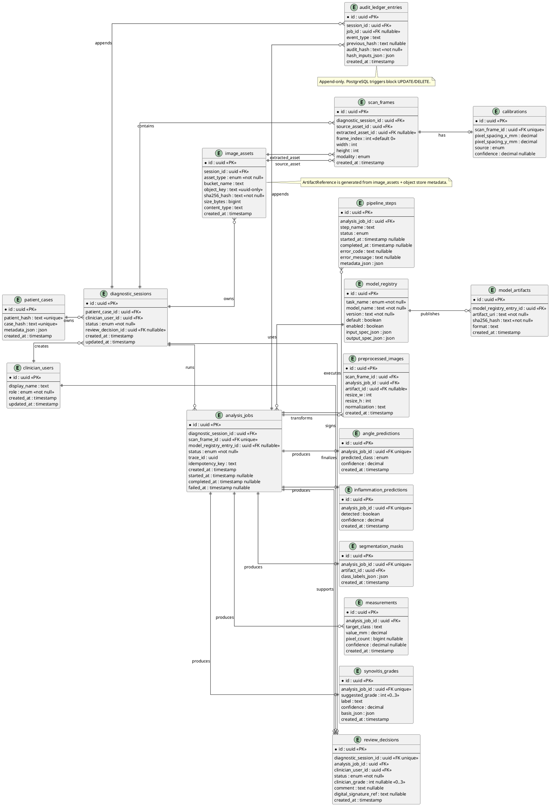

## PlantUML Deliverable 1 — Logical ER / Schema Diagram

Recommended design file:

```text
PILOT_PROJECT/workspace/sprint_1_2/Design_Material/DATA-INGESTION/RELATIONAL_DB_SCHEMA_SPEC.md
```

Use this ER/schema diagram as the primary schema diagram.



## PlantUML Deliverable 2 — Chen Notation ER Diagram

Use this as the Chen-notation ER diagram. It emphasizes entities, relationships, and cardinality. Attribute ovals show key attributes only to keep the diagram readable.

```plantuml
@startchen "VKIST_Relational_DB__Chen_Notation"
skinparam linetype ortho

' Entities with their nested attributes
entity ClinicianUser {
  id <<key>>
  display_name
  role
}

entity PatientCase {
  id <<key>>
  patient_hash
  case_hash
}

entity DiagnosticSession {
  id <<key>>
  status
  created_at
}

entity ImageAsset {
  id <<key>>
  asset_type
  sha256_hash
  object_key
}

entity ScanFrame {
  id <<key>>
  frame_index
  width
  height
}

entity Calibration {
  id <<key>>
  pixel_spacing
  source
  confidence
}

entity AnalysisJob {
  id <<key>>
  status
  trace_id
}

entity PipelineStep {
  id <<key>>
  step_name
  status
}

entity ModelRegistryEntry {
  id <<key>>
  task_name
  model_name
  version
}

entity ModelArtifact {
  id <<key>>
  artifact_uri
  sha256_hash
}

entity AnglePrediction {
  id <<key>>
  predicted_class
  confidence
}

entity InflammationPrediction {
  id <<key>>
  detected
  confidence
}

entity SegmentationMask {
  id <<key>>
  artifact_id
  class_labels
}

entity Measurement {
  id <<key>>
  target_class
  value_mm
}

entity SynovitisGrade {
  id <<key>>
  suggested_grade
  confidence
}

entity ReviewDecision {
  id <<key>>
  status
  clinician_grade
}

entity AuditLedgerEntry {
  id <<key>>
  event_type
  audit_hash
}

' Relationships
relationship creates {
}

relationship owns {
}

relationship stores {
}

relationship contains {
}

relationship calibrates {
}

relationship runs {
}

relationship executes {
}

relationship uses {
}

relationship publishes {
}

relationship produces_angle {
}

relationship produces_inflam {
}

relationship produces_mask {
}

relationship measures {
}

relationship grades {
}

relationship user_signs {
}

relationship session_signs {
}

relationship job_signs {
}

relationship session_appends {
}

relationship job_appends {
}

' Connectivity & Participation Mapping
creates -1- ClinicianUser
creates -N- DiagnosticSession

owns -1- PatientCase
owns -N- DiagnosticSession

stores -1- DiagnosticSession
stores -N- ImageAsset

contains -1- DiagnosticSession
contains -N- ScanFrame

calibrates -1- ScanFrame
calibrates -(0,1)- Calibration

runs -1- DiagnosticSession
runs -N- AnalysisJob

executes -1- AnalysisJob
executes -N- PipelineStep

uses -N- AnalysisJob
uses -1- ModelRegistryEntry

publishes -1- ModelRegistryEntry
publishes -N- ModelArtifact

produces_angle -1- AnalysisJob
produces_angle -(0,1)- AnglePrediction

produces_inflam -1- AnalysisJob
produces_inflam -(0,1)- InflammationPrediction

produces_mask -1- AnalysisJob
produces_mask -(0,1)- SegmentationMask

measures -1- AnalysisJob
measures -N- Measurement

grades -1- AnalysisJob
grades -(0,1)- SynovitisGrade

user_signs -1- ClinicianUser
user_signs -N- ReviewDecision

session_signs -1- DiagnosticSession
session_signs -(0,1)- ReviewDecision

job_signs -1- AnalysisJob
job_signs -(0,1)- ReviewDecision

session_appends -1- DiagnosticSession
session_appends -N- AuditLedgerEntry

job_appends -1- AnalysisJob
job_appends -N- AuditLedgerEntry

@endchen
```



* Refractor & Splited version for easy to visualizing
### Part 1: Core Clinical & Diagnostic Subsystem
```
@startchen "VKIST_Clinical_Diagnostic_Subsystem"
skinparam linetype ortho

entity ClinicianUser {
  id <<key>>
  display_name
  role
}

entity PatientCase {
  id <<key>>
  patient_hash
  case_hash
}

entity DiagnosticSession {
  id <<key>>
  status
  created_at
}

entity ImageAsset {
  id <<key>>
  asset_type
  sha256_hash
  object_key
}

entity ScanFrame {
  id <<key>>
  frame_index
  width
  height
}

entity Calibration {
  id <<key>>
  pixel_spacing
  source
  confidence
}

entity ReviewDecision {
  id <<key>>
  status
  clinician_grade
}

relationship Creates_Session {
}
relationship Owns_Session {
}
relationship Stores_Asset {
}
relationship Contains_Frame {
}
relationship Calibrates_Frame {
}
relationship User_Signs {
}
relationship Session_Signs {
}

ClinicianUser -1- Creates_Session
Creates_Session -N- DiagnosticSession

PatientCase -1- Owns_Session
Owns_Session -N- DiagnosticSession

DiagnosticSession -1- Stores_Asset
Stores_Asset -N- ImageAsset

DiagnosticSession -1- Contains_Frame
Contains_Frame -N- ScanFrame

ScanFrame -1- Calibrates_Frame
Calibrates_Frame -(0,1)- Calibration

ClinicianUser -1- User_Signs
User_Signs -N- ReviewDecision

DiagnosticSession -1- Session_Signs
Session_Signs -(0,1)- ReviewDecision

@endchen
```
### Part 2: AI/ML Pipeline & Audit Subsystem
```
@startchen "VKIST_ML_Pipeline_Audit_Subsystem"
skinparam linetype ortho

entity DiagnosticSession {
  id <<key>>
}

entity ReviewDecision {
  id <<key>>
}

entity AnalysisJob {
  id <<key>>
  status
  trace_id
}

entity PipelineStep {
  id <<key>>
  step_name
  status
}

entity ModelRegistryEntry {
  id <<key>>
  task_name
  model_name
  version
}

entity ModelArtifact {
  id <<key>>
  artifact_uri
  sha256_hash
}

entity AnglePrediction {
  id <<key>>
  predicted_class
  confidence
}

entity InflammationPrediction {
  id <<key>>
  detected
  confidence
}

entity SegmentationMask {
  id <<key>>
  artifact_id
  class_labels
}

entity Measurement {
  id <<key>>
  target_class
  value_mm
}

entity SynovitisGrade {
  id <<key>>
  suggested_grade
  confidence
}

entity AuditLedgerEntry {
  id <<key>>
  event_type
  audit_hash
}

relationship Runs_Job {
}
relationship Executes_Step {
}
relationship Uses_Model {
}
relationship Publishes_Artifact {
}
relationship Produces_Angle {
}
relationship Produces_Inflam {
}
relationship Produces_Mask {
}
relationship Measures_Metrics {
}
relationship Grades_Synovitis {
}
relationship Job_Signs {
}
relationship Session_Appends {
}
relationship Job_Appends {
}

DiagnosticSession -1- Runs_Job
Runs_Job -N- AnalysisJob

AnalysisJob -1- Executes_Step
Executes_Step -N- PipelineStep

AnalysisJob -N- Uses_Model
Uses_Model -1- ModelRegistryEntry

ModelRegistryEntry -1- Publishes_Artifact
Publishes_Artifact -N- ModelArtifact

AnalysisJob -1- Produces_Angle
Produces_Angle -(0,1)- AnglePrediction

AnalysisJob -1- Produces_Inflam
Produces_Inflam -(0,1)- InflammationPrediction

AnalysisJob -1- Produces_Mask
Produces_Mask -(0,1)- SegmentationMask

AnalysisJob -1- Measures_Metrics
Measures_Metrics -N- Measurement

AnalysisJob -1- Grades_Synovitis
Grades_Synovitis -(0,1)- SynovitisGrade

AnalysisJob -1- Job_Signs
Job_Signs -(0,1)- ReviewDecision

DiagnosticSession -1- Session_Appends
Session_Appends -N- AuditLedgerEntry

AnalysisJob -1- Job_Appends
Job_Appends -N- AuditLedgerEntry

@endchen
```


## Migration / Schema Plan

### Step 1 — Logical schema freeze

Create the design spec first. Include:

- ER/schema PlantUML,
- Chen PlantUML,
- table list,
- FK map,
- indexes,
- constraints,
- NFR/UC traceability.

### Step 2 — SQLite Sprint 1_2 migrations

Implement minimal SQLite migrations for:

- `clinician_users`
- `patient_cases`
- `diagnostic_sessions`
- `image_assets`
- `scan_frames`
- `calibrations`
- `analysis_jobs`
- `pipeline_steps`
- `model_registry`
- `model_artifacts`
- `preprocessed_images`
- `angle_predictions`
- `inflammation_predictions`
- `segmentation_masks`
- `measurements`
- `synovitis_grades`
- `review_decisions`
- `audit_ledger_entries`

SQLite constraints:

- UUIDs stored as `TEXT`.
- `CHECK` constraints for grade ranges, enum-like statuses, and non-empty hashes.
- Foreign keys enabled.
- `audit_ledger_entries` treated as append-only at application layer.

### Step 3 — PostgreSQL target migrations

Add PostgreSQL migrations with:

- `uuid` type,
- `jsonb`,
- `CHECK` constraints,
- `NOT NULL` FKs,
- indexes for FK and query paths,
- append-only triggers on `audit_ledger_entries`,
- RLS policies where required,
- optional `postgis` schema readiness for future spatial markers.

### Step 4 — Object storage contract

Add object storage metadata contract:

```text
image_assets.object_key
image_assets.bucket_name
image_assets.sha256_hash
image_assets.content_type
image_assets.size_bytes
```

Rules:

- UUID-only object keys.
- No PHI in object keys.
- Store binary payloads in object storage.
- Store only metadata and safe references in DB.

## Implementation Steps

1. Confirm whether Sprint 1_2 uses SQLite only or PostgreSQL-ready migrations from the start.
2. Write `PILOT_PROJECT/workspace/sprint_1_2/Design_Material/DATA-INGESTION/RELATIONAL_DB_SCHEMA_SPEC.md`.
3. Add ER/schema PlantUML.
4. Add Chen notation PlantUML.
5. Add table-by-table schema with types, constraints, indexes, and FK rules.
6. Add NFR/UC traceability matrix.
7. Add open decisions and migration plan.
8. After design approval, implement migrations and repositories.

## Open Decisions

1. `patients` table: Sprint 1_2 uses `patient_cases` with hashes only; FR-25 may need a fuller PHI-bearing `patients` table under strict compliance.
2. `review_decisions`: single latest decision table vs append-only decision revisions.
3. `artifact_references`: generated value only vs physical table for presigned URL cache.
4. `preprocessed_images`: keep as metadata table or fold into `image_assets` with `asset_type = preprocessed`.
5. `pipeline_steps`: include per-model VRAM/runtime metrics in Sprint 1_2 or add later.
6. `review_decisions.digital_signature_ref`: store only a reference hash/credential ID, never private keys.
7. Q4 anomaly telemetry: DB metadata only, with raw tensors/masks in isolated object storage.

## Acceptance Criteria

- [ ] ER/schema PlantUML covers all OOP domain objects from Sprint 1_2.
- [ ] Chen notation PlantUML covers core entities, relationships, and cardinalities.
- [ ] Schema includes all required tables from `OOP_DATA_ENGINEERING_SPEC.md`.
- [ ] FK map supports upload, analysis, review, audit, and finalization flows.
- [ ] Constraints enforce grade ranges, status values, hash presence, and human sign-off.
- [ ] NFR traceability covers privacy, immutability, air-gap, explainability, and latency requirements.
- [ ] Object storage boundary is explicit: DB stores refs/checksums, not binary payloads.
- [ ] Design supports SQLite PoC and PostgreSQL/PostGIS target migration path.
