BELOW is the consolidated structural baseline engineering reference document tracking all architectural constraints, system interactions, and discovered sub-components for the **FR-25 Synovitis Grading Engine**.

---

# Context_FR_25_UC.md

## 1. Context, Mission Boundary & Core Rationale

### 1.1 Scope Identification

* **Target Core Functional Requirement:** `FR-25` (ULTS-Đánh giá và phân cấp mức độ viêm màng hoạt dịch / Synovitis Grading Engine).
* **Primary System Boundary:** The workspace acts as a strict secure diagnostic execution wrapper. In order to manage systemic liability and avoid black-box compliance failures, the advanced multi-agent checking modules (**LLM Explainer**, **BERT Hallucination Detector**, and **RAG-Referee**) are restricted from handling generic application operations. They are encapsulated entirely as **Internal Layered Workspace Subsystems** dedicated exclusively to validating human-AI coordination logs for `FR-25`.

### 1.2 Engineering Value Optimization

* **The Clinical Chasm:** In high-volume Vietnamese public clinics, specialists face intensive shift demands often exceeding 100 scans daily. Basic AI setups risk inducing automated checklist fatigue or introducing catastrophic blindness loops if human clinicians simply blind-concur with machine estimations.
* **The System Solution:** By engineering clear internal state boundaries separating standard CRUD processing from multi-tier validation agents, the system systematically handles four concurrent behavioral quadrants. It forces explicit human verification loops during disagreements, cross-references findings against un-biased clinical knowledge nodes, and maintains diagnostic speed metrics without degrading data correctness limits.

---

## 2. Structural Actor Profile Mapping

| Actor Name | Canonical Identifier | Role Scope & Operational Profile within FR-25 Boundary |
| --- | --- | --- |
| **Diagnostic Radiologist** | `Rad (UP5)` | **Primary Human Actor:** National-level clinical expert (Specialist II / Professor, age 40–60+). Holds ultimate medical accountability; validates and signs off pixel segmentations, metrics, and grading summaries. |
| **Hospital EMR System** | `EMR` | **External System Actor:** Recipient database server. Receives finalized JSON structures and signed clinical data logs over localized network pipes post human validation. |
| **VKIST Vision Grader Engine** | `Grader` | **External System Actor:** Foundation deep-learning array (ConvNeXt/MedSAM). Ingests raw frame parameters and produces pixel segmentations, thickness markers (mm), and classification tensors. |

---

## 3. Discovered Use Cases (4-Quadrant Framework)

### 3.1 Core Image Data Intake & Workflow Baselines

* **`UC-48376` (Load Patient Scan Session):** Ingests incoming image frames, maps spatial structures, and activates local session states.
* **`UC-47988` (Review Suggested Synovitis Grade):** Renders the initial classification summary panel (Grades 0-3) alongside color-coded segmentation overlaps.
* **`UC-92006` (Finalize & Sign Electronic Record):** Seals the session data via localized human cryptographic signing steps before dispatching payload JSON logs to the hospital storage sinks.

### 3.2 Quadrant 1: True Agreement Flow (AI Correct / Doctor Correct)

* **`UC-25776` (Generate GradCAM & CoT Explanation Panel):** The internal LLM Explainer checks raw pixel masks and maps multi-modal prompt matrices to output clear, human-scannable rationales.
* **`UC-02423` (Log High-Trust Concur Block):** Encapsulates the corresponding Chain-of-Thought logs confirming human-machine consensus into a structured block to verify system state traceability.

### 3.3 Quadrant 2: Automation Override Risk Loop (AI Correct / Doctor Oversight)

* **`UC-22159` (Trigger Conversational Circuit Breaker):** Intercepts standard workspace finalization pathways if high mouse click adjustments or text conflict markers indicate user friction or ambiguity.
* **`UC-55146` (Facilitate Socratic Reasoning Dialogue):** Initiates an inline workspace chat panel, prompting the specialist to evaluate spatial discrepancies or vascular metrics versus the machine's model inputs.
* **`UC-74821` (Monitor Drift via BERT Sub-Layer):** Scans active conversation tokens continuously to detect illogical claims or contextual drift during active discussion.
* **`UC-65473` (Arbitrate Evidence via RAG-Referee):** Intervenes if human-machine disputes reach an impasse, bypassing active chat logs to pull verified medical guidelines directly from fixed reference sources.

### 3.4 Quadrant 3: Clinician Subservience Risk Loop (AI Hallucinates / Doctor Correct)

* **`UC-25637` (Expose Pixel-Level Activation Logic):** Displays granular layer activations and weight scores when a clinician actively contests a machine grade suggestion.
* **`UC-60739` (Isolate Visual Noise/Artifacts):** Provides on-screen cursor brushes for the specialist to isolate and mask out clutter variables like acoustic shadowing or bone scattering.
* **`UC-62864` (Commit Validated Ground-Truth Record):** Re-runs data logs through the verification referee, updating final reports to show human superiority while saving the masked framework for subsequent model training runs.

### 3.5 Quadrant 4: Double Blind Failure Loop (AI Faulty / Doctor Biased)

* **`UC-35956` (Activate Clinical Investigation Mode):** Transitions the user interface environment instantly to a strict manual tracking orientation when low vision confidence values align with zero-match RAG search responses.
* **`UC-47796` (Execute Structured Morphology Annotation):** Displays a standardized template forcing manual plotting of novel structural modifications or unrecognized lesion variations.
* **`UC-01580` (Serialize Session to Telemetry Queue):** Packages unencrypted image tensors, coordinate indices, and clinical commentary blocks into localized storage pipelines, bypassing standard EMR charts to flag data directly for software engineering team review.

---

## 4. Master PlantUML System Compilation

```plantuml
@startuml
' Settings & Aesthetic Optimization
left to right direction
skin rose

' External Actors
actor "Diagnostic Radiologist (UP5)" as Rad
actor "Hospital EMR System" as EMR << System >>
actor "VKIST Vision Grader Engine" as Grader << System >>

' System Boundary
rectangle "VKIST MSK Workspace (FR-25: Synovitis Grading Scope)" {
    
    ' Core Viewing & Data Intake Pipelines
    usecase "UC-48376\nLoad Patient Scan Session" as UC_Load
    usecase "UC-47988\nReview Suggested Synovitis Grade (0-3)" as UC_Review
    usecase "UC-92006\nFinalize & Sign Electronic Record" as UC_Finalize
    
    ' Sub-Boundary for the Internal Cognitive/Multi-Agent Subsystems
    rectangle "Internal Cognitive & Validation Stack" {
        
        ' Q1: True Agreement Use Cases
        usecase "UC-25776\nGenerate GradCAM & CoT Explanation Panel" as UC_Q1_Explain
        usecase "UC-02423\nLog High-Trust Concur Block" as UC_Q1_Log
        
        ' Q2: Automation Override Risk Use Cases
        usecase "UC-22159\nTrigger Conversational Circuit Breaker" as UC_Q2_Intercept
        usecase "UC-55146\nFacilitate Socratic Reasoning Dialogue" as UC_Q2_Socratic
        usecase "UC-74821\nMonitor Drift via BERT Sub-Layer" as UC_Q2_BERT
        usecase "UC-65473\nArbitrate Evidence via RAG-Referee" as UC_Q2_Arbiter
        
        ' Q3: Clinician Subservience Risk Use Cases
        usecase "UC-25637\nExpose Pixel-Level Activation Logic" as UC_Q3_Expose
        usecase "UC-60739\nIsolate Visual Noise/Artifacts" as UC_Q3_Isolate
        usecase "UC-62864\nCommit Validated Ground-Truth Record" as UC_Q3_Commit
        
        ' Q4: Double Blind Failure Use Cases
        usecase "UC-35956\nActivate Clinical Investigation Mode" as UC_Q4_Escalate
        usecase "UC-47796\nExecute Structured Morphology Annotation" as UC_Q4_Annotate
        usecase "UC-01580\nSerialize Session to Telemetry Queue" as UC_Q4_Queue
    }
}

' Human-System Interactions
Rad --> UC_Load
Rad --> UC_Review
Rad --> UC_Finalize

' Q2, Q3 & Q4 Interaction Entrypoints
Rad --> UC_Q2_Socratic : Argue observations
Rad --> UC_Q3_Isolate : Tag artifacts
Rad --> UC_Q4_Annotate : Document manual findings

' Machine-to-Machine Pipelines
Grader --> UC_Load : Feeds vision tensors & initial scores

' Internal Use Case Associations & Extends
UC_Load ..> UC_Q1_Explain : <<include>>
UC_Q1_Explain ..> UC_Q1_Log : <<include>>

' Q2 Loop Connections
UC_Review <.. UC_Q2_Intercept : <<extend>> (If clinician friction detected)
UC_Q2_Intercept ..> UC_Q2_Socratic : <<include>>
UC_Q2_Socratic ..> UC_Q2_BERT : <<include>>
UC_Q2_BERT ..> UC_Q2_Arbiter : <<extend>> (If impasse or semantic drift caught)

' Q3 Loop Connections
UC_Review <.. UC_Q3_Expose : <<extend>> (If clinician contests AI score)
UC_Q3_Expose ..> UC_Q3_Isolate : <<include>>
UC_Q3_Isolate ..> UC_Q3_Commit : <<include>>

' Q4 Loop Connections
UC_Review <.. UC_Q4_Escalate : <<extend>> (If low confidence & empty RAG)
UC_Q4_Escalate ..> UC_Q4_Annotate : <<include>>
UC_Q4_Annotate ..> UC_Q4_Queue : <<include>>

' Final Hand-off Synchronization
UC_Finalize ..> EMR : Sync standardized structural JSON data
@enduml
```



---

## 5. Blueprint Cross-Traceability Matrices

### 5.1 Scenario-to-Agent Mapping Tracking Matrix

This structural trace links the user behavior scenarios directly back to the active internal validation elements processing the loop.

```
+---------------------------+-----------------------+-------------------------+-------------------------+
| Interaction Scenario      | Core Vision Component | Dialogue Safety Layer   | Arbitration Safety Node |
+---------------------------+-----------------------+-------------------------+-------------------------+
| Q1: True Agreement        | VKIST Vision Grader   | LLM Explainer (CoT Log) | RAG-Referee (Clear)     |
| Q2: Automation Override   | VKIST Vision Grader   | Socratic Circuit Breaker| RAG-Referee (Active)    |
| Q3: Clinician Subservience| Feature Map Vis       | Objective Critic Dialog | RAG-Referee (Active)    |
| Q4: Double Blind Edge Case| Anomaly State Ingest  | Exploratory Morphology  | Telemetry Retrain Queue |
+---------------------------+-----------------------+-------------------------+-------------------------+

```

### 5.2 Functional Requirements Validation Trace

* **ULTS-FR-25 Criteria Trace 01:** The system must process initial classifications using pixel-percentage markers. Checked by: `UC_Load` $\rightarrow$ `UC_Review`.
* **ULTS-FR-25 Criteria Trace 02:** System designs must enforce a circuit breaker step if user actions indicate diagnostic mismatch or context drift. Checked by: `UC_Q2_Intercept` $\rightarrow$ `UC_Q2_BERT`.
* **ULTS-FR-25 Criteria Trace 03:** Sessions documenting unmapped anatomical variants must bypass standard hospital charts and stream records directly to optimization sinks. Checked by: `UC_Q4_Escalate` $\rightarrow$ `UC_Q4_Queue`.

---

## 6. Downstream UIX & Specification Target Anchors

This baseline file establishes structural anchor configurations for subsequent product development phases:

1. **Phase 4 (Workspace Dashboard Wireframing):** Wireframe templates must reserve split-screen display blocks: one side hosting the medical canvas with artifact isolation tools (`UC_Q3_Isolate`), and an inline section mapping socratic messaging interactions (`UC_Q2_Socratic`).
2. **Use Case Specification Drafting:** Individual use case descriptions can reference this anchor block to maintain absolute consistency regarding precondition bounds, primary exception vectors, and hand-off synchronization parameters (`EMR`).

---

*This engineering reference document accurately captures the system boundaries finalized during the requirement discovery sprint.*