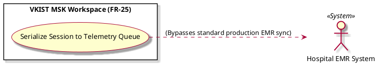

# Serialize Session to Telemetry Queue

Actor: Hospital EMR System (EMR)
DateAdd: June 7, 2026 10:37 PM
Engineer: Đạt Trần Tiến (Daves Tran)
Functional Requirement Engineer DB: CHUẨN ĐOÁN Phân loại Mức độ Viêm Khớp gối (https://app.notion.com/p/CHU-N-O-N-Ph-n-lo-i-M-c-Vi-m-Kh-p-g-i-375f910aea75800199d4feb8b07f9145?pvs=21)
Goal: Route anomalous case data directly to engineering telemetry streams while bypassing standard hospital records to protect clinical data pipes
Interaction: System-to-System
Stimulus: Completion of manual morphology reporting arrays within the clinical investigation interface
SysResponse: Packages unencrypted image tensors, coordinate arrays, and user text blocks directly into core product telemetry queues
Title [Verb + Noun]: Serialize Session to Telemetry Queue
UC-ID: UC-01580
VerboseForm: The use case 'Serialize Session to Telemetry Queue' defines a System-to-System interaction where the Hospital EMR System (EMR) aims to Route anomalous case data directly to engineering telemetry streams while bypassing standard hospital records to protect clinical data pipes. This workflow is triggered when Completion of manual morphology reporting arrays within the clinical investigation interface, causing the system to respond by providing Packages unencrypted image tensors, coordinate arrays, and user text blocks directly into core product telemetry queues.

```markdown

```markdown
# Use Case Deep-Dive: Serialize Session to Telemetry Queue

## 1. Structural Preconditions & Postconditions
* **Preconditions:**
  * Manual morphology plotting and clinical documentation inputs are finalized (`UC_Q4_Annotate`).
* **Postconditions (Success State):**
  * Case files containing structural anomalies bypass standard EMR storage pathways.
  * Raw image tensors are queued in engineering streams to expand future model capabilities.

---

## 2. Interaction Scenarios (Step-by-Step Flow)

### Main Success Scenario (Happy Path)
1. **System** identifies the active session as an anomalous anomaly case during final compilation.
2. **System** aggregates raw frame tensors, manual coordinate indices, and user-entered clinical commentary blocks into a secure telemetry archive package.
3. **System** bypasses standard EMR production database pipelines to protect standard hospital operational data.
4. **System** routes the telemetry package directly to the product engineering data pipeline for system optimization and future model training runs.

---

## 3. PlantUML Visual Model


---

```

