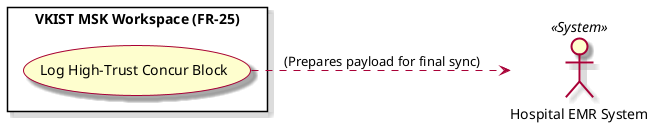

# Log High-Trust Concur Block

Actor: Hospital EMR System (EMR)
DateAdd: June 7, 2026 10:09 PM
Engineer: Đạt Trần Tiến (Daves Tran)
Functional Requirement Engineer DB: CHUẨN ĐOÁN Phân loại Mức độ Viêm Khớp gối (https://app.notion.com/p/CHU-N-O-N-Ph-n-lo-i-M-c-Vi-m-Kh-p-g-i-375f910aea75800199d4feb8b07f9145?pvs=21)
Goal: Secure the human-AI alignment log trace within the final diagnostic report payload
Interaction: System-to-System
Stimulus: Explanatory panel validation completes successfully without user override actions
SysResponse: Appends a tamper-evident audit trace block verifying explicit human-AI agreement into the session log cache
Title [Verb + Noun]: Log High-Trust Concur Block
UC-ID: UC-02423
VerboseForm: The use case 'Log High-Trust Concur Block' defines a System-to-System interaction where the Hospital EMR System (EMR) aims to Secure the human-AI alignment log trace within the final diagnostic report payload. This workflow is triggered when Explanatory panel validation completes successfully without user override actions, causing the system to respond by providing Appends a tamper-evident audit trace block verifying explicit human-AI agreement into the session log cache.


```markdown

# Use Case Deep-Dive: Log High-Trust Concur Block

## 1. Structural Preconditions & Postconditions
* **Preconditions:**
  * Multi-modal explanations were fully generated (`UC_Q1_Explain`) and passed without human alteration marks.
* **Postconditions (Success State):**
  * Explicit audit string trace tracking high-trust convergence is formatted for downstream pipeline compilation.

---

## 2. Interaction Scenarios (Step-by-Step Flow)

### Main Success Scenario (Happy Path)
1. **System** detects a direct consensus condition where the human expert confirms the model data without text/grading edits.
2. **System** serializes the multi-modal text breakdown and pixel attribution coordinates into an immutable log string block.
3. **System** assigns an explicit alignment token header flag (`HIGH_TRUST_CONCURRENCE`).
4. **System** caches this specialized tracking trace within the localized session state data, making it ready to be appended during final data hand-off routines (`UC_Finalize`).

---

## 3. PlantUML Visual Model

```