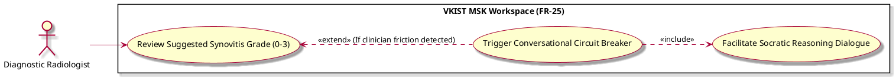

# Trigger Conversational Circuit Breaker

Actor: UP5
DateAdd: June 7, 2026 10:11 PM
Engineer: Đạt Trần Tiến (Daves Tran)
Functional Requirement Engineer DB: CHUẨN ĐOÁN Phân loại Mức độ Viêm Khớp gối (https://app.notion.com/p/CHU-N-O-N-Ph-n-lo-i-M-c-Vi-m-Kh-p-g-i-375f910aea75800199d4feb8b07f9145?pvs=21)
Goal: Intercept premature finalization workflows if interface telemetry reveals friction, hesitation, or cognitive blind-spots
Interaction: User-to-System
Stimulus: Extended extension trace caught during review steps if user behavior markers diverge from smooth consensus paths
SysResponse: Halts default workspace finalization routes and shifts the UI into a mandatory safety evaluation mode
Title [Verb + Noun]: Trigger Conversational Circuit Breaker
UC-ID: UC-22159
VerboseForm: The use case 'Trigger Conversational Circuit Breaker' defines a User-to-System interaction where the UP5 aims to Intercept premature finalization workflows if interface telemetry reveals friction, hesitation, or cognitive blind-spots. This workflow is triggered when Extended extension trace caught during review steps if user behavior markers diverge from smooth consensus paths, causing the system to respond by providing Halts default workspace finalization routes and shifts the UI into a mandatory safety evaluation mode.


```markdown

### Page Body Content (`SpecificationWithDiagram`)

```markdown
# Use Case Deep-Dive: Trigger Conversational Circuit Breaker

## 1. Structural Preconditions & Postconditions
* **Preconditions:**
  * Active session is inside the `UC_Review` workflow phase.
  * UI layer telemetry captures specific friction indicators (e.g., high-frequency cursor oscillation, repeatedly typing and deleting text, or conflicting grading inputs).
* **Postconditions (Success State):**
  * Direct finalization path is securely locked down.
  * System-forced conversational validation interface is deployed into view.

---

## 2. Interaction Scenarios (Step-by-Step Flow)

### Main Success Scenario (Happy Path)
1. **System** evaluates live workspace telemetry tracking patterns during active case validation.
2. **System** detects user behavior triggers signaling high diagnostic friction or potential automatic oversight trends.
3. **System** blocks the immediate execution availability of the standard finalization command sequence (`UC_Finalize`).
4. **System** transforms workspace panel focus areas to present an interactive confirmation overlay.
5. **System** executes `UC_Q2_Socratic` to initialize direct safety check communications.

---

## 3. PlantUML Visual Model

```