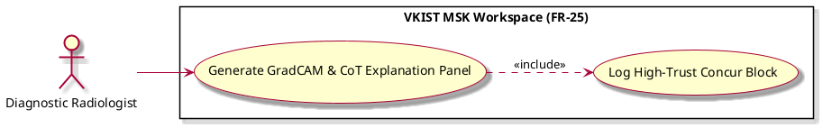

# Generate GradCAM & CoT Explanation Panel

Actor: UP5
DateAdd: June 7, 2026 10:00 PM
Engineer: Đạt Trần Tiến (Daves Tran)
Functional Requirement Engineer DB: CHUẨN ĐOÁN Phân loại Mức độ Viêm Khớp gối (https://app.notion.com/p/CHU-N-O-N-Ph-n-lo-i-M-c-Vi-m-Kh-p-g-i-375f910aea75800199d4feb8b07f9145?pvs=21)
Goal: Present clear, pixel-linked visuospatial explanations and multi-modal clinical reasoning for high-trust verification
Interaction: User-to-System
Stimulus: Inclusion trigger initialized during session data intake (Load Patient Scan Session)
SysResponse: Renders heatmaps highlighting model focus zones alongside structured, clear reasoning steps
Title [Verb + Noun]: Generate GradCAM & CoT Explanation Panel
UC-ID: UC-25776
VerboseForm: The use case 'Generate GradCAM & CoT Explanation Panel' defines a User-to-System interaction where the UP5 aims to Present clear, pixel-linked visuospatial explanations and multi-modal clinical reasoning for high-trust verification. This workflow is triggered when Inclusion trigger initialized during session data intake (Load Patient Scan Session), causing the system to respond by providing Renders heatmaps highlighting model focus zones alongside structured, clear reasoning steps.


```markdown

# Use Case Deep-Dive: Generate GradCAM & CoT Explanation Panel

## 1. Structural Preconditions & Postconditions
* **Preconditions:**
  * Raw image frames and vision engine inference matrix weights have been imported via `Load Patient Scan Session`.
* **Postconditions (Success State):**
  * Split-screen layout displays visual explanation elements without adding visual noise to the core image frame workspace canvas.

---

## 2. Interaction Scenarios (Step-by-Step Flow)

### Main Success Scenario (Happy Path)
1. **System** evaluates the internal deep-learning model gradient parameters for the target ultrasound image slice.
2. **System** generates a visual GradCAM heatmap layer mapping feature locations that dictated model classifications (e.g., hypervascularized synovial proliferation zones).
3. **System** maps multi-modal prompt metrics through the internal LLM Explainer module to produce a concise, point-by-point clinical reasoning string.
4. **System** populates the split-screen workspace sub-section block with this explanation data to guide human inspection efficiently.
5. **System** includes `UC_Q1_Log` to serialize verification metadata.

---

## 3. PlantUML Visual Model

```