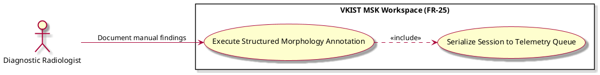

# Execute Structured Morphology Annotation

Actor: UNK
DateAdd: June 7, 2026 10:32 PM
Engineer: Đạt Trần Tiến (Daves Tran)
Functional Requirement Engineer DB: CHUẨN ĐOÁN Phân loại Mức độ Viêm Khớp gối (https://app.notion.com/p/CHU-N-O-N-Ph-n-lo-i-M-c-Vi-m-Kh-p-g-i-375f910aea75800199d4feb8b07f9145?pvs=21)
Goal: Force the manual plotting of anatomical coordinates and morphological anomalies using a strict, un-biased framework
Interaction: User-to-System
Stimulus: The workspace forces a manual review layout via the active escalation workflow step
SysResponse: Interactive visual mapping showing the exact high-frequency noise regions driving model prediction errors
Title [Verb + Noun]: Execute Structured Morphology Annotation
UC-ID: UC-47796
VerboseForm: The use case 'Execute Structured Morphology Annotation' defines a User-to-System interaction where the UNK aims to Force the manual plotting of anatomical coordinates and morphological anomalies using a strict, un-biased framework. This workflow is triggered when The workspace forces a manual review layout via the active escalation workflow step, causing the system to respond by providing Interactive visual mapping showing the exact high-frequency noise regions driving model prediction errors.

```markdown

```markdown
# Use Case Deep-Dive: Execute Structured Morphology Annotation

## 1. Structural Preconditions & Postconditions
* **Preconditions:**
  * System UI layer has transitioned to manual investigation mode parameters (`UC_Q4_Escalate`).
* **Postconditions (Success State):**
  * Specialist successfully plots manual structural bounds.
  * Text verification parameters capture explicit clinical observations.

---

## 2. Interaction Scenarios (Step-by-Step Flow)

### Main Success Scenario (Happy Path)
1. **System** displays an empty, un-biased ultrasound canvas frame alongside a series of mandatory measurement fields.
2. **Diagnostic Radiologist** plots coordinate points across the canvas layer to outline the boundaries of the anomalous tissue.
3. **Diagnostic Radiologist** manually populates text fields describing structural observations (e.g., bone fragments or atypical lesion shapes).
4. **System** compiles these manual coordinates and comments into a detailed case record.
5. **System** includes `UC_Q4_Queue` to route the data directly to optimization pipelines.

---

## 3. PlantUML Visual Model


```

