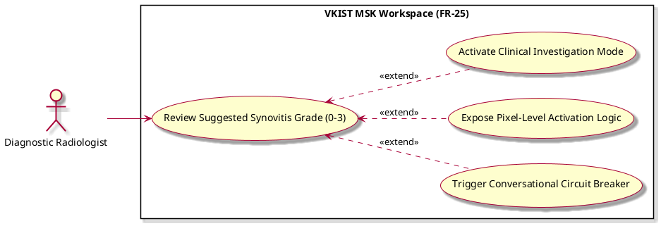

# Review Suggested Synovitis Grade (0-3)

Actor: UP5
DateAdd: June 7, 2026 9:54 PM
Engineer: Đạt Trần Tiến (Daves Tran)
Functional Requirement Engineer DB: CHUẨN ĐOÁN Phân loại Mức độ Viêm Khớp gối (https://app.notion.com/p/CHU-N-O-N-Ph-n-lo-i-M-c-Vi-m-Kh-p-g-i-375f910aea75800199d4feb8b07f9145?pvs=21)
Goal: Evaluate the ML engine's (VKIST-visual detector & classifier) proposed synovitis classification and structural overlays
Interaction: User-to-System
Stimulus: The workspace completes localized UI construction and displays the diagnostic panel
SysResponse: Display of classification metrics (Grades 0-3), color-coded overlays, and active risk-extension hooks
Title [Verb + Noun]: Review Suggested Synovitis Grade (0-3)
UC-ID: UC-47988
VerboseForm: The use case 'Review Suggested Synovitis Grade (0-3)' defines a User-to-System interaction where the UP5 aims to Evaluate the ML engine's (VKIST-visual detector & classifier) proposed synovitis classification and structural overlays. This workflow is triggered when The workspace completes localized UI construction and displays the diagnostic panel, causing the system to respond by providing Display of classification metrics (Grades 0-3), color-coded overlays, and active risk-extension hooks.

```markdown

```markdown
# Use Case Deep-Dive: Review Suggested Synovitis Grade (0-3)

## 1. Structural Preconditions & Postconditions
* **Preconditions:**
  * Image frames and raw ML prediction tensors (segmentation masks, classification weights) are fully loaded in memory via `Load Patient Scan Session`.
* **Postconditions (Success State):**
  * System records human gaze/interaction initialization flags.
  * System keeps exception-based extend vectors armed (`UC_Q2_Intercept`, `UC_Q3_Expose`, `UC_Q4_Escalate`).

---

## 2. Interaction Scenarios (Step-by-Step Flow)

### Main Success Scenario (Happy Path)
1. **System** presents the active ultrasound canvas with interactive, toggleable, color-coded segmentation mask overlays.
2. **System** displays the vision engine's suggested synovitis grading estimation (Grade 0, 1, 2, or 3) alongside structural pixel-percentage distribution metrics.
3. **Diagnostic Radiologist** inspects the spatial distribution of the synovial hypertrophy markers and reads the inline text panels.
4. **Diagnostic Radiologist** approves the visual data metrics without requesting alterations or triggering corrective dialogue paths.

### Alternative & Exception Flows
* **Extension Flow A: Clinician Friction / Disagreement Caught**
  * At step [3], if mouse click frequencies suggest hesitation or manual adjustments cross a conflict delta threshold, the execution path triggers `UC_Q2_Intercept` to prevent blind override errors.
* **Extension Flow B: Expert Contests Automated Grade**
  * At step [3], if the clinician explicitly changes the classification dropdown away from the ML-proposed score, the workspace extends to `UC_Q3_Expose` to display the machine activation weights.
* **Extension Flow C: Anomaly / Confidence Failure Detected**
  * At step [1], if the deep-learning array returned a classification confidence metric below safety bounds paired with blank knowledge base lookups, the interface branches into `UC_Q4_Escalate`.

---

## 3. PlantUML Visual Model


```

```

/image.png)