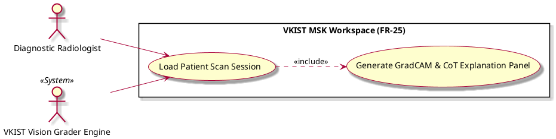

# Load Patient Scan Session

Actor: UP5, VKIST Vision Grader Engine (Grader)
DateAdd: June 6, 2026 1:01 AM
Engineer: Đạt Trần Tiến (Daves Tran)
Functional Requirement Engineer DB: CHUẨN ĐOÁN Phân loại Mức độ Viêm Khớp gối (https://app.notion.com/p/CHU-N-O-N-Ph-n-lo-i-M-c-Vi-m-Kh-p-g-i-375f910aea75800199d4feb8b07f9145?pvs=21)
Goal: Ingest raw ultrasound frame arrays and initialize the diagnostic session state
Interaction: System-to-System, User-to-System
Stimulus: User opens an unreviewed patient file, or the workspace catches an active DICOM stream hook
SysResponse: Confirmation that raw frame arrays are mapped, spatial calibrations are set, and the local session state is active
Title [Verb + Noun]: Load Patient Scan Session
UC-ID: UC-48376
VerboseForm: The use case 'Load Patient Scan Session' defines a User-to-System,System-to-System interaction where the UP5, VKIST Vision Grader Engine (Grader) aims to Ingest raw ultrasound frame arrays and initialize the diagnostic session state. This workflow is triggered when User opens an unreviewed patient file, or the workspace catches an active DICOM stream hook, causing the system to respond by providing Confirmation that raw frame arrays are mapped, spatial calibrations are set, and the local session state is active.

```markdown

## 1. Structural Preconditions & Postconditions
* **Preconditions:**
  * Local workspace application is authenticated and has secure socket access to the local image buffer.
  * DICOM/raw frame data payload is uncorrupted and readable.
* **Postconditions (Success State):**
  * Core frame parameters are loaded into memory with spatial scale calibrations preserved.
  * Background parsing pipeline registers the unique session hash and prepares the context matrix for downstream agents.

---

## 2. Interaction Scenarios (Step-by-Step Flow)

### Main Success Scenario (Happy Path)
1. **Diagnostic Radiologist** selects a patient case file from the workspace worklist interface.
2. **VKIST Vision Grader Engine** feeds raw ultrasound image tensors, spatial calibrations, and foundational frame telemetry metadata into the workspace memory layer.
3. **System** extracts pixel dimensions and constructs localized rendering viewports.
4. **System** includes `UC_Q1_Explain` in the background to spin up explanation prompt matrices.
5. **System** displays the fully loaded image frame in the workspace canvas, preparing the viewport for immediate review.

### Alternative & Exception Flows
* **Exception Flow A: Corrupted Image Frame Payload**
  * At step [2], if the payload data fails format validation or structural check headers, the system halts execution, logs a data corruption fault code, and alerts the user with an "Unable to Parse Scan Session" dialog box.
* **Exception Flow B: Resolution / Calibration Mismatch**
  * At step [3], if spatial aspect ratios or metadata pixel matrices lack the standardized calibration tags required by the vision engine, the workspace falls back to a safe default scale flag and displays a non-blocking diagnostic accuracy warning icon.

---

## 3. PlantUML Visual Model

```

