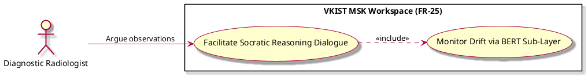

# Facilitate Socratic Reasoning Dialogue

Actor: UP5
DateAdd: June 7, 2026 10:14 PM
Engineer: Đạt Trần Tiến (Daves Tran)
Functional Requirement Engineer DB: CHUẨN ĐOÁN Phân loại Mức độ Viêm Khớp gối (https://app.notion.com/p/CHU-N-O-N-Ph-n-lo-i-M-c-Vi-m-Kh-p-g-i-375f910aea75800199d4feb8b07f9145?pvs=21)
Goal: Engage the specialist in a targeted, conversational double-check loop regarding controversial structural markers.
Interaction: User-to-System
Stimulus: Core execution request passed down by the active circuit breaker module.
SysResponse: Interactive conversational sub-panel displaying focused prompt choices that check specific diagnostic criteria
Title [Verb + Noun]: Facilitate Socratic Reasoning Dialogue
UC-ID: UC-55146
VerboseForm: The use case 'Facilitate Socratic Reasoning Dialogue' defines a User-to-System interaction where the UP5 aims to Engage the specialist in a targeted, conversational double-check loop regarding controversial structural markers.. This workflow is triggered when Core execution request passed down by the active circuit breaker module., causing the system to respond by providing Interactive conversational sub-panel displaying focused prompt choices that check specific diagnostic criteria.

```markdown

```markdown
# Use Case Deep-Dive: Facilitate Socratic Reasoning Dialogue

## 1. Structural Preconditions & Postconditions
* **Preconditions:**
  * Circuit breaker safety intercept sequence has completed successfully, freezing generic CRUD paths.
* **Postconditions (Success State):**
  * User inputs conversational defense arguments or confirms specific anatomical findings.
  * Live conversation data tokens are actively streamed to automated safety monitors.

---

## 2. Interaction Scenarios (Step-by-Step Flow)

### Main Success Scenario (Happy Path)
1. **System** initializes a conversational chat element right next to the ultrasound display field.
2. **System** presents a non-confrontational, clinically grounded question regarding the identified discrepancies (e.g., *"Note the echo-free thickening layer in the suprapatellar recess; please confirm if this modification represents minor effusion or structural pannus tissue"*).
3. **Diagnostic Radiologist** enters text responses or selects structural tag tokens to clarify their assessment.
4. **System** includes `UC_Q2_BERT` in real time to process active conversation token patterns.

---

## 3. PlantUML Visual Model

```

