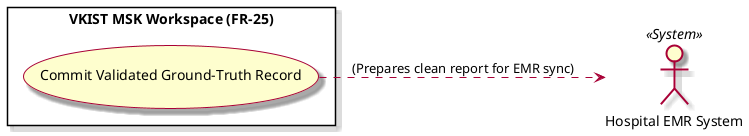

# Commit Validated Ground-Truth Record

Actor: Hospital EMR System (EMR)
DateAdd: June 7, 2026 10:26 PM
Engineer: Đạt Trần Tiến (Daves Tran)
Functional Requirement Engineer DB: CHUẨN ĐOÁN Phân loại Mức độ Viêm Khớp gối (https://app.notion.com/p/CHU-N-O-N-Ph-n-lo-i-M-c-Vi-m-Kh-p-g-i-375f910aea75800199d4feb8b07f9145?pvs=21)
Goal: Secure the human-corrected ground-truth dataset variant while appending clean, expert-validated report payloads to the EMR
Interaction: System-to-System
Stimulus: Completion of manual artifact masking operations and confirmation of corrected metrics
SysResponse: Stores the corrected medical report in the EMR and saves the isolated image mask to an optimization cache for subsequent retraining
Title [Verb + Noun]: Commit Validated Ground-Truth Record
UC-ID: UC-62864
VerboseForm: The use case 'Commit Validated Ground-Truth Record' defines a System-to-System interaction where the Hospital EMR System (EMR) aims to Secure the human-corrected ground-truth dataset variant while appending clean, expert-validated report payloads to the EMR. This workflow is triggered when Completion of manual artifact masking operations and confirmation of corrected metrics, causing the system to respond by providing Stores the corrected medical report in the EMR and saves the isolated image mask to an optimization cache for subsequent retraining.

```markdown

```markdown
# Use Case Deep-Dive: Commit Validated Ground-Truth Record

## 1. Structural Preconditions & Postconditions
* **Preconditions:**
  * Human-directed canvas modification steps are locked in place without remaining pixel parity errors (`UC_Q3_Isolate`).
* **Postconditions (Success State):**
  * EMR database updates receive the human expert's diagnostic findings.
  * Isolated ground-truth tensor pairs are safely cached for AI training refinement runs.

---

## 2. Interaction Scenarios (Step-by-Step Flow)

### Main Success Scenario (Happy Path)
1. **System** packages the human expert's corrected diagnostic data metrics into the primary transmission bundle.
2. **System** isolates the human-brushed image mask layers alongside the initial incorrect model classification output.
3. **System** tags the data pair as a validated retraining asset (`GROUND_TRUTH_OVERRIDE`).
4. **System** saves the optimization asset to a secure local retraining storage folder, while preparing the primary medical report for delivery to the **Hospital EMR System**.

---

## 3. PlantUML Visual Model

```

