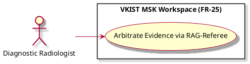

# Arbitrate Evidence via RAG-Referee

Actor: UP5
DateAdd: June 7, 2026 10:18 PM
Engineer: Đạt Trần Tiến (Daves Tran)
Functional Requirement Engineer DB: CHUẨN ĐOÁN Phân loại Mức độ Viêm Khớp gối (https://app.notion.com/p/CHU-N-O-N-Ph-n-lo-i-M-c-Vi-m-Kh-p-g-i-375f910aea75800199d4feb8b07f9145?pvs=21)
Goal: Query static, authoritative clinical knowledge bases to resolve human-machine disagreements with objective evidence
Interaction: User-to-System
Stimulus: Triggered when communication tracking scores cross a severe semantic mismatch or impasse threshold
SysResponse: Inline injection of un-biased diagnostic text extracts and guidelines matching the active frame conditions
Title [Verb + Noun]: Arbitrate Evidence via RAG-Referee
UC-ID: UC-65473
VerboseForm: The use case 'Arbitrate Evidence via RAG-Referee' defines a User-to-System interaction where the UP5 aims to Query static, authoritative clinical knowledge bases to resolve human-machine disagreements with objective evidence. This workflow is triggered when Triggered when communication tracking scores cross a severe semantic mismatch or impasse threshold, causing the system to respond by providing Inline injection of un-biased diagnostic text extracts and guidelines matching the active frame conditions.

```markdown

```markdown
# Use Case Deep-Dive: Arbitrate Evidence via RAG-Referee

## 1. Structural Preconditions & Postconditions
* **Preconditions:**
  * BERT analytics layers detect a diagnostic impasse or significant semantic drift.
  * Authoritative local clinical knowledge base index (e.g., OMERACT synovitis grading reference manuals) is online and responsive.
* **Postconditions (Success State):**
  * Disagreement matrix is resolved via verified medical data injection.
  * Final chosen path is linked directly to a standard medical guideline anchor.

---

## 2. Interaction Scenarios (Step-by-Step Flow)

### Main Success Scenario (Happy Path)
1. **System** halts active conversational dialogue inputs temporarily to execute a localized context search.
2. **System** extracts spatial measurements and text tokens to construct a specialized RAG search string.
3. **System** queries local, validated medical knowledge data banks to locate matching diagnostic criteria sections.
4. **System** displays the verified guideline text extract right inside the workspace alert view block (e.g., *"OMERACT standardizes Grade 2 as hypoechoic synovial hypertrophy demonstrating fluid-filled distension up to structural boundary bounds"*).
5. **Diagnostic Radiologist** reviews the authoritative reference framework and either adjusts their classification choice or submits a structured expert override justifying their deviation.

---

## 3. PlantUML Visual Model

```

