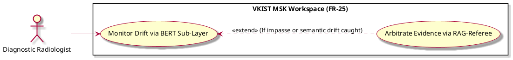

# Monitor Context Drift via BERT Sub-Layer

Actor: UP5
DateAdd: June 7, 2026 10:17 PM
Engineer: Đạt Trần Tiến (Daves Tran)
Functional Requirement Engineer DB: CHUẨN ĐOÁN Phân loại Mức độ Viêm Khớp gối (https://app.notion.com/p/CHU-N-O-N-Ph-n-lo-i-M-c-Vi-m-Kh-p-g-i-375f910aea75800199d4feb8b07f9145?pvs=21)
Goal: Continuously parse communication tokens to identify logical contradictions or semantic drift during clinical debates
Interaction: User-to-System
Stimulus: Streamed entry of communication tokens within the active dialogue loop
SysResponse: Real-time semantic checking flags; extends out to the RAG referee if an impasse or severe drift is captured
Title [Verb + Noun]: Monitor Context Drift via BERT Sub-Layer
UC-ID: UC-74821
VerboseForm: The use case 'Monitor Context Drift via BERT Sub-Layer' defines a User-to-System interaction where the UP5 aims to Continuously parse communication tokens to identify logical contradictions or semantic drift during clinical debates. This workflow is triggered when Streamed entry of communication tokens within the active dialogue loop, causing the system to respond by providing Real-time semantic checking flags; extends out to the RAG referee if an impasse or severe drift is captured.

```markdown

```markdown
# Use Case Deep-Dive: Monitor Drift via BERT Sub-Layer

## 1. Structural Preconditions & Postconditions
* **Preconditions:**
  * Active conversational dialogue module is processing user data strings (`UC_Q2_Socratic`).
* **Postconditions (Success State):**
  * Log structures capture semantic alignment metrics.
  * System successfully catches contradictions before data parameters flow to final storage.

---

## 2. Interaction Scenarios (Step-by-Step Flow)

### Main Success Scenario (Happy Path)
1. **System** continuously intercepts conversation tokens as the human expert types input strings.
2. **System** runs token matrices through an embedded BERT checking model to calculate contextual semantic coherence scores.
3. **System** verifies that user claims line up logically with the visual indicators under review.
4. **System** approves the validated conversational step, allowing the specialist to complete the confirmation cycle smoothly.

### Alternative & Exception Flows
* **Extension Flow A: Impasse or Semantic Contradiction Detected**
  * At step [3], if the specialist's input text contradicts objective structural metrics (e.g., claiming a region is "completely normal" while the visual layer registers massive synovial proliferation) or exhibits context drift, the process branches into `UC_Q2_Arbiter` to request evidence evaluation.

---

## 3. PlantUML Visual Model


```

