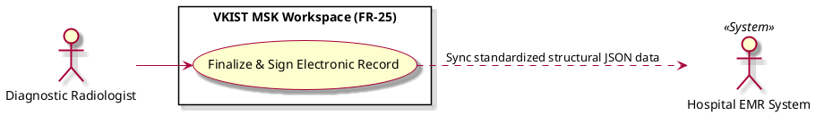

# Finalize & Sign Electronic Record

Actor: Hospital EMR System (EMR), UP5
DateAdd: June 7, 2026 9:54 PM
Engineer: Đạt Trần Tiến (Daves Tran)
Functional Requirement Engineer DB: CHUẨN ĐOÁN Phân loại Mức độ Viêm Khớp gối (https://app.notion.com/p/CHU-N-O-N-Ph-n-lo-i-M-c-Vi-m-Kh-p-g-i-375f910aea75800199d4feb8b07f9145?pvs=21)
Goal: Authenticate, cryptographically seal, and sync verified diagnostic reports down to storage infrastructure
Interaction: System-to-System, User-to-System
Stimulus: User executes the final confirmation/signature command button in the workspace utility ribbon
SysResponse: Generation of a signed cryptographic log block and structured JSON transmission payload delivered to the EMR endpoint
Title [Verb + Noun]: Finalize & Sign Electronic Record
UC-ID: UC-92006
VerboseForm: The use case 'Finalize & Sign Electronic Record' defines a User-to-System,System-to-System interaction where the UP5, Hospital EMR System (EMR) aims to Authenticate, cryptographically seal, and sync verified diagnostic reports down to storage infrastructure. This workflow is triggered when User executes the final confirmation/signature command button in the workspace utility ribbon, causing the system to respond by providing Generation of a signed cryptographic log block and structured JSON transmission payload delivered to the EMR endpoint.


```markdown

```markdown
# Use Case Deep-Dive: Finalize & Sign Electronic Record

## 1. Structural Preconditions & Postconditions
* **Preconditions:**
  * Active scan session evaluation has been resolved, and grading metrics are verified by the human specialist.
  * Local localized network channel to the hospital server framework is functional.
* **Postconditions (Success State):**
  * Session record is transformed into a read-only state.
  * Standardized structural JSON payload data is safely stored within the Hospital EMR System sink.

---

## 2. Interaction Scenarios (Step-by-Step Flow)

### Main Success Scenario (Happy Path)
1. **Diagnostic Radiologist** initiates the session finalization pipeline by interacting with the cryptographic signature command trigger.
2. **System** prompts for the secure authentication credentials of the signing specialist.
3. **System** generates a unified clinical log structure, packing structural thickness measurements (mm), final validated synovitis tier scores, and accompanying multi-agent trace logs.
4. **System** calculates a secure cryptographic data hash, locking the session record into an immutable post-review profile.
5. **System** delivers the structured data package across localized network pipes to the **Hospital EMR System**.
6. **Hospital EMR System** confirms safe database commit storage updates and provides an acknowledgment packet back to the workspace.

### Alternative & Exception Flows
* **Exception Flow A: Network Pipeline Transmission Failure**
  * At step [5], if network communications timeout or socket breaks occur, the workspace locks the finalized JSON package into a local encrypted offline buffer, changes the session status tag to "Pending Sync", and presents a clear connectivity warning alert.

---

## 3. PlantUML Visual Model


```

```