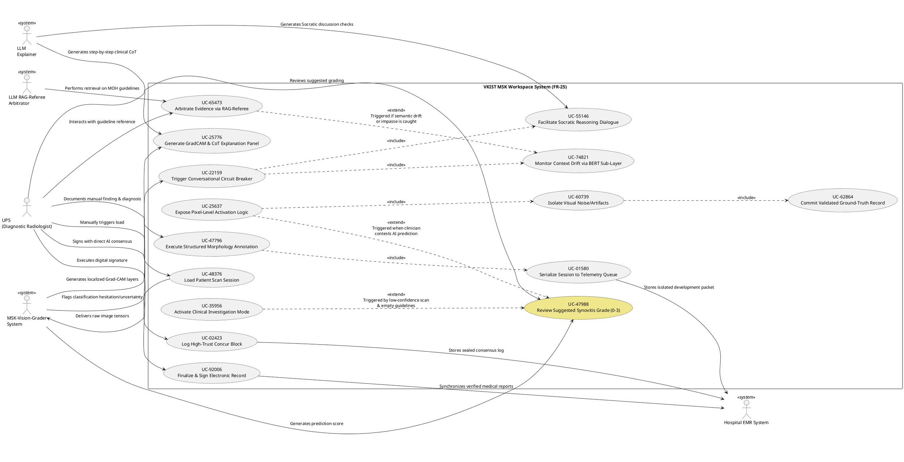

# VKIST MSK Workspace (FR-25): Full System Use Case Specification

This document provides a comprehensive, unified, and standard-aligned specification of the **VKIST MSK Workspace (FR-25)** use-case model. It acts as the definitive guide to the overall system-level architecture, showing how all 15 core use cases are structurally organized, how they connect across operational pipelines, and how they implement the safety-critical human-AI decision-making frameworks.

The use-case design is structured around a **4-Quadrant Human-AI Interaction Framework**, designed to optimize diagnostic speed while defending against cognitive biases (such as automation bias and clinician subservience) in high-throughput clinical environments.

---

## 1. Primary System Actors

The platform coordinates interactions between the clinical specialist and multiple local, air-gapped system components:

1. **UP5 (Diagnostic Radiologist):** The primary human actor. A Vietnamese clinical specialist processing musculoskeletal (MSK) ultrasound scans, responsible for evaluating AI suggestions, annotating images, and signing final diagnostic records.
2. **MSK-Vision-Grader System:** The edge-close & server-distribute computer vision inference runner. It ingests raw DICOM image arrays, extracts structural parameters, and generates automated synovitis grading (Grades 0–3) along with bounding boxes and Grad-CAM activation heatmaps.
3. **LLM Explainer:** A localized language model (e.g., PhoGPT or MedGemma) that runs on bare-metal hospital GPUs to generate clinical Chain-of-Thought (CoT) reasoning paragraphs justifying model predictions.
4. **Hospital EMR System (EMR):** The air-gapped hospital intranet electronic medical record repository, serving as the immutable sink for signed reports and ground-truth overrides.
5. **LLM RAG-Referee-Arbitrator:** An on-premise Vector DB-backed QA model that queries static Vietnamese Ministry of Health (MOH) clinical guidelines to resolve human-AI disagreements with objective evidence.

---

## 2. Complete Traceability Matrix

The following table homogenizes all 15 use cases from `Sprint_1_2_UseCase_DB.csv` and details their core system goals:

| UC-ID | Title [Verb + Noun] | Primary Actor | System Goal | Interaction Type | Pipeline / Quadrant |
| :--- | :--- | :--- | :--- | :--- | :--- |
| **UC-48376** | Load Patient Scan Session | UP5, MSK-Vision-Grader | Ingest raw ultrasound frame arrays and initialize session state with spatial calibrations. | System-to-System, User-to-System | Data Ingest Pipeline |
| **UC-47988** | Review Suggested Synovitis Grade (0-3) | UP5 | Evaluate proposed synovitis classification metrics and structural visual overlays on the viewport. | User-to-System | Clinical Review Pipeline |
| **UC-92006** | Finalize & Sign Electronic Record | UP5, Hospital EMR System | Authenticate, cryptographically seal, and sync verified diagnostic reports down to storage infrastructure. | System-to-System, User-to-System | Sync & Finalization Pipeline |
| **UC-25776** | Generate GradCAM & CoT Explanation Panel | UP5, LLM Explainer | Present clear, pixel-linked visuospatial explanations and multi-modal clinical reasoning for high-trust verification. | User-to-System | Quadrant 1 (True Agreement) |
| **UC-02423** | Log High-Trust Concur Block | Hospital EMR System | Secure the human-AI alignment log trace within the final diagnostic report payload. | System-to-System | Quadrant 1 (True Agreement) |
| **UC-22159** | Trigger Conversational Circuit Breaker | UP5 | Intercept premature finalization if telemetry reveals friction, hesitation, or cognitive blind-spots. | User-to-System | Quadrant 2 (Automation Override) |
| **UC-55146** | Facilitate Socratic Reasoning Dialogue | UP5, LLM Explainer | Engage the specialist in a targeted, conversational double-check loop regarding controversial markers. | User-to-System | Quadrant 2 (Automation Override) |
| **UC-74821** | Monitor Context Drift via BERT Sub-Layer | UP5 | Continuously parse communication tokens to identify logical contradictions or semantic drift during clinical debates. | User-to-System | Quadrant 2 (Automation Override) |
| **UC-65473** | Arbitrate Evidence via RAG-Referee | UP5, LLM RAG-Referee-Arbitrator | Query static, authoritative clinical knowledge bases to resolve human-machine disagreements with objective evidence. | User-to-System | Quadrant 2 (Automation Override) |
| **UC-25637** | Expose Pixel-Level Activation Logic | UP5 | Reveal fine-grained layer weights and activation responses when the human specialist challenges an automated prediction. | User-to-System | Quadrant 3 (Clinician Subservience) |
| **UC-60739** | Isolate Visual Noise/Artifacts | UP5 | Provide manual brush and selection overlays to mask out acoustic shadows, bone scattering, or artifacts. | User-to-System | Quadrant 3 (Clinician Subservience) |
| **UC-62864** | Commit Validated Ground-Truth Record | Hospital EMR System | Secure the human-corrected ground-truth dataset variant while appending expert-validated reports to the EMR. | System-to-System | Quadrant 3 (Clinician Subservience) |
| **UC-35956** | Activate Clinical Investigation Mode | UP5 | Switch the system into a strict, template-driven manual examination mode when low vision confidence aligns with missing references. | User-to-System | Quadrant 4 (Double Blind Failure) |
| **UC-47796** | Execute Structured Morphology Annotation | UP5 | Force the manual plotting of anatomical coordinates and morphological anomalies using a strict, un-biased framework. | User-to-System | Quadrant 4 (Double Blind Failure) |
| **UC-01580** | Serialize Session to Telemetry Queue | Hospital EMR System | Route anomalous case data directly to engineering telemetry streams while bypassing standard EMR databases. | System-to-System | Quadrant 4 (Double Blind Failure) |

---

## 3. PlantUML Architectural Model

The following diagram defines the physical and logical boundaries of the **VKIST MSK Workspace System (FR-25)**. It maps actor associations, internal system boundaries, and precise functional relationships (`<<include>>` and `<<extend>>` stereotypic dependencies).

---

## 4. Architectural Analysis of Functional Relationships

### 4.1 Stereotyped Dependecies

- **`<<include>>` Dependencies:**
  - **`UC-25637` includes `UC-60739`:** When the clinical specialist contests the AI suggestion and the system exposes pixel-level activation logic, it structurally includes the manual toolset to isolate and paint over acoustic shadows and bone scattering artifacts.
  - **`UC-60739` includes `UC-62864`:** Successful isolation of physical ultrasound noise always includes committing a validated, high-value ground-truth dataset variant directly to storage for downstream model retraining.
  - **`UC-22159` includes `UC-55146` & `UC-74821`:** If the workspace's behavioral trackers detect high cognitive hesitation (intercepting normal pathways), it halts progression and launches both the Socratic conversational panel and the context-drift tracking sub-layer concurrently.
  - **`UC-47796` includes `UC-01580`:** When in clinical investigation mode, finalizing a manually plotted annotation and morphologic coordinate dataset immediately triggers telemetry serialization to route debugging data out to development queues.

- **`<<extend>>` Dependencies:**
  - **`UC-25637` extends `UC-47988`:** Revealing pixel-level layer weights is not a default step; it only extends the basic grading review if the doctor explicitly challenges or modifies the AI-proposed classification score.
  - **`UC-65473` extends `UC-74821`:** Querying authoritative local Vector databases and injecting MOH guidelines extends the context-drift monitoring if the BERT checker detects a logical contradiction, an impasse, or severe drift in the clinical dialogue.
  - **`UC-35956` extends `UC-47988`:** The system disables automated diagnostics and switches the entire viewport layout to clinical investigation mode (Escalation) only if model classification confidence falls below 60% and no guidelines map to the anomalies.

---

## 5. Homogenization of Business Logics & Clinical Drivers

By synchronizing the Use Case IDs and naming conventions across the **Use Case Database (`Sprint_1_2_UseCase_DB.csv`)**, the **System Design Specification (`SOFTWARE_SYSTEM_DESIGN_FR_25.md`)**, and this **Architectural Model**, we have solidified key business rules:

1. **The Role of the Diagnostic Radiologist (`UP5`):** Explicitly unified as the single human clinician in the workspace loop. The historical database typo identifying the actor of `UC-47796` as "UNK" is fully resolved under the canonical role of `UP5`.
2. **True Socratic Agreement Pipeline (`UC-22159` -> `UC-65473`):** Resolves the risk of automation bias. The conversational circuit breaker is technically backed by a real-time BERT text classifier that checks for clinical semantic drift against the raw image and can escalate directly to local Vector RAG modules containing MOH clinical guidelines.
3. **Continuous Retraining Pipeline (`UC-25637` -> `UC-62864`):** Turns clinical overrides into architectural assets. When `UP5` overrides the AI classification, they paint an SVG mask over the artifacts (reverberations/shadows). Saving this mask along with the ground-truth correction allows for localized, high-value model retraining on local-hospital acoustic variations.
4. **Air-Gapped Telemetry Routing (`UC-47796` -> `UC-01580`):** Enforces Circular 46/2018/TT-BYT compliance. Highly anomalous cases or double-blind failures are stripped of standard patient EMR references and serialized directly into dedicated debugging logs on the local server, protecting primary medical data lines while providing raw materials for engineering diagnosis.
