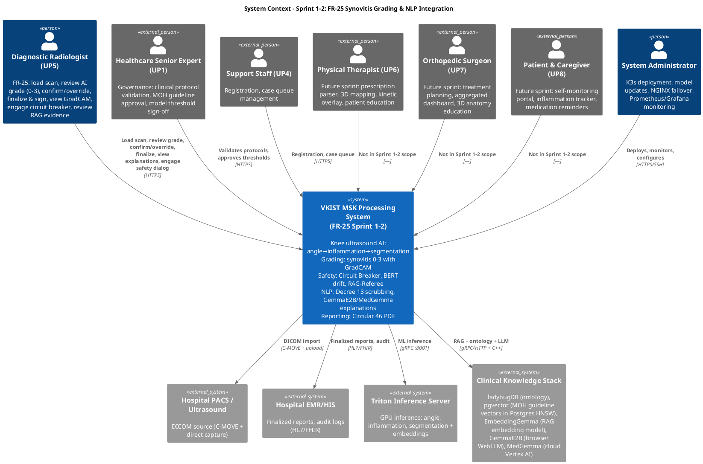
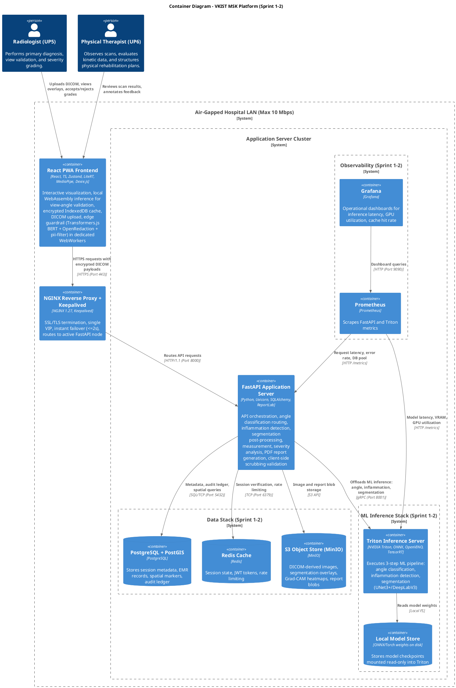
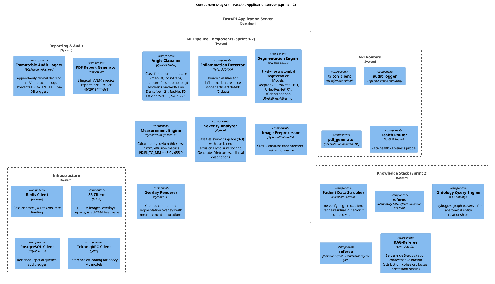
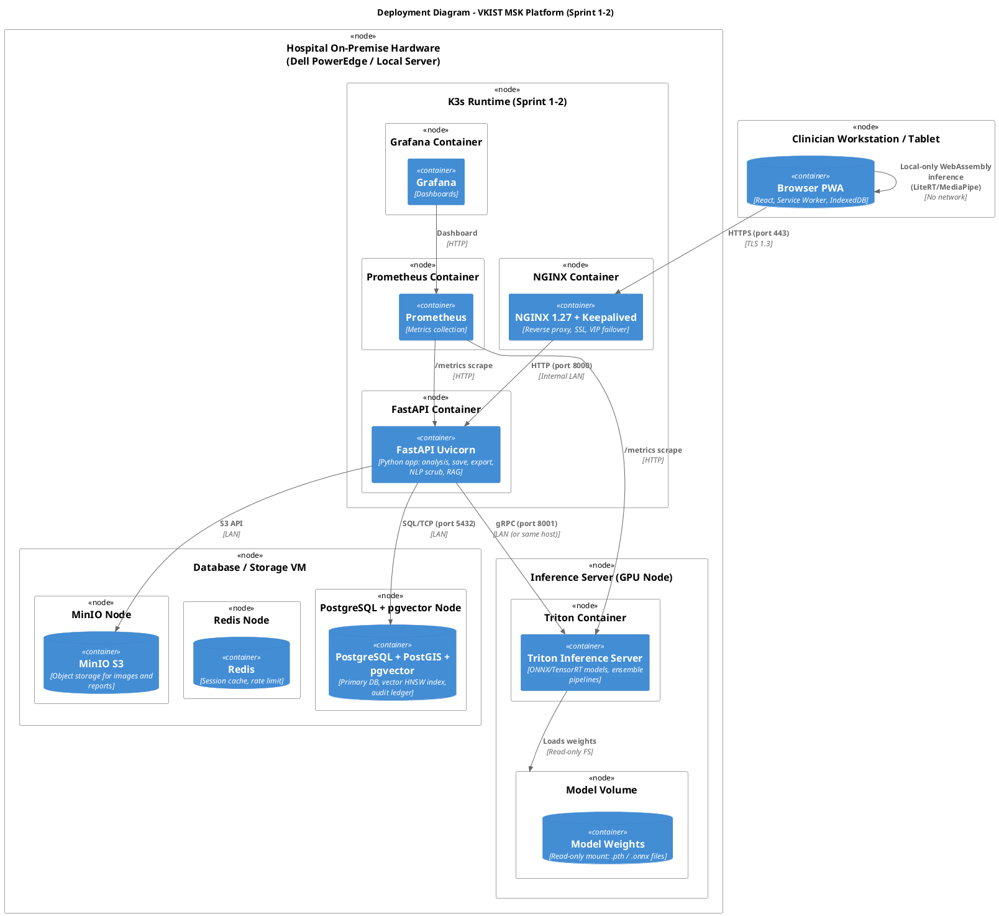
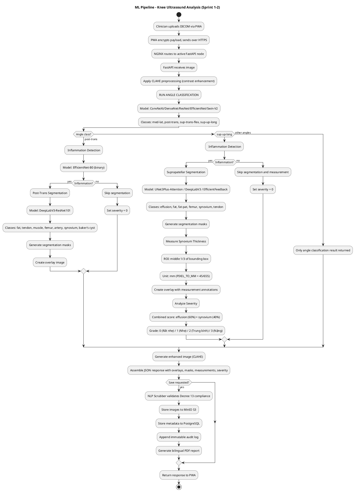
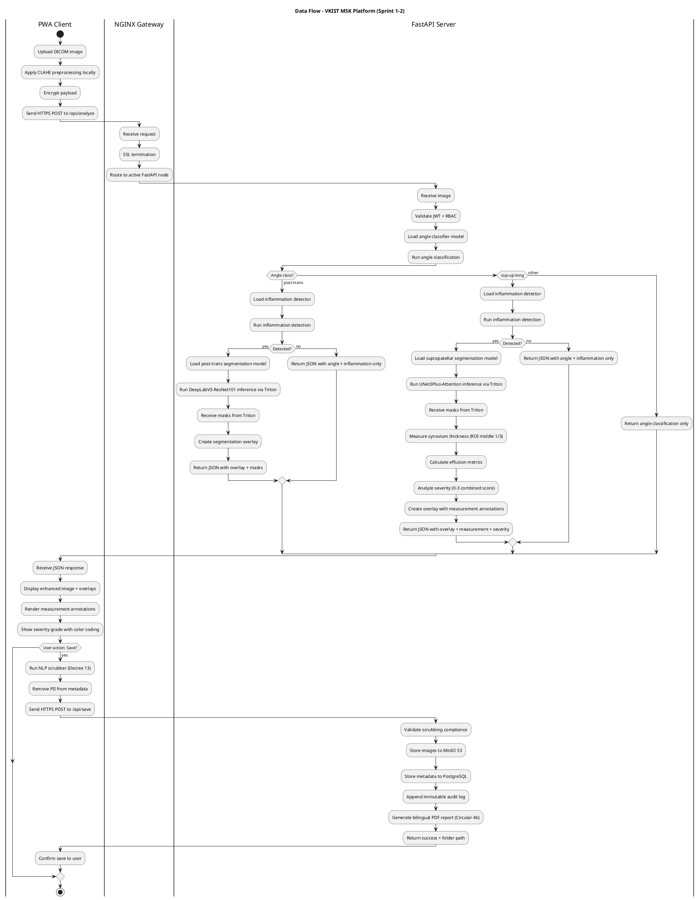

# Sprint 1-2 Architecture Specification

**Sprint:** Sprint 1 (June 15 – June 26) + Sprint 2 (June 29 – July 10)  
**Theme:** "The Fast PoC Baseline" + "Multi-Modal & NLP Integration"  
**Parent Document:** [SOLUTION_ARCHITECTURE_SPEC.md](../SOLUTION_ARCHITECTURE_SPEC.md)

---

## 1. Sprint Scope & Goals

### 1.1 Sprint 1: The Fast PoC Baseline
- Establish interactive end-to-end processing pipeline
- Rapid UI prototype with high-fidelity mockups
- Configure initial FastAPI server pipelines to process raw array matrices
- Output early inference mask previews onto browser-based preview window canvas
- Wire ultrasound image ingest pathways into classification pipeline

### 1.2 Sprint 2: Multi-Modal & NLP Integration
- Embed localized NLP translation modules
- Implement client-side privacy scrubbing masks for Decree 13 compliance
- Configure on-device string parsers to sanitize personal identification tokens
- Deploy multi-modal diagnostic chat system
- Build zero-friction NLP conduits for clinical abbreviations

---

## 2. Architectural Constraints for Sprint 1-2

| Constraint | Implementation |
| --- | --- |
| **Air-Gapped Hospital LAN** | No external cloud processing during normal operation. All inference and storage on-premise via K3s. NFR-16a governs emergency cloud fallback only. |
| **Code & Issue Hosting (NFR-16a exception)** | GitLab CE and Jira run self-hosted on a cloud VM (not SaaS). All code, tickets, and pipeline configs transit over public internet to reach the VM. Compensating controls: no PHI in commits or tickets (pre-push hook + team policy); SSH-only git access with certificate pinning; daily GitLab RDB backup to hospital MinIO (not cloud storage); cloud VM IAM with minimum-role access and 2FA; VM access restricted to hospital whitelisted IPs. This exception is reviewed at PoC sign-off. |
| **Network Bandwidth (10 Mbps max)** | Optimize payload sizes, leverage local caching (IndexedDB, Redis). |
| **DICOM Compliance** | Process DICOM images via pydicom stream over local HTTPS. |
| **Client Memory ≤ 150 MB** | PWA uses React + Zustand + LiteRT (no dedicated GPU required). |
| **Latency ≤ 1.5s for inference** | Heavy ML offloaded to Triton Inference Server with ONNX/TensorRT. |
| **Zero PHI Leakage** | Client-side scrubbing before network transfer; no PHI in Git/Jenkins. |

---

## 3. System Context Diagram (C4) - Sprint 1-2 Scope (FR-25 Synovitis Grading)

---

## 4. Container Diagram (C4) - Sprint 1-2 Implementation

---

## 5. Component Diagram (C4) - FastAPI Server Internals (Sprint 1-2)

---

## 6. Deployment Diagram (C4) - Sprint 1-2 Hospital LAN Runtime

---

## 7. Sprint 1-2 ML Workflow: Ultrasound Processing Pipeline

---

## 8. Data Flow Diagram (Activity View)

---

## 9. Non-Functional Requirements Coverage (Sprint 1-2)

| NFR | Sprint 1-2 Implementation |
| --- | --- |
| **NFR-1** (DICOM Speed ≤ 3.0s) | Local Triton inference + Redis caching of recent sessions |
| **NFR-4** (Client Memory ≤ 150 MB) | React PWA with Zustand; LiteRT WebAssembly (no GPU); Dexie.js for local cache |
| **NFR-5** (Inference ≤ 1.5s) | Triton with TensorRT/OpenVINO quantization; ONNX runtime |
| **NFR-6** (VRAM ≤ 2 GB) | Quantized ONNX models; batch size 1; DeepLabV3-ResNet101 optimized |
| **NFR-7** (UI Refresh ≤ 200ms) | Token streaming via SSE; frontend state updates async |
| **NFR-8** (Fault Tolerance) | IndexedDB local cache; service worker offline mode; session recovery |
| **NFR-9** (Availability ≥ 99.9%) | NGINX + Keepalived active-passive VIP; Docker restart policies |
| **NFR-10** (Generative Safety) | Edge guardrail: prompt rules + BERT detection (hallucination/mal-intention/scope-breach) → session termination → cloud mitigate (Vertex AI). Mandatory RAG pre-processing for all LLM tiers (not optional tool calling). RAG-Referee citation contestant validation (3-axis). Server-side Decree 13 redaction ground-check before Vertex AI egress. |
| **NFR-11** (Onboarding ≤ 45 min) | High-fidelity Figma prototypes in Sprint 1; structured workflows |
| **NFR-13** (Grad-CAM Zero-Click) | Overlay rendered directly on upload; zero extra UI steps |
| **NFR-14** (No client GPU) | PWA falls back to CPU-bound rendering; LiteRT for lightweight inference |
| **NFR-16** (Air-Gapped) | Entire inference and storage stack on-premise via K3s; no external cloud for clinical data. NFR-16a exception: GitLab/Jira on cloud VM with compensating controls. |
| **NFR-17** (Immutable Audit) | PostgreSQL triggers prevent UPDATE/DELETE on audit tables |
| **NFR-18** (RAG Citations) | pgvector retrieves MOH guideline passages (PostgreSQL HNSW index); LLM generates footnoted explanations |
| **NFR-19** (HITL Gate) | Database state machine prevents FINALIZED status without clinician digital signature |

---

## 10. Key Decree 13 / Circular 46 Compliance (Sprint 2)

### 10.1 Decree 13/2023/ND-CP - Personal Data Protection
- Client-side scrubbing via `nlp_scrubber` component before any network transfer
- Regex-based PII removal (names, IDs, phone numbers) in browser
- No PHI stored in Git, Jenkins artifacts, or external systems

### 10.2 Circular 46/2018/TT-BYT - EMR Compliance
- PDF reports generated per official MOH format (bilingual VI/EN)
- Audit trail immutable via database triggers
- Reports stored with cryptographic checksums in MinIO

---

## 11. Infrastructure Decisions (Sprint 1-2)

| Decision | Choice | Rationale |
| --- | --- | --- |
| **Orchestration** | K3s (Kubernetes-certified, lightweight edge distribution) | Chosen over Docker Compose, Docker Swarm, Nomad, ECS Fargate, Cloud Run. NFR-16 requires on-premise, eliminating cloud-only options. Docker Swarm offers lowest PoC cost but is in maintenance mode with highest migration overhead. K3s is already production-grade; scaling path is multi-cluster federation, not platform replacement. |
| **CI/CD** | Jenkins on hospital K3s | Runs inside trusted LAN; connects to cloud-hosted GitLab for source. No external build triggers. |
| **Code Hosting** | Self-hosted GitLab CE on cloud VM (NFR-16a exception) | Reliability over hospital-hardware self-hosting; not SaaS. Compensating controls: no PHI in commits (pre-push hook), SSH-only access with cert pinning, daily RDB backup to hospital MinIO, cloud IAM with 2FA + minimum-role, IP whitelist to hospital networks. Exception reviewed at PoC sign-off. |
| **Issue Tracking** | Self-hosted Jira on same cloud VM (NFR-16a exception) | Clinical feedback and tickets stay within controlled access boundary. No PHI in tickets per team policy. Same compensating controls as GitLab. |
| **Model Serving** | Triton Inference Server | ONNX/TensorRT support; ensemble pipelines; HTTP/gRPC |
| **Reverse Proxy** | NGINX + Keepalived | VIP for high availability; SSL termination; instant failover |
| **Local LLM** | Browser WebLLM (GemmaE2B) + Cloud MedGemma (Vertex AI) | Browser: Vietnamese + clinical language support, local inference (air-gapped). Cloud: MedGemma for NFR-16a fallback + BERT-triggered arbiter. Triton hosts CV models + EmbeddingGemma only. |
| **Vector Search** | pgvector (PostgreSQL HNSW index) | Already deployed with Postgres; zero additional infrastructure; ~15K MOH vectors at ~5-20ms query latency fits NFR-7. Complex SQL filtering for clinical queries. Qdrant deferred to Phase 2. |
| **Ontology DB** | ladybugDB embedded | C++ library embedded in FastAPI process; SNOMED-CT/LOINC mappings |

---

## 12. Technology Stack Summary

| Layer | Technology | Purpose |
| --- | --- | --- |
| Frontend | React, TypeScript, Zustand, Dexie.js, LiteRT, MediaPipe, Transformers.js, OpenRedaction, pii-filter, js-data-anonymizer | PWA with offline support, local inference, and edge guardrail (BERT hallucination/mal-intention detection, Decree 13 PII scrubbing) |
| Guardrail | Transformers.js BERT (WebWorker), OpenRedaction, pii-filter, js-data-anonymizer, FastAPI `phi_scrub` middleware, Vertex AI Model Garden safety filters | Edge behavior control without NeMo/GuardrailsAI; prompt-rule + BERT detection; session termination + cloud mitigate; mandatory RAG pre-processing (not optional tool-call); server-side redaction ground-check before NFR-16a egress |
| Gateway | NGINX 1.27 + Keepalived | SSL termination, VIP, load balancing |
| API | FastAPI, Uvicorn, SQLAlchemy, ReportLab | REST API, ORM, PDF generation |
| ML Inference | Triton, ONNX, TensorRT, OpenVINO | Model serving with quantization |
| Models | ConvNeXt, DenseNet, ResNet, EfficientNet, Swin-V2, UNet3Plus, DeepLabV3 | Angle, inflammation, segmentation |
| Data | PostgreSQL + PostGIS, MinIO, Redis | Relational, object, cache |
| Knowledge | pgvector, ladybugDB, GemmaE2B/MedGemma, EmbeddingGemma, BioClinicalBERT | RAG (pgvector HNSW), ontology (ladybugDB), Vietnamese/clinical LLM, 768-dim RAG embeddings, BERT drift/referee |
| Observability | Prometheus, Grafana | Metrics and dashboards |
| Code Hosting | Self-hosted GitLab CE (cloud VM, NFR-16a exception) | Source control, issue tracking, merge requests, container registry |
| CI/CD | Jenkins on hospital K3s | Build, test, deploy pipeline; connects to cloud-hosted GitLab |

---

## 13. Cross-References

| Document | Relevance |
| --- | --- |
| [SOLUTION_ARCHITECTURE_SPEC.md](../SOLUTION_ARCHITECTURE_SPEC.md) | Main architecture spec, NFR definitions, pattern citations, trade-off analysis |
| [Backend Specification](CODEBASE/backend/spec/backend-spec.md) | FastAPI server internal design, API contracts, RAG coordinator |
| [Knowledge Stack Specification](CODEBASE/knowledge/spec/knowledge_spec.md) | Qdrant/ladybugDB schema, embedding models, LLM endpoints |
| [CI/CD Deployment Pipeline](Design_Material/CI_CD_docs/CI_CD_DEPLOYMENT_PIPELINE.md) | Jenkins pipeline, Docker Compose runtime, offline bundles, rollback |
| [DATA_SPEC.md](CODEBASE/data/spec/data_spec.md) | Data contracts, schema definitions |
| [CONTEXT_VISION_SCOPE.md](../../PROJ_LEVEL_READING/PLAN/CONTEXT_VISION_SCOPE.md) | Project vision, sprint timelines, user personas |

---

## 14. Design Decisions

| # | Decision | Alternatives Considered | Rationale |
| --- | --- | --- | --- |
| 1 | Triton for model serving | TorchServe, FastAPI direct | Triton supports ONNX/TensorRT ensembles, dynamic batching, and concurrent model execution |
| 2 | K3s over Docker Compose/Swarm/Nomad/ECS/Cloud Run | Docker Compose, Docker Swarm, Nomad, ECS Fargate, Cloud Run | NFR-16 requires on-premise, eliminating cloud-only platforms (ECS, Cloud Run). Docker Swarm is in maintenance mode with highest migration cost to production. K3s is already production-grade; scaling to N hospitals is multi-cluster federation, not platform replacement. |
| 3 | MinIO over AWS S3 | Direct filesystem, NFS | S3-compatible API allows future cloud migration; object versioning built-in |
| 4 | pgvector over Qdrant/Pinecone | Qdrant, Pinecone, Weaviate | Postgres already deployed; pgvector adds zero infrastructure overhead. At ~15K MOH guideline vectors, HNSW query latency (~5-20ms in shared_buffers) fits within NFR-7 budget. Qdrant advantage appears at millions of vectors or >500 QPS; not needed at PoC scale. Phase 2: introduce Qdrant if corpus exceeds ~100K vectors. |
| 5 | ladybugDB embedded | Separate graph DB service | Embedded C++ library reduces latency; no separate process to manage |

---

## 15. Open Questions / Future Work (Post Sprint 2)

| ID | Question | Target Sprint |
| --- | --- | --- |
| Q1 | How to handle concurrent clinician sessions with shared Triton GPU? | Sprint 3 |
| Q2 | Should model weights be versioned in PostgreSQL for A/B testing? | Sprint 4 |
| Q3 | How to integrate DICOM C-STORE for automatic PACS ingestion (currently C-MOVE only)? | Sprint 5 |
| Q4 | Will GemmaE2B be swapped for MedGemma or Willa when hospital provides GPU cluster? | Sprint 5 |
| Q5 | Should Prometheus scrape endpoints be authenticated for NFR-17 audit compliance? | Sprint 3 |
